Test Residuals for Model Fits
================

Using the R packages, *car* and *MASS*, it is possible to check the residuals prior to fitting a model to help instruct in model selection.

Below are several tests for each of the different sets of data using four different data distributions:

-   Normal,

-   Log normal,

-   Exponential, and

-   Chi-squared.

2015 Tiller Incidence
---------------------

``` r
qqp(AUDPS_15$TShB_inc_AUDPS, "norm")
```


``` r
qqp(AUDPS_15$TShB_inc_AUDPS, "lnorm")
```

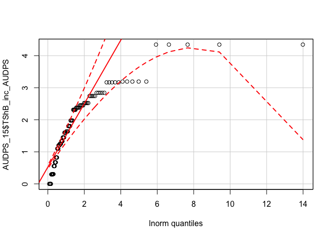

``` r
qqp(AUDPS_15$TShB_inc_AUDPS, "exp")
```

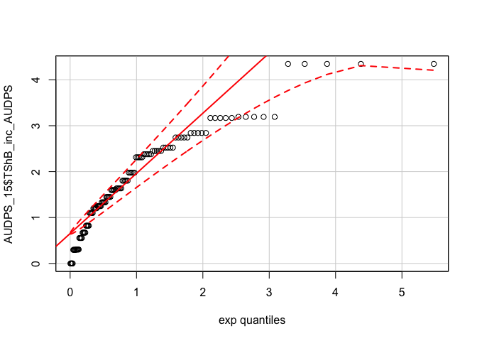

``` r
qqp(AUDPS_15$TShB_inc_AUDPS, "chisq", df = 2)
```


2015 Tiller Severity
--------------------

``` r
qqp(AUDPS_15$TShB_percent_AUDPS, "norm")
```

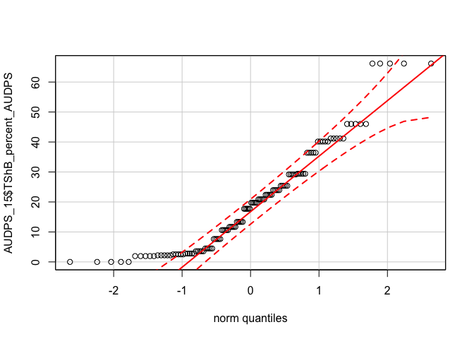

``` r
qqp(AUDPS_15$TShB_percent_AUDPS, "lnorm")
```

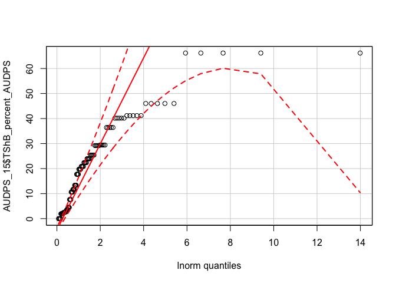

``` r
qqp(AUDPS_15$TShB_percent_AUDPS, "exp")
```

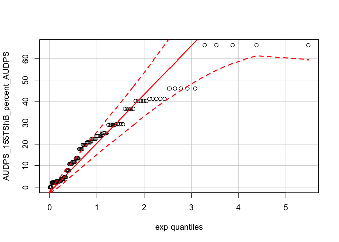

``` r
qqp(AUDPS_15$TShB_percent_AUDPS, "chisq", df = 2)
```


2015 Leaf Severity
------------------

``` r
qqp(AUDPS_15$LShB_percent_AUDPS, "norm")
```

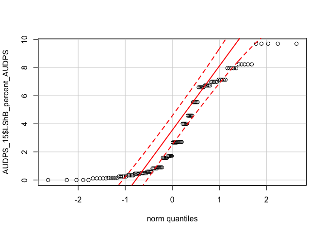

``` r
qqp(AUDPS_15$LShB_percent_AUDPS, "lnorm")
```

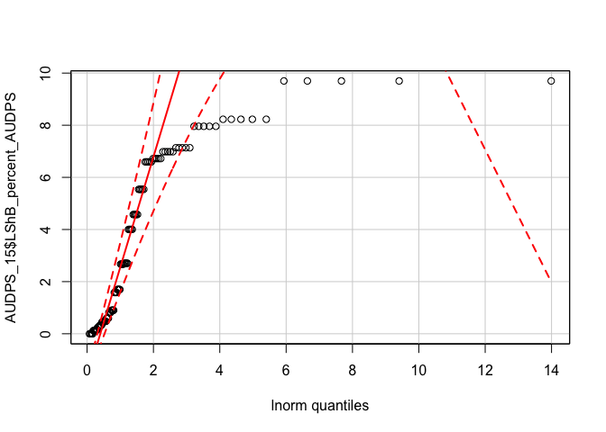

``` r
qqp(AUDPS_15$LShB_percent_AUDPS, "exp")
```

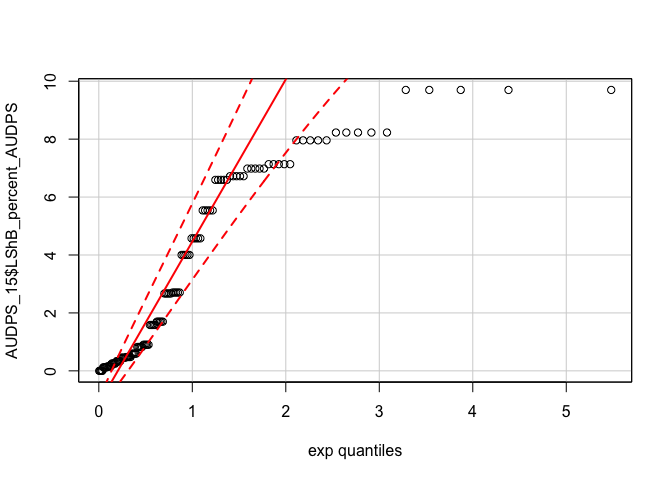

``` r
qqp(AUDPS_15$LShB_percent_AUDPS, "chisq", df = 2)
```


2016 Tiller Incidence
---------------------

``` r
qqp(AUDPS_16$TShB_inc_AUDPS, "norm")
```

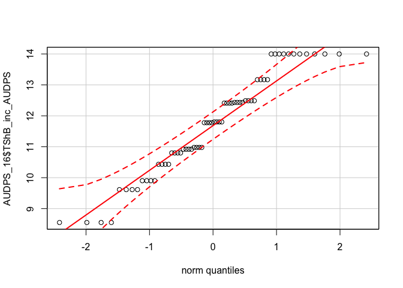

``` r
qqp(AUDPS_16$TShB_inc_AUDPS, "lnorm")
```


``` r
qqp(AUDPS_16$TShB_inc_AUDPS, "exp")
```

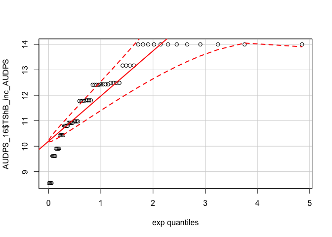

``` r
qqp(AUDPS_16$TShB_inc_AUDPS, "chisq", df = 2)
```

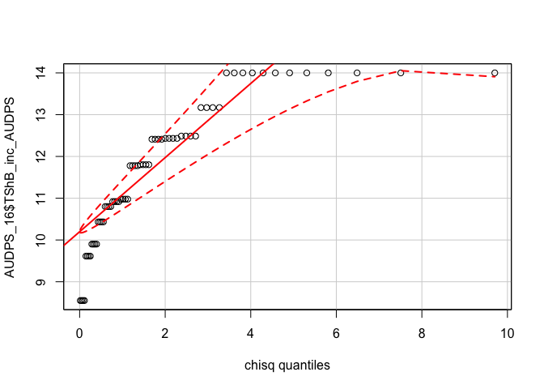

2016 Tiller Severity
--------------------

``` r
qqp(AUDPS_16$TShB_percent_AUDPS, "norm")
```

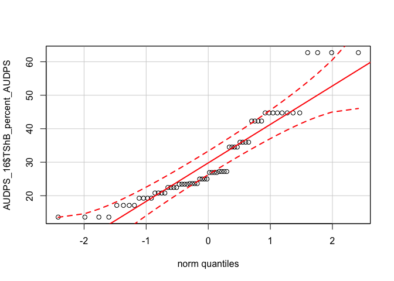

``` r
qqp(AUDPS_16$TShB_percent_AUDPS, "lnorm")
```

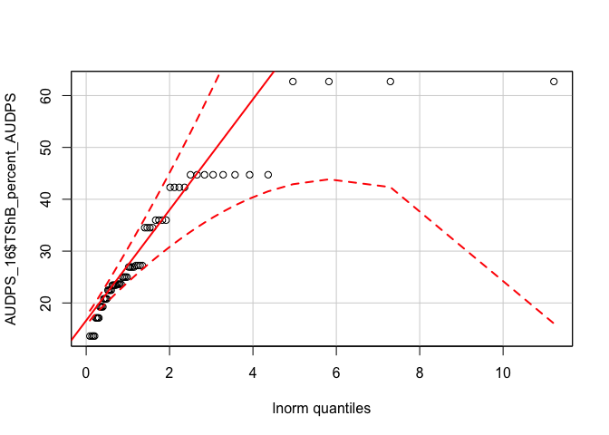

``` r
qqp(AUDPS_16$TShB_percent_AUDPS, "exp")
```


``` r
qqp(AUDPS_16$TShB_percent_AUDPS, "chisq", df = 2)
```


2016 Leaf Severity
------------------

``` r
qqp(AUDPS_16$LShB_percent_AUDPS, "norm")
```

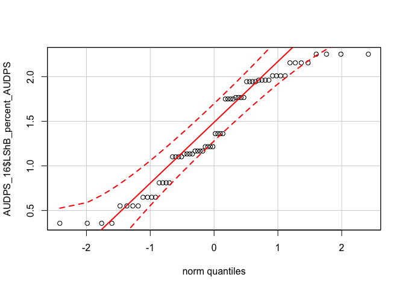

``` r
qqp(AUDPS_16$LShB_percent_AUDPS, "lnorm")
```


``` r
qqp(AUDPS_16$LShB_percent_AUDPS, "exp")
```


``` r
qqp(AUDPS_16$LShB_percent_AUDPS, "chisq", df = 2)
```

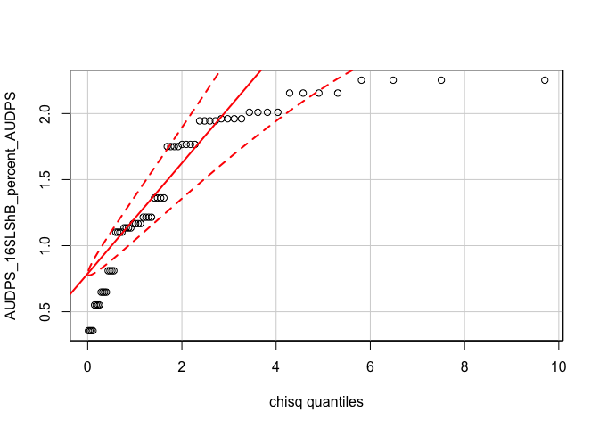

Based on these graphs, few of the data are a good fit for a normal distribution. Ideally, we want to see the residuals close to the solid line and between the dotted lines. Several of the data do not exhibit this behaviour, which suggests that using an analysis that does need these assumptions to be met, *e.g.* a Bayesian analysis method should be used. The *MCMCglmm* package provides an easy way to implement this type of analysis. The analyses can be found in the [02\_MCMCglmm\_analysis.md](02_MCMCglmm_analysis.md) file.

R Session Info
--------------

    ## Session info -------------------------------------------------------------

    ##  setting  value                       
    ##  version  R version 3.4.1 (2017-06-30)
    ##  system   x86_64, darwin15.6.0        
    ##  ui       X11                         
    ##  language (EN)                        
    ##  collate  en_AU.UTF-8                 
    ##  tz       Australia/Brisbane          
    ##  date     2017-08-24

    ## Packages -----------------------------------------------------------------

    ##  package         * version    date       source                          
    ##  agricolae       * 1.2-6      2017-08-05 cran (@1.2-6)                   
    ##  AlgDesign         1.1-7.3    2014-10-15 CRAN (R 3.4.0)                  
    ##  ape             * 4.1        2017-02-14 CRAN (R 3.4.0)                  
    ##  assertthat        0.2.0      2017-04-11 CRAN (R 3.4.1)                  
    ##  backports         1.1.0      2017-05-22 CRAN (R 3.4.1)                  
    ##  base            * 3.4.1      2017-07-07 local                           
    ##  bindr             0.1        2016-11-13 CRAN (R 3.4.1)                  
    ##  bindrcpp        * 0.2        2017-06-17 CRAN (R 3.4.1)                  
    ##  bitops            1.0-6      2013-08-17 CRAN (R 3.4.1)                  
    ##  boot              1.3-19     2017-04-21 CRAN (R 3.4.1)                  
    ##  broom             0.4.2      2017-02-13 CRAN (R 3.4.1)                  
    ##  car             * 2.1-5      2017-07-04 CRAN (R 3.4.1)                  
    ##  caTools           1.17.1     2014-09-10 CRAN (R 3.4.1)                  
    ##  cellranger        1.1.0      2016-07-27 CRAN (R 3.4.1)                  
    ##  cluster           2.0.6      2017-03-10 CRAN (R 3.4.1)                  
    ##  coda            * 0.19-1     2016-12-08 CRAN (R 3.4.0)                  
    ##  colorspace        1.3-2      2016-12-14 CRAN (R 3.4.1)                  
    ##  combinat          0.0-8      2012-10-29 CRAN (R 3.4.0)                  
    ##  compiler          3.4.1      2017-07-07 local                           
    ##  corpcor           1.6.9      2017-04-01 CRAN (R 3.4.0)                  
    ##  cubature          1.3-11     2017-07-19 CRAN (R 3.4.1)                  
    ##  datasets        * 3.4.1      2017-07-07 local                           
    ##  deldir            0.1-14     2017-04-22 CRAN (R 3.4.0)                  
    ##  devtools          1.13.3     2017-08-02 cran (@1.13.3)                  
    ##  digest            0.6.12     2017-01-27 CRAN (R 3.4.1)                  
    ##  dplyr           * 0.7.2      2017-07-20 CRAN (R 3.4.1)                  
    ##  evaluate          0.10.1     2017-06-24 CRAN (R 3.4.1)                  
    ##  expm              0.999-2    2017-03-29 CRAN (R 3.4.0)                  
    ##  fitdistrplus    * 1.0-9      2017-03-24 CRAN (R 3.4.0)                  
    ##  forcats           0.2.0      2017-01-23 CRAN (R 3.4.1)                  
    ##  foreign           0.8-69     2017-06-21 CRAN (R 3.4.1)                  
    ##  gdata             2.18.0     2017-06-06 CRAN (R 3.4.0)                  
    ##  ggplot2         * 2.2.1      2016-12-30 CRAN (R 3.4.1)                  
    ##  glue              1.1.1      2017-06-21 CRAN (R 3.4.1)                  
    ##  gmodels           2.16.2     2015-07-22 CRAN (R 3.4.0)                  
    ##  gplots            3.0.1      2016-03-30 CRAN (R 3.4.0)                  
    ##  graphics        * 3.4.1      2017-07-07 local                           
    ##  grDevices       * 3.4.1      2017-07-07 local                           
    ##  grid              3.4.1      2017-07-07 local                           
    ##  gtable            0.2.0      2016-02-26 CRAN (R 3.4.1)                  
    ##  gtools            3.5.0      2015-05-29 CRAN (R 3.4.0)                  
    ##  haven             1.1.0      2017-07-09 CRAN (R 3.4.1)                  
    ##  hms               0.3        2016-11-22 CRAN (R 3.4.1)                  
    ##  htmltools         0.3.6      2017-04-28 CRAN (R 3.4.1)                  
    ##  httr              1.3.1      2017-08-20 cran (@1.3.1)                   
    ##  jsonlite          1.5        2017-06-01 CRAN (R 3.4.1)                  
    ##  KernSmooth        2.23-15    2015-06-29 CRAN (R 3.4.1)                  
    ##  klaR              0.6-12     2014-08-06 CRAN (R 3.4.0)                  
    ##  knitr             1.17       2017-08-10 cran (@1.17)                    
    ##  labeling          0.3        2014-08-23 CRAN (R 3.4.1)                  
    ##  lattice         * 0.20-35    2017-03-25 CRAN (R 3.4.1)                  
    ##  lazyeval          0.2.0      2016-06-12 CRAN (R 3.4.1)                  
    ##  LearnBayes        2.15       2014-05-29 CRAN (R 3.4.0)                  
    ##  lme4              1.1-13     2017-04-19 CRAN (R 3.4.0)                  
    ##  lubridate       * 1.6.0      2016-09-13 CRAN (R 3.4.1)                  
    ##  magrittr          1.5        2014-11-22 CRAN (R 3.4.1)                  
    ##  MASS            * 7.3-47     2017-04-21 CRAN (R 3.4.1)                  
    ##  Matrix          * 1.2-10     2017-05-03 CRAN (R 3.4.1)                  
    ##  MatrixModels      0.4-1      2015-08-22 CRAN (R 3.4.0)                  
    ##  MCMCglmm        * 2.24       2016-11-14 CRAN (R 3.4.0)                  
    ##  memoise           1.1.0      2017-04-21 CRAN (R 3.4.1)                  
    ##  methods         * 3.4.1      2017-07-07 local                           
    ##  mgcv              1.8-17     2017-02-08 CRAN (R 3.4.0)                  
    ##  minqa             1.2.4      2014-10-09 CRAN (R 3.4.0)                  
    ##  mnormt            1.5-5      2016-10-15 CRAN (R 3.4.0)                  
    ##  modelr            0.1.1      2017-07-24 CRAN (R 3.4.1)                  
    ##  munsell           0.4.3      2016-02-13 CRAN (R 3.4.1)                  
    ##  nlme              3.1-131    2017-02-06 CRAN (R 3.4.0)                  
    ##  nloptr            1.0.4      2014-08-04 CRAN (R 3.4.0)                  
    ##  nnet              7.3-12     2016-02-02 CRAN (R 3.4.1)                  
    ##  parallel          3.4.1      2017-07-07 local                           
    ##  pbkrtest          0.4-7      2017-03-15 CRAN (R 3.4.0)                  
    ##  pkgconfig         2.0.1      2017-03-21 CRAN (R 3.4.1)                  
    ##  plotMCMC        * 2.0-0      2014-03-12 CRAN (R 3.4.0)                  
    ##  plyr              1.8.4      2016-06-08 CRAN (R 3.4.1)                  
    ##  ProjectTemplate * 0.8        2017-08-09 cran (@0.8)                     
    ##  psych             1.7.5      2017-05-03 CRAN (R 3.4.1)                  
    ##  purrr           * 0.2.3      2017-08-02 cran (@0.2.3)                   
    ##  quantreg          5.33       2017-04-18 CRAN (R 3.4.0)                  
    ##  R6                2.2.2      2017-06-17 CRAN (R 3.4.1)                  
    ##  Rcpp              0.12.12    2017-07-15 CRAN (R 3.4.1)                  
    ##  readr           * 1.1.1      2017-05-16 CRAN (R 3.4.1)                  
    ##  readxl            1.0.0      2017-04-18 CRAN (R 3.4.1)                  
    ##  reshape2        * 1.4.2      2016-10-22 CRAN (R 3.4.1)                  
    ##  rlang             0.1.2.9000 2017-08-21 Github (tidyverse/rlang@f20124b)
    ##  rmarkdown         1.6        2017-06-15 CRAN (R 3.4.1)                  
    ##  rprojroot         1.2        2017-01-16 CRAN (R 3.4.1)                  
    ##  rvest             0.3.2      2016-06-17 CRAN (R 3.4.1)                  
    ##  scales            0.4.1      2016-11-09 CRAN (R 3.4.1)                  
    ##  sp                1.2-5      2017-06-29 CRAN (R 3.4.1)                  
    ##  SparseM           1.77       2017-04-23 CRAN (R 3.4.0)                  
    ##  spdep             0.6-13     2017-04-25 CRAN (R 3.4.0)                  
    ##  splines           3.4.1      2017-07-07 local                           
    ##  stats           * 3.4.1      2017-07-07 local                           
    ##  stringi           1.1.5      2017-04-07 CRAN (R 3.4.1)                  
    ##  stringr           1.2.0      2017-02-18 CRAN (R 3.4.1)                  
    ##  survival        * 2.41-3     2017-04-04 CRAN (R 3.4.1)                  
    ##  tensorA           0.36       2010-12-01 CRAN (R 3.4.0)                  
    ##  tibble          * 1.3.3      2017-05-28 CRAN (R 3.4.1)                  
    ##  tidyr           * 0.7.0      2017-08-16 cran (@0.7.0)                   
    ##  tidyselect        0.1.1      2017-07-24 cran (@0.1.1)                   
    ##  tidyverse       * 1.1.1      2017-01-27 CRAN (R 3.4.1)                  
    ##  tools             3.4.1      2017-07-07 local                           
    ##  utils           * 3.4.1      2017-07-07 local                           
    ##  withr             2.0.0      2017-07-28 cran (@2.0.0)                   
    ##  xml2              1.1.1      2017-01-24 CRAN (R 3.4.1)                  
    ##  yaml              2.1.14     2016-11-12 CRAN (R 3.4.1)
