Analysis of split plot design using MCMCglmm
================

Notes on this analysis before starting
--------------------------------------

The analyses are semi-automated. When this file is knit, it automatically loads the *ProjectTemplate* package and calls the `load.project()` function. This loads the data, cleans and munges it creating the `AUDPS` data frame used for the analysis below. The scripts used to clean and munge the data are located in the [munge](./munge) folder and numbered in the sequential order in which they are run.

#### How to interpret these analyses

For a quick overview, see this thread on Stack Overflow that walks through the output of `summary.MCMCglmm`, which is used below. [R: Making sense of the output of a MCMCglmm](http://stackoverflow.com/questions/20993643/r-making-sense-of-the-output-of-a-mcmcglmm)

The MCMCglmm documentation is more in-depth but should still be referenced.

``` r
library(MCMCglmm)
vignette("Overview")
vignette("CourseNotes")
```

#### Changes between 2015 and 2016

Before the analysis, note that due to changes between the years, the analysis must be carried out on each year separately. The 2015 data and 2016 data cannot be combined due to changes in inoculation methods; there are other changes too, but the main one is this. Therefore, the analyses will be conducted separately for leaf severity and Leaf severity for 2015 dry season and 2016 dry season. Comparisons will only be observational and cannot be statistically compared.

#### Iterations

Fitting the models with the default iterations resulted in some less than acceptable models. Because of this, the number of iterations has been increased, `nitt = 5e+05` and `burnin = 5000` and `thin = 100`. This results in much smaller errors for random effects and better models.

Setup
-----

Use `set.seed()` for reproducibility.

``` r
set.seed(27)
```

The `AUDPS` object is created when the project is loaded, in the file [munge/03\_preprocess\_data.R](./munge/03_preprocess_data.R). However, because it is a `tibble` and the treatments exist in a single column for graphing the raw data, this object needs a few minor changes to be usable for the analysis.

First, separate the TRT column into the two treatments for analysis

``` r
AUDPS <- separate(data = AUDPS, col = TRT, sep = "_", into = c("WMGT", "NRTE"))
AUDPS <- mutate_at(.tbl = AUDPS, .funs = factor, .vars = c("WMGT", "NRTE"))
```

Now create individual data frames for the analysis.

``` r
AUDPS_2015 <- as.data.frame(AUDPS[AUDPS$YEAR == 2015, ])
AUDPS_2015 <- droplevels(AUDPS_2015)

AUDPS_16 <- as.data.frame(AUDPS[AUDPS$YEAR == 2016, ])
AUDPS_16 <- droplevels(AUDPS_16)
```

Now that the `AUDPS_15` and `AUDPS_16` `data.frames` exist, we can start the analysis.

2015
----

### 2015 Tiller Sheath Blight Incidence Model

``` r
eprior <- list(R = list(V = 1, nu = 0.02),
               G = list(G1 = list(V = 1, nu = 0.02, alpha.V = 1000)))
TShB_incidence_lmm_2015 <- MCMCglmm(TShB_inc_AUDPS ~ WMGT * NRTE,
                                    random = ~REP, 
                          data = AUDPS_2015,
                          verbose = FALSE,
                          prior = eprior,
                          nitt = 5e+05,
                          burnin = 5000,
                          thin = 100,
                          pr = TRUE)

summary(TShB_incidence_lmm_2015)
```

    ## 
    ##  Iterations = 5001:499901
    ##  Thinning interval  = 100
    ##  Sample size  = 4950 
    ## 
    ##  DIC: 330.8031 
    ## 
    ##  G-structure:  ~REP
    ## 
    ##     post.mean  l-95% CI u-95% CI eff.samp
    ## REP     1.163 0.0004146    3.817     4950
    ## 
    ##  R-structure:  ~units
    ## 
    ##       post.mean l-95% CI u-95% CI eff.samp
    ## units    0.8547   0.6412     1.09     5119
    ## 
    ##  Location effects: TShB_inc_AUDPS ~ WMGT * NRTE 
    ## 
    ##                  post.mean l-95% CI u-95% CI eff.samp   pMCMC    
    ## (Intercept)        1.05573  0.09282  2.12552     4950 0.04848 *  
    ## WMGTFLD            0.22367 -0.33339  0.83213     4950 0.45414    
    ## NRTEN100           0.86051  0.27270  1.42425     4950 0.00162 ** 
    ## NRTEN120           1.30319  0.70100  1.87254     4950 < 2e-04 ***
    ## WMGTFLD:NRTEN100  -0.45456 -1.27325  0.35989     4950 0.27798    
    ## WMGTFLD:NRTEN120  -0.57833 -1.43385  0.23340     4950 0.17980    
    ## ---
    ## Signif. codes:  0 '***' 0.001 '**' 0.01 '*' 0.05 '.' 0.1 ' ' 1

``` r
# create data frames for generating diagnostic plots
reps <- data.frame(TShB_incidence_lmm_2015$Sol[, c(1, 7:10)])
reps <- melt(reps)
```

    ## No id variables; using all as measure variables

``` r
trts <-  data.frame(TShB_incidence_lmm_2015$Sol[, 2:6])
trts <- melt(trts)
```

    ## No id variables; using all as measure variables

``` r
# Create a dummy x-axis variable for plotting
x <- 1:nrow(TShB_incidence_lmm_2015$Sol)

# diagnostic line plots for replicate
plot_diagnostic_lines(d = reps,
                      x = x,
                      title = "2015 Diagnostic Plots for Replicates, Tiller ShB Incidence")
```

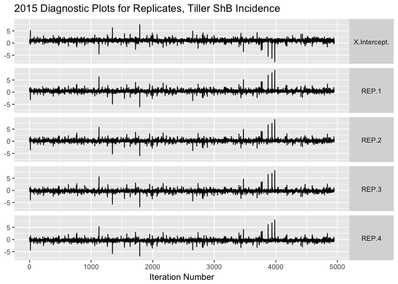

``` r
# posterior distributions for replicate
plot_replicate_posteriors(d = reps,
                          title = "2015 Reps Replicate Posteriors for Replicates, Tiller ShB Incidence")
```


``` r
# diagnostic line plots for treatments
plot_diagnostic_lines(d = trts,
                      x = x,
                      title = "2015 Diagnostic Plots for Treatments, Tiller ShB Incidence")
```

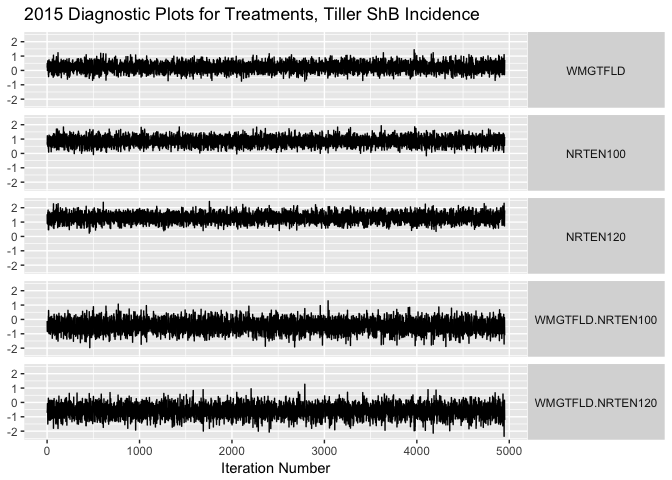

``` r
# Posterior distributions for treatment
plot_treatment_posteriors(d = trts,
                          title = "2015 Posteriors for Treatments, Tiller ShB Incidence")
```

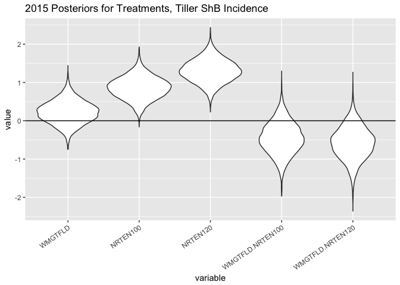

``` r
# check random effects
plotTrace(TShB_incidence_lmm_2015$VCV, log = TRUE)
```

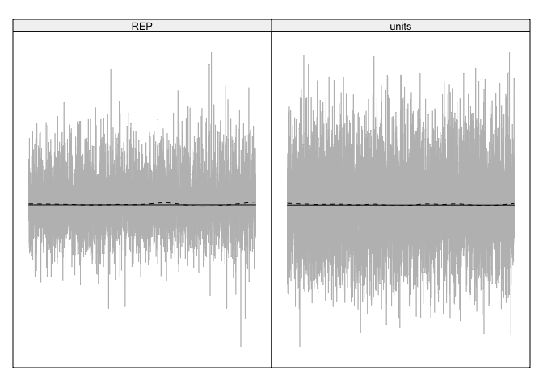

``` r
# plot joint distibution of error
rdf <- data.frame(TShB_incidence_lmm_2015$VCV)
plot_joint_random_error_dist(d = rdf,
                             title = ("2015 Random Error Distribution for Tiller ShB Incidence"))
```

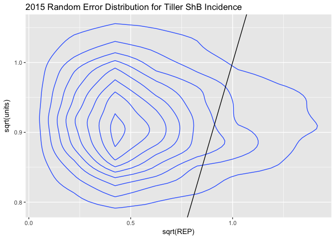

### 2015 Tiller Sheath Blight Severity Model

``` r
eprior <- list(R = list(V = 1, nu = 0.02),
               G = list(G1 = list(V = 1, nu = 0.02, alpha.V = 1000)))
TShB_severity_lmm_2015 <- MCMCglmm(TShB_percent_AUDPS ~ WMGT * NRTE,
                                    random = ~REP, 
                          data = AUDPS_2015,
                          verbose = FALSE,
                          prior = eprior,
                          nitt = 5e+05,
                          burnin = 5000,
                          thin = 100,
                          pr = TRUE)

summary(TShB_severity_lmm_2015)
```

    ## 
    ##  Iterations = 5001:499901
    ##  Thinning interval  = 100
    ##  Sample size  = 4950 
    ## 
    ##  DIC: 980.4397 
    ## 
    ##  G-structure:  ~REP
    ## 
    ##     post.mean  l-95% CI u-95% CI eff.samp
    ## REP     38.87 5.345e-08    128.6     4950
    ## 
    ##  R-structure:  ~units
    ## 
    ##       post.mean l-95% CI u-95% CI eff.samp
    ## units     193.2    144.1    245.9     5154
    ## 
    ##  Location effects: TShB_percent_AUDPS ~ WMGT * NRTE 
    ## 
    ##                  post.mean l-95% CI u-95% CI eff.samp    pMCMC    
    ## (Intercept)        10.8802   2.8754  19.5271     4950 0.013333 *  
    ## WMGTFLD            -4.2804 -13.1594   4.2087     4950 0.335758    
    ## NRTEN100           23.7202  15.3592  33.1669     4950  < 2e-04 ***
    ## NRTEN120           16.1934   6.9771  24.5803     4950 0.000808 ***
    ## WMGTFLD:NRTEN100  -13.4026 -25.4225  -0.7932     4950 0.033535 *  
    ## WMGTFLD:NRTEN120    1.1310 -11.1241  12.8806     5245 0.842020    
    ## ---
    ## Signif. codes:  0 '***' 0.001 '**' 0.01 '*' 0.05 '.' 0.1 ' ' 1

``` r
# create data frames for generating diagnostic plots
reps <- data.frame(TShB_severity_lmm_2015$Sol[, c(1, 7:10)])
reps <- melt(reps)
```

    ## No id variables; using all as measure variables

``` r
trts <-  data.frame(TShB_severity_lmm_2015$Sol[, 2:6])
trts <- melt(trts)
```

    ## No id variables; using all as measure variables

``` r
# Create a dummy x-axis variable for plotting
x <- 1:nrow(TShB_severity_lmm_2015$Sol)

# diagnostic line plots for replicate
plot_diagnostic_lines(d = reps,
                      x = x,
                      title = "2015 Diagnostic Plots for Replicates, Tiller ShB Severity")
```

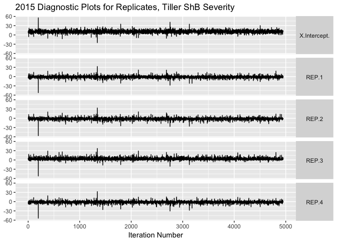

``` r
# posterior distributions for replicate
plot_replicate_posteriors(d = reps,
                          title = "2015 Reps Replicate Posteriors for Replicates, Tiller ShB Severity")
```


``` r
# diagnostic line plots for treatments
plot_diagnostic_lines(d = trts,
                      x = x,
                      title = "2015 Diagnostic Plots for Treatments, Tiller ShB Severity")
```

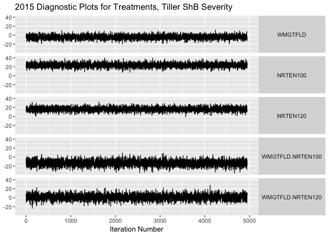

``` r
# Posterior distributions for treatment
plot_treatment_posteriors(d = trts,
                          title = "2015 Posteriors for Treatments, Tiller ShB Severity")
```

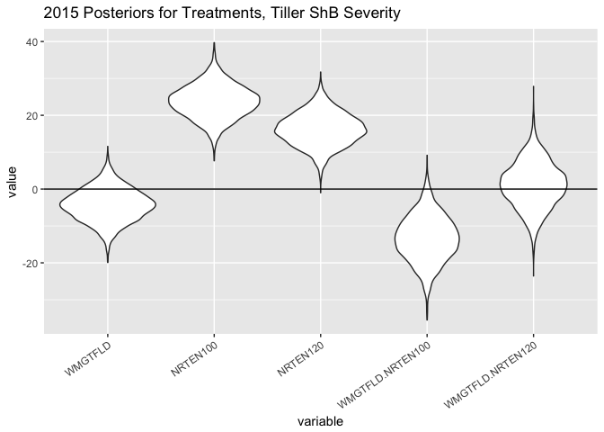

``` r
# check random effects
plotTrace(TShB_severity_lmm_2015$VCV, log = TRUE)
```

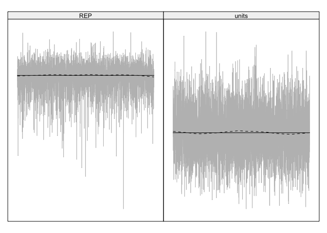

``` r
# plot joint distibution of error
rdf <- data.frame(TShB_severity_lmm_2015$VCV)
plot_joint_random_error_dist(d = rdf,
                             title = ("2015 Random Error Distribution for Tiller ShB Severity"))
```

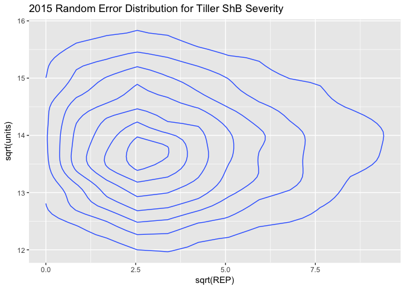

### 2015 Leaf Sheath Blight Severity Model

``` r
eprior <- list(R = list(V = 1, nu = 0.02),
               G = list(G1 = list(V = 1, nu = 0.02, alpha.V = 1000)))
LShB_severity_lmm_2015 <- MCMCglmm(LShB_percent_AUDPS ~ WMGT * NRTE,
                                    random = ~REP, 
                          data = AUDPS_2015,
                          verbose = FALSE,
                          prior = eprior,
                          nitt = 5e+05,
                          burnin = 5000,
                          thin = 100,
                          pr = TRUE)

summary(LShB_severity_lmm_2015)
```

    ## 
    ##  Iterations = 5001:499901
    ##  Thinning interval  = 100
    ##  Sample size  = 4950 
    ## 
    ##  DIC: 549.6104 
    ## 
    ##  G-structure:  ~REP
    ## 
    ##     post.mean l-95% CI u-95% CI eff.samp
    ## REP     10.15   0.2621    33.89     4950
    ## 
    ##  R-structure:  ~units
    ## 
    ##       post.mean l-95% CI u-95% CI eff.samp
    ## units      5.32    3.909    6.758     4950
    ## 
    ##  Location effects: LShB_percent_AUDPS ~ WMGT * NRTE 
    ## 
    ##                  post.mean l-95% CI u-95% CI eff.samp  pMCMC    
    ## (Intercept)         0.6724  -2.6627   3.7706     4950 0.5398    
    ## WMGTFLD             1.2026  -0.1499   2.6530     4950 0.0865 .  
    ## NRTEN100            5.0970   3.7189   6.5425     4950 <2e-04 ***
    ## NRTEN120            4.3373   2.8595   5.7669     4950 <2e-04 ***
    ## WMGTFLD:NRTEN100   -4.2496  -6.3004  -2.2677     4950 <2e-04 ***
    ## WMGTFLD:NRTEN120   -2.4312  -4.4611  -0.5480     4518 0.0198 *  
    ## ---
    ## Signif. codes:  0 '***' 0.001 '**' 0.01 '*' 0.05 '.' 0.1 ' ' 1

``` r
# create data frames for generating diagnostic plots
reps <- data.frame(LShB_severity_lmm_2015$Sol[, c(1, 7:10)])
reps <- melt(reps)
```

    ## No id variables; using all as measure variables

``` r
trts <-  data.frame(LShB_severity_lmm_2015$Sol[, 2:6])
trts <- melt(trts)
```

    ## No id variables; using all as measure variables

``` r
# Create a dummy x-axis variable for plotting
x <- 1:nrow(LShB_severity_lmm_2015$Sol)

# diagnostic line plots for replicate
plot_diagnostic_lines(d = reps,
                      x = x,
                      title = "2015 Diagnostic Plots for Replicates, Leaf ShB Severity")
```

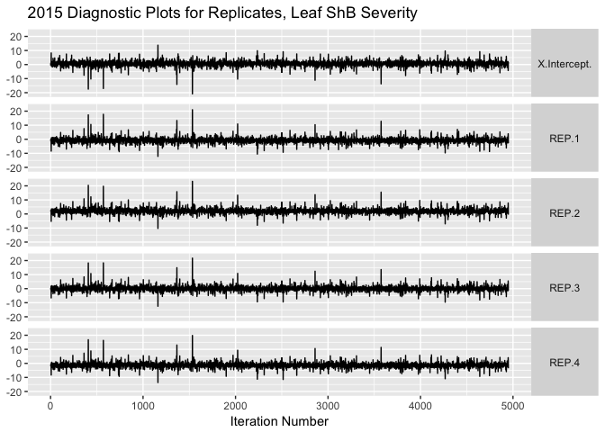

``` r
# posterior distributions for replicate
plot_replicate_posteriors(d = reps,
                          title = "2015 Reps Replicate Posteriors for Replicates, Leaf ShB Severity")
```


``` r
# diagnostic line plots for treatments
plot_diagnostic_lines(d = trts,
                      x = x,
                      title = "2015 Diagnostic Plots for Treatments, Leaf ShB Severity")
```

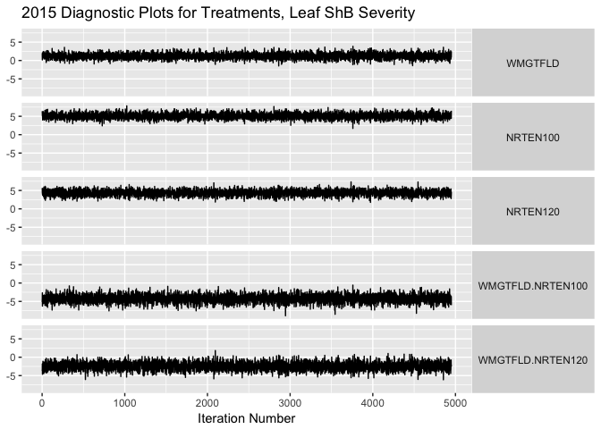

``` r
# Posterior distributions for treatment
plot_treatment_posteriors(d = trts,
                          title = "2015 Posteriors for Treatments, Leaf ShB Severity")
```

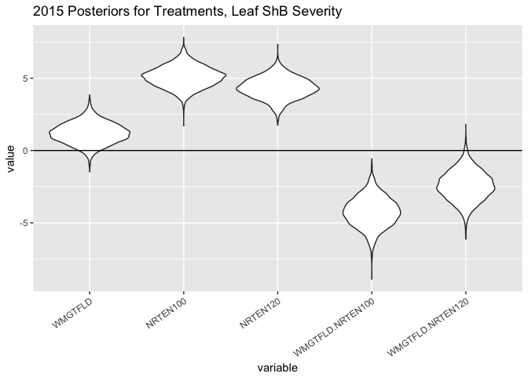

``` r
# check random effects
plotTrace(LShB_severity_lmm_2015$VCV, log = TRUE)
```

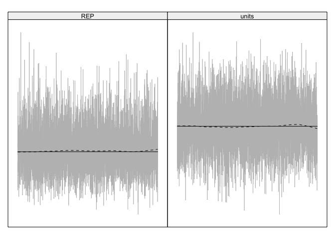

``` r
# plot joint distibution of error
rdf <- data.frame(LShB_severity_lmm_2015$VCV)
plot_joint_random_error_dist(d = rdf,
                             title = ("2015 Random Error Distribution for Leaf ShB Severity"))
```

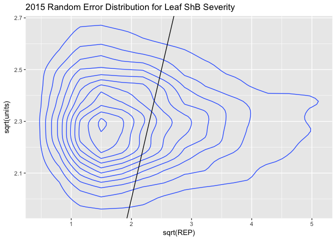

------------------------------------------------------------------------

2016
----

### 2016 Tiller Sheath Blight Incidence Model

``` r
eprior <- list(R = list(V = 1, nu = 0.02),
               G = list(G1 = list(V = 1, nu = 0.02, alpha.V = 1000)))

TShB_incidence_lmm_2016 <- MCMCglmm(TShB_inc_AUDPS ~ WMGT * NRTE, 
                                    random = ~REP, 
                          data = AUDPS_16,
                          verbose = FALSE,
                          prior = eprior,
                          nitt = 5e+05,
                          burnin = 5000,
                          thin = 100,
                          pr = TRUE)

summary(TShB_incidence_lmm_2016)
```

    ## 
    ##  Iterations = 5001:499901
    ##  Thinning interval  = 100
    ##  Sample size  = 4950 
    ## 
    ##  DIC: 187.0551 
    ## 
    ##  G-structure:  ~REP
    ## 
    ##     post.mean l-95% CI u-95% CI eff.samp
    ## REP     5.186  0.09985    16.64     4950
    ## 
    ##  R-structure:  ~units
    ## 
    ##       post.mean l-95% CI u-95% CI eff.samp
    ## units    0.9824   0.6364    1.363     5135
    ## 
    ##  Location effects: TShB_inc_AUDPS ~ WMGT * NRTE 
    ## 
    ##                 post.mean  l-95% CI  u-95% CI eff.samp  pMCMC    
    ## (Intercept)     12.684651 10.498329 14.690101     4950 <2e-04 ***
    ## WMGTFLD          0.004514 -0.712805  0.666176     4559  0.996    
    ## NRTEN60         -1.537113 -2.231441 -0.891587     4950 <2e-04 ***
    ## WMGTFLD:NRTEN60 -0.774722 -1.767406  0.193410     4950  0.115    
    ## ---
    ## Signif. codes:  0 '***' 0.001 '**' 0.01 '*' 0.05 '.' 0.1 ' ' 1

``` r
# create data frames for generating diagnostic plots
reps <- data.frame(TShB_incidence_lmm_2016$Sol[, c(1, 5:8)])
reps <- melt(reps)
```

    ## No id variables; using all as measure variables

``` r
trts <-  data.frame(TShB_incidence_lmm_2016$Sol[, 2:4])
trts <- melt(trts)
```

    ## No id variables; using all as measure variables

``` r
# Create a dummy x-axis variable for plotting
x <- 1:nrow(TShB_incidence_lmm_2016$Sol)

# diagnostic line plots for replicate
plot_diagnostic_lines(d = reps,
                      x = x,
                      title = "2016 Diagnostic Plots for Replicates, Tiller ShB Incidence")
```

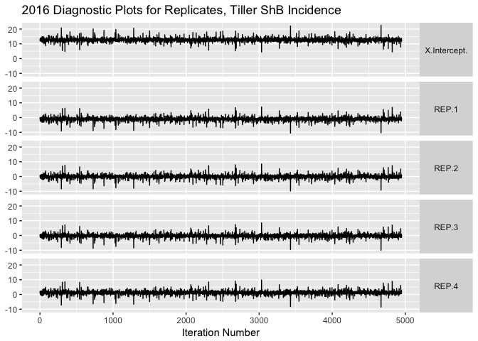

``` r
# posterior distributions for replicate
plot_replicate_posteriors(d = reps,
                          title = "2016 Reps Replicate Posteriors for Replicates, Tiller ShB Incidence")
```

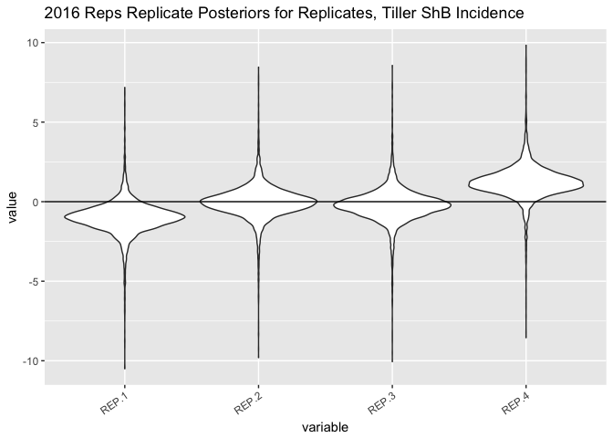

``` r
# diagnostic line plots for treatments
plot_diagnostic_lines(d = trts,
                      x = x,
                      title = "2016 Diagnostic Plots for Treatments, Tiller ShB Incidence")
```

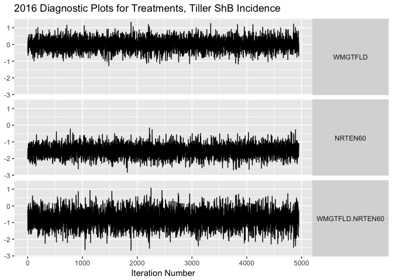

``` r
# Posterior distributions for treatment
plot_treatment_posteriors(d = trts,
                          title = "2016 Posteriors for Treatments, Tiller ShB Incidence")
```

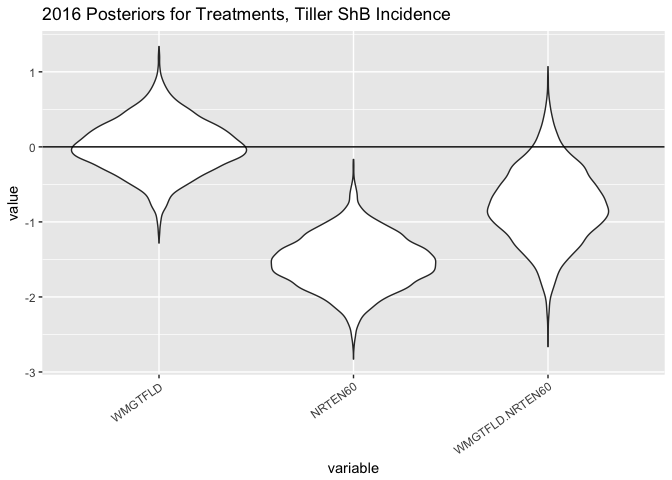

``` r
# check random effects
plotTrace(TShB_incidence_lmm_2016$VCV, log = TRUE)
```


``` r
# plot joint distibution of error
rdf <- data.frame(TShB_incidence_lmm_2016$VCV)
plot_joint_random_error_dist(d = rdf,
                             title = ("2016 Random Error Distribution for Tiller ShB Incidence"))
```

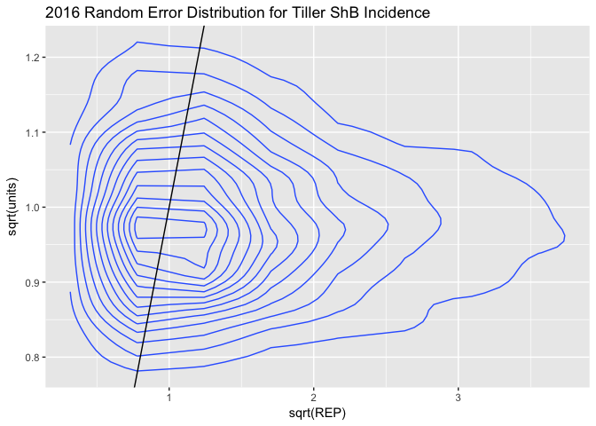

### 2016 Tiller Sheath Blight Severity Model

``` r
eprior <- list(R = list(V = 1, nu = 0.02),
               G = list(G1 = list(V = 1, nu = 0.02, alpha.V = 1000)))
TShB_severity_lmm_2016 <- MCMCglmm(TShB_percent_AUDPS ~ WMGT * NRTE,
                                    random = ~REP, 
                          data = AUDPS_16,
                          verbose = FALSE,
                          prior = eprior,
                          nitt = 5e+05,
                          burnin = 5000,
                          thin = 100,
                          pr = TRUE)

summary(TShB_severity_lmm_2016)
```

    ## 
    ##  Iterations = 5001:499901
    ##  Thinning interval  = 100
    ##  Sample size  = 4950 
    ## 
    ##  DIC: 462.8646 
    ## 
    ##  G-structure:  ~REP
    ## 
    ##     post.mean l-95% CI u-95% CI eff.samp
    ## REP     267.8     10.4    745.7     4950
    ## 
    ##  R-structure:  ~units
    ## 
    ##       post.mean l-95% CI u-95% CI eff.samp
    ## units     72.86     48.4    102.2     5351
    ## 
    ##  Location effects: TShB_percent_AUDPS ~ WMGT * NRTE 
    ## 
    ##                 post.mean l-95% CI u-95% CI eff.samp  pMCMC    
    ## (Intercept)       26.2450  10.3569  40.9267     4950 0.0141 *  
    ## WMGTFLD           12.7532   7.0270  18.7851     4950 <2e-04 ***
    ## NRTEN60           -0.2008  -6.1862   5.5885     4950 0.9491    
    ## WMGTFLD:NRTEN60   -8.9841 -16.9150  -0.2855     4950 0.0352 *  
    ## ---
    ## Signif. codes:  0 '***' 0.001 '**' 0.01 '*' 0.05 '.' 0.1 ' ' 1

``` r
# create data frames for generating diagnostic plots
reps <- data.frame(TShB_severity_lmm_2016$Sol[, c(1, 5:8)])
reps <- melt(reps)
```

    ## No id variables; using all as measure variables

``` r
trts <-  data.frame(TShB_severity_lmm_2016$Sol[, 2:4])
trts <- melt(trts)
```

    ## No id variables; using all as measure variables

``` r
# Create a dummy x-axis variable for plotting
x <- 1:nrow(TShB_severity_lmm_2016$Sol)

# diagnostic line plots for replicate
plot_diagnostic_lines(d = reps,
                      x = x,
                      title = "2016 Diagnostic Plots for Replicates, Tiller ShB Severity")
```

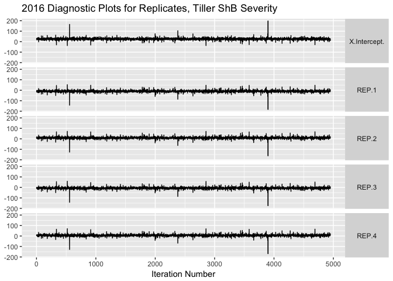

``` r
# posterior distributions for replicate
plot_replicate_posteriors(d = reps,
                          title = "2016 Reps Replicate Posteriors for Replicates, Tiller ShB Severity")
```

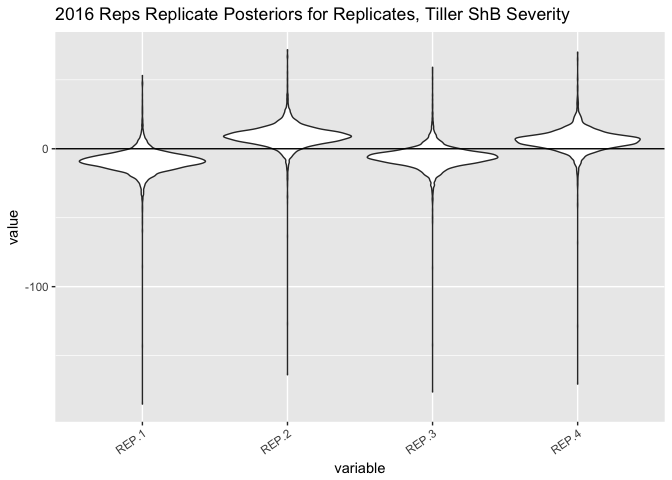

``` r
# diagnostic line plots for treatments
plot_diagnostic_lines(d = trts,
                      x = x,
                      title = "2016 Diagnostic Plots for Treatments, Tiller ShB Severity")
```

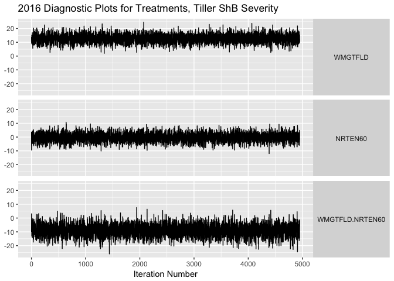

``` r
# Posterior distributions for treatment
plot_treatment_posteriors(d = trts,
                          title = "2016 Posteriors for Treatments, Tiller ShB Severity")
```

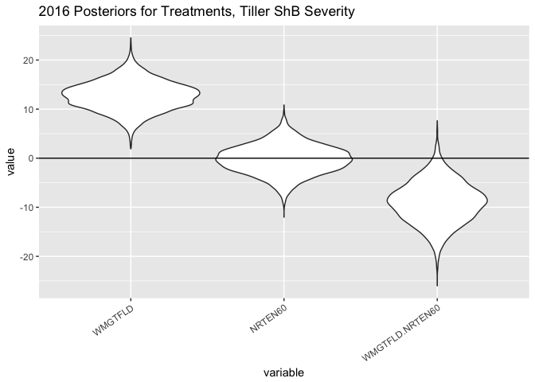

``` r
# check random effects
plotTrace(TShB_severity_lmm_2016$VCV, log = TRUE)
```

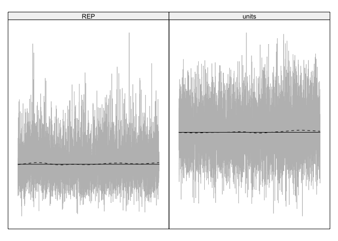

``` r
# plot joint distibution of error
rdf <- data.frame(TShB_severity_lmm_2016$VCV)
plot_joint_random_error_dist(d = rdf,
                             title = ("2016 Random Error Distribution for Tiller ShB Severity"))
```

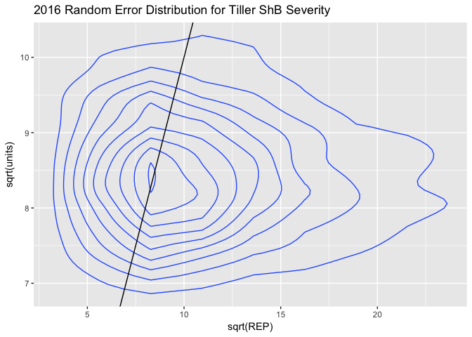

### 2016 Leaf Sheath Blight Severity Model

``` r
eprior <- list(R = list(V = 1, nu = 0.02),
               G = list(G1 = list(V = 1, nu = 0.02, alpha.V = 1000)))
LShB_severity_lmm_2016 <- MCMCglmm(LShB_percent_AUDPS ~ WMGT * NRTE,
                                    random = ~REP, 
                          data = AUDPS_16,
                          verbose = FALSE,
                          prior = eprior,
                          nitt = 5e+05,
                          burnin = 5000,
                          thin = 100,
                          pr = TRUE)

summary(LShB_severity_lmm_2016)
```

    ## 
    ##  Iterations = 5001:499901
    ##  Thinning interval  = 100
    ##  Sample size  = 4950 
    ## 
    ##  DIC: 85.01022 
    ## 
    ##  G-structure:  ~REP
    ## 
    ##     post.mean l-95% CI u-95% CI eff.samp
    ## REP     1.051  0.01496    3.436     4950
    ## 
    ##  R-structure:  ~units
    ## 
    ##       post.mean l-95% CI u-95% CI eff.samp
    ## units    0.1994   0.1336   0.2751     4950
    ## 
    ##  Location effects: LShB_percent_AUDPS ~ WMGT * NRTE 
    ## 
    ##                 post.mean l-95% CI u-95% CI eff.samp   pMCMC   
    ## (Intercept)       1.32767  0.41132  2.27194     4950 0.02384 * 
    ## WMGTFLD           0.24465 -0.07577  0.55093     4950 0.12283   
    ## NRTEN60           0.24335 -0.06666  0.55150     4315 0.12242   
    ## WMGTFLD:NRTEN60  -0.73441 -1.17030 -0.29765     4950 0.00242 **
    ## ---
    ## Signif. codes:  0 '***' 0.001 '**' 0.01 '*' 0.05 '.' 0.1 ' ' 1

``` r
# create data frames for generating diagnostic plots
reps <- data.frame(LShB_severity_lmm_2016$Sol[, c(1, 5:8)])
reps <- melt(reps)
```

    ## No id variables; using all as measure variables

``` r
trts <-  data.frame(LShB_severity_lmm_2016$Sol[, 2:4])
trts <- melt(trts)
```

    ## No id variables; using all as measure variables

``` r
# Create a dummy x-axis variable for plotting
x <- 1:nrow(LShB_severity_lmm_2016$Sol)

# diagnostic line plots for replicate
plot_diagnostic_lines(d = reps,
                      x = x,
                      title = "2016 Diagnostic Plots for Replicates, Leaf ShB Severity")
```


``` r
# posterior distributions for replicate
plot_replicate_posteriors(d = reps,
                          title = "2016 Reps Replicate Posteriors for Replicates, Leaf ShB Severity")
```

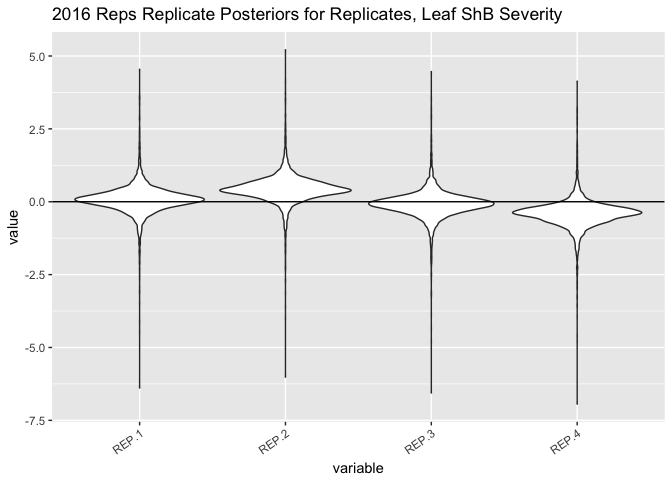

``` r
# diagnostic line plots for treatments
plot_diagnostic_lines(d = trts,
                      x = x,
                      title = "2016 Diagnostic Plots for Treatments, Leaf ShB Severity")
```

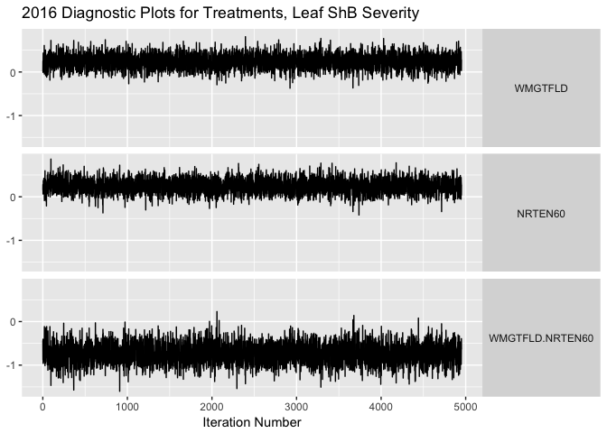

``` r
# Posterior distributions for treatment
plot_treatment_posteriors(d = trts,
                          title = "2016 Posteriors for Treatments, Leaf ShB Severity")
```

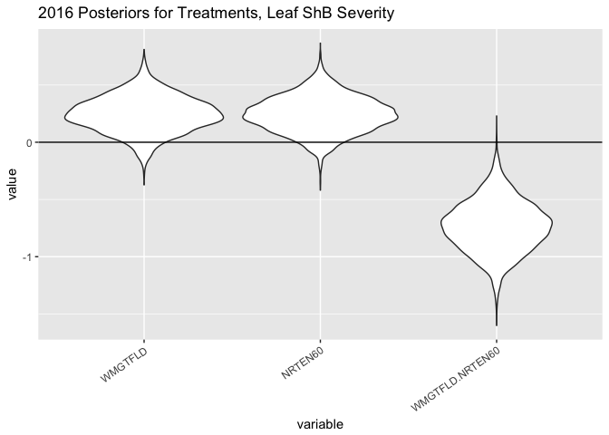

``` r
# check random effects
plotTrace(LShB_severity_lmm_2016$VCV, log = TRUE)
```

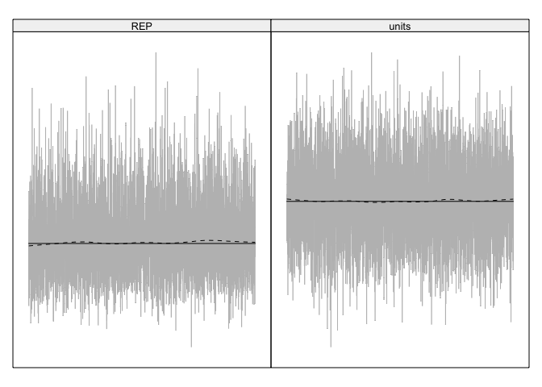

``` r
# plot joint distibution of error
rdf <- data.frame(LShB_severity_lmm_2016$VCV)
plot_joint_random_error_dist(d = rdf,
                             title = ("2016 Random Error Distribution for Leaf ShB Severity"))
```

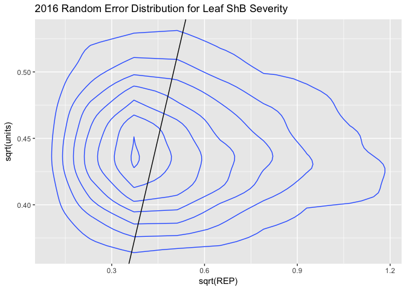

Conclusions
-----------

### Tiller Sheath Blight Incidence and Severity

In 2015 and 2016 the highest N treatments (note that they were different amounts in these two years) were significant in both the tiller sheath blight incidence and severity. In 2016 the flooding treatment was significant for tiller sheath blight severity.

### Leaf Sheath Blight Severity

In neither experiment was the leaf sheath blight affected by nitrogen rates or irrigation regime.

### Interactions of Nitrogen and Irrigation Regime

In 2015 no significant interaction was observed. In 2016 a significant interaction between flooding and nitrogen rate is observed for both the tiller and leaf severity ratings.

### Model Fit

The models all appear to be good fits.

None of the diagnostic plots show any signs of autocorrelation or any other obvious patterns.

The random effects all appear to be acceptable, the dotted line stays near to the solid line with no discernible patterns.

The random effects are all fairly equally distributed except for 2016 tiller sheath blight severity where water management:replicate has a larger effect. This is not surprising given that the plot and replicate sizes were different in 2016 due to the use of two fields in the IRRI experiment station, see the [2016 plot layout plan](https://github.com/adamhsparks/AWD_ShB_Interaction/blob/master/doc/Metadata/2016%20AWD%20ShB%20Metadata/ExptLayoutAWD2016.pdf).

R Session Info
--------------

    ## Session info -------------------------------------------------------------

    ##  setting  value                       
    ##  version  R version 3.4.1 (2017-06-30)
    ##  system   x86_64, darwin16.7.0        
    ##  ui       unknown                     
    ##  language (EN)                        
    ##  collate  en_AU.UTF-8                 
    ##  tz       Australia/Brisbane          
    ##  date     2017-07-31

    ## Packages -----------------------------------------------------------------

    ##  package         * version date       source        
    ##  agricolae       * 1.2-5   2017-07-26 cran (@1.2-5) 
    ##  AlgDesign         1.1-7.3 2014-10-15 CRAN (R 3.4.1)
    ##  ape             * 4.1     2017-02-14 CRAN (R 3.4.1)
    ##  assertthat        0.2.0   2017-04-11 CRAN (R 3.4.1)
    ##  backports         1.1.0   2017-05-22 CRAN (R 3.4.1)
    ##  base            * 3.4.1   2017-07-25 local         
    ##  bindr             0.1     2016-11-13 CRAN (R 3.4.1)
    ##  bindrcpp        * 0.2     2017-06-17 CRAN (R 3.4.1)
    ##  bitops            1.0-6   2013-08-17 CRAN (R 3.4.1)
    ##  boot              1.3-19  2017-02-11 CRAN (R 3.4.1)
    ##  broom             0.4.2   2017-02-13 CRAN (R 3.4.1)
    ##  car             * 2.1-5   2017-07-04 CRAN (R 3.4.1)
    ##  caTools           1.17.1  2014-09-10 CRAN (R 3.4.1)
    ##  cellranger        1.1.0   2016-07-27 CRAN (R 3.4.1)
    ##  cluster           2.0.6   2017-03-10 CRAN (R 3.4.1)
    ##  coda            * 0.19-1  2016-12-08 CRAN (R 3.4.1)
    ##  colorspace        1.3-2   2016-12-14 CRAN (R 3.4.1)
    ##  combinat          0.0-8   2012-10-29 CRAN (R 3.4.1)
    ##  compiler          3.4.1   2017-07-25 local         
    ##  corpcor           1.6.9   2017-04-01 CRAN (R 3.4.1)
    ##  cubature          1.3-11  2017-07-19 CRAN (R 3.4.1)
    ##  datasets        * 3.4.1   2017-07-25 local         
    ##  deldir            0.1-14  2017-04-22 CRAN (R 3.4.1)
    ##  devtools          1.13.2  2017-06-02 CRAN (R 3.4.1)
    ##  digest            0.6.12  2017-01-27 CRAN (R 3.4.1)
    ##  dplyr           * 0.7.2   2017-07-20 CRAN (R 3.4.1)
    ##  evaluate          0.10.1  2017-06-24 CRAN (R 3.4.1)
    ##  expm              0.999-2 2017-03-29 CRAN (R 3.4.1)
    ##  fitdistrplus    * 1.0-9   2017-03-24 CRAN (R 3.4.1)
    ##  forcats           0.2.0   2017-01-23 CRAN (R 3.4.1)
    ##  foreign           0.8-69  2017-06-22 CRAN (R 3.4.1)
    ##  gdata             2.18.0  2017-06-06 CRAN (R 3.4.1)
    ##  ggplot2         * 2.2.1   2016-12-30 CRAN (R 3.4.1)
    ##  glue              1.1.1   2017-06-21 CRAN (R 3.4.1)
    ##  gmodels           2.16.2  2015-07-22 CRAN (R 3.4.1)
    ##  gplots            3.0.1   2016-03-30 CRAN (R 3.4.1)
    ##  graphics        * 3.4.1   2017-07-25 local         
    ##  grDevices       * 3.4.1   2017-07-25 local         
    ##  grid              3.4.1   2017-07-25 local         
    ##  gtable            0.2.0   2016-02-26 CRAN (R 3.4.1)
    ##  gtools            3.5.0   2015-05-29 CRAN (R 3.4.1)
    ##  haven             1.1.0   2017-07-09 CRAN (R 3.4.1)
    ##  hms               0.3     2016-11-22 CRAN (R 3.4.1)
    ##  htmltools         0.3.6   2017-04-28 CRAN (R 3.4.1)
    ##  httr              1.2.1   2016-07-03 CRAN (R 3.4.1)
    ##  jsonlite          1.5     2017-06-01 CRAN (R 3.4.1)
    ##  KernSmooth        2.23-15 2015-06-29 CRAN (R 3.4.1)
    ##  klaR              0.6-12  2014-08-06 CRAN (R 3.4.1)
    ##  knitr             1.16    2017-05-18 CRAN (R 3.4.1)
    ##  labeling          0.3     2014-08-23 CRAN (R 3.4.1)
    ##  lattice         * 0.20-35 2017-03-25 CRAN (R 3.4.1)
    ##  lazyeval          0.2.0   2016-06-12 CRAN (R 3.4.1)
    ##  LearnBayes        2.15    2014-05-29 CRAN (R 3.4.1)
    ##  lme4              1.1-13  2017-04-19 CRAN (R 3.4.1)
    ##  lubridate       * 1.6.0   2016-09-13 CRAN (R 3.4.1)
    ##  magrittr          1.5     2014-11-22 CRAN (R 3.4.1)
    ##  MASS            * 7.3-47  2017-02-26 CRAN (R 3.4.1)
    ##  Matrix          * 1.2-10  2017-05-03 CRAN (R 3.4.1)
    ##  MatrixModels      0.4-1   2015-08-22 CRAN (R 3.4.1)
    ##  MCMCglmm        * 2.24    2016-11-14 CRAN (R 3.4.1)
    ##  memoise           1.1.0   2017-04-21 CRAN (R 3.4.1)
    ##  methods         * 3.4.1   2017-07-25 local         
    ##  mgcv              1.8-17  2017-02-08 CRAN (R 3.4.1)
    ##  minqa             1.2.4   2014-10-09 CRAN (R 3.4.1)
    ##  mnormt            1.5-5   2016-10-15 CRAN (R 3.4.1)
    ##  modelr            0.1.1   2017-07-24 CRAN (R 3.4.1)
    ##  munsell           0.4.3   2016-02-13 CRAN (R 3.4.1)
    ##  nlme              3.1-131 2017-02-06 CRAN (R 3.4.1)
    ##  nloptr            1.0.4   2014-08-04 CRAN (R 3.4.1)
    ##  nnet              7.3-12  2016-02-02 CRAN (R 3.4.1)
    ##  parallel          3.4.1   2017-07-25 local         
    ##  pbkrtest          0.4-7   2017-03-15 CRAN (R 3.4.1)
    ##  pkgconfig         2.0.1   2017-03-21 CRAN (R 3.4.1)
    ##  plotMCMC        * 2.0-0   2014-03-12 CRAN (R 3.4.1)
    ##  plyr              1.8.4   2016-06-08 CRAN (R 3.4.1)
    ##  ProjectTemplate * 0.7     2016-08-11 CRAN (R 3.4.1)
    ##  psych             1.7.5   2017-05-03 CRAN (R 3.4.1)
    ##  purrr           * 0.2.2.2 2017-05-11 CRAN (R 3.4.1)
    ##  quantreg          5.33    2017-04-18 CRAN (R 3.4.1)
    ##  R6                2.2.2   2017-06-17 CRAN (R 3.4.1)
    ##  Rcpp              0.12.12 2017-07-15 CRAN (R 3.4.1)
    ##  readr           * 1.1.1   2017-05-16 CRAN (R 3.4.1)
    ##  readxl            1.0.0   2017-04-18 CRAN (R 3.4.1)
    ##  reshape2        * 1.4.2   2016-10-22 CRAN (R 3.4.1)
    ##  rlang             0.1.1   2017-05-18 CRAN (R 3.4.1)
    ##  rmarkdown         1.6     2017-06-15 CRAN (R 3.4.1)
    ##  rprojroot         1.2     2017-01-16 CRAN (R 3.4.1)
    ##  rvest             0.3.2   2016-06-17 CRAN (R 3.4.1)
    ##  scales            0.4.1   2016-11-09 CRAN (R 3.4.1)
    ##  sp                1.2-5   2017-06-29 CRAN (R 3.4.1)
    ##  SparseM           1.77    2017-04-23 CRAN (R 3.4.1)
    ##  spdep             0.6-13  2017-04-25 CRAN (R 3.4.1)
    ##  splines           3.4.1   2017-07-25 local         
    ##  stats           * 3.4.1   2017-07-25 local         
    ##  stringi           1.1.5   2017-04-07 CRAN (R 3.4.1)
    ##  stringr           1.2.0   2017-02-18 CRAN (R 3.4.1)
    ##  survival        * 2.41-3  2017-04-04 CRAN (R 3.4.1)
    ##  tensorA           0.36    2010-12-01 CRAN (R 3.4.1)
    ##  tibble          * 1.3.3   2017-05-28 CRAN (R 3.4.1)
    ##  tidyr           * 0.6.3   2017-05-15 CRAN (R 3.4.1)
    ##  tidyverse       * 1.1.1   2017-01-27 CRAN (R 3.4.1)
    ##  tools             3.4.1   2017-07-25 local         
    ##  utils           * 3.4.1   2017-07-25 local         
    ##  withr             2.0.0   2017-07-28 cran (@2.0.0) 
    ##  xml2              1.1.1   2017-01-24 CRAN (R 3.4.1)
    ##  yaml              2.1.14  2016-11-12 CRAN (R 3.4.1)
