Analysis of split plot design using MCMCglmm
================

Notes on this analysis before starting
--------------------------------------

#### How to interpret these analyses

For a quick overview, see this thread on Stack Overflow that walks through the output of `summary.MCMCglmm`, which is used below. [R: Making sense of the output of a MCMCglmm](http://stackoverflow.com/questions/20993643/r-making-sense-of-the-output-of-a-mcmcglmm)

The MCMCglmm documentation is more in-depth but should still be referenced.

``` r
library(MCMCglmm)
vignette("Overview")
vignette("CourseNotes")
```

#### Changes between 2015 and 2016

Before the analysis, note that due to changes between the years, the analysis must be carried out on each year separately. The 2015 data and 2016 data cannot be combined due to changes in inoculation methods; there are other changes too, but the main one is this. Therefore, the analyses will be conducted separately for leaf severity and Leaf severity for 2015 dry season and 2016 dry season. Comparisons will only be observational and cannot be statistically compared.

#### Iterations

Fitting the models with the default iterations resulted in some less than acceptable models. Because of this, the number of iterations has been increased, `nitt = 5e+05` and `burnin = 5000` and `thin = 100`. This results in much smaller errors for random effects and better models.

Setup
-----

Use `set.seed()` for reproducibility.

``` r
set.seed(27)
```

2015
----

### 2015 Leaf Sheath Blight Severity Model

``` r
eprior <- list(R = list(V = 1, nu = 0.02),
               G = list(G1 = list(V = 1, nu = 0.02, alpha.V = 1000)))
LShB_lmm_2015 <- MCMCglmm(LShB_AUDPS ~ WMGT * NRTE,
                          random = ~REP, 
                          data = as.data.frame(AUDPS_2015),
                          verbose = FALSE,
                          prior = eprior,
                          nitt = 5e+05,
                          burnin = 5000,
                          thin = 100,
                          pr = TRUE)

summary(LShB_lmm_2015)
```

    ## 
    ##  Iterations = 5001:499901
    ##  Thinning interval  = 100
    ##  Sample size  = 4950 
    ## 
    ##  DIC: 32.53085 
    ## 
    ##  G-structure:  ~REP
    ## 
    ##     post.mean  l-95% CI u-95% CI eff.samp
    ## REP    0.3212 2.106e-10   0.6424     4950
    ## 
    ##  R-structure:  ~units
    ## 
    ##       post.mean l-95% CI u-95% CI eff.samp
    ## units    0.1739  0.06468   0.3076     5304
    ## 
    ##  Location effects: LShB_AUDPS ~ WMGT * NRTE 
    ## 
    ##                 post.mean l-95% CI u-95% CI eff.samp pMCMC
    ## (Intercept)       0.18276 -0.40852  0.68368     4950 0.470
    ## WMGTFLD           0.02199 -0.54582  0.59875     4604 0.952
    ## NRTE100           0.35849 -0.24375  0.92693     4950 0.207
    ## NRTE120           0.29549 -0.28844  0.85184     5166 0.289
    ## WMGTFLD:NRTE100  -0.35040 -1.20296  0.45835     4950 0.391
    ## WMGTFLD:NRTE120  -0.20466 -1.00060  0.63703     4950 0.600

``` r
# create data frames for generating diagnostic plots
reps <- data.frame(LShB_lmm_2015$Sol[, c(1, 7:10)])
x <- 1:nrow(reps)
reps <- melt(reps)
```

    ## No id variables; using all as measure variables

``` r
trts <-  data.frame(LShB_lmm_2015$Sol[, 2:6])
trts <- melt(trts)
```

    ## No id variables; using all as measure variables

``` r
# Create a dummy x-axis variable for plotting
x <- 1:nrow(LShB_lmm_2015$Sol)

# diagnostic line plots for replicate
plot_diagnostic_lines(d = reps,
                      x = x,
                      title = "2015 Diagnostic Plots for Replicates, Leaf ShB Severity")
```

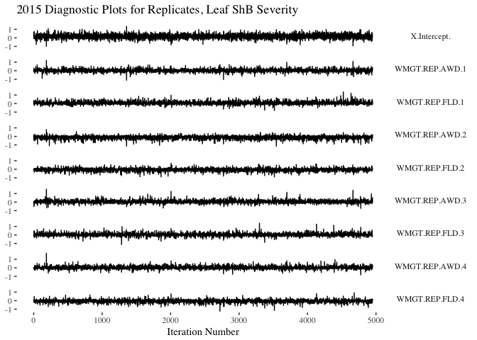

``` r
# posterior distributions for replicate
plot_replicate_posteriors(d = reps,
                          title = "2015 Reps Replicate Posteriors for Replicates, Leaf ShB Severity")
```

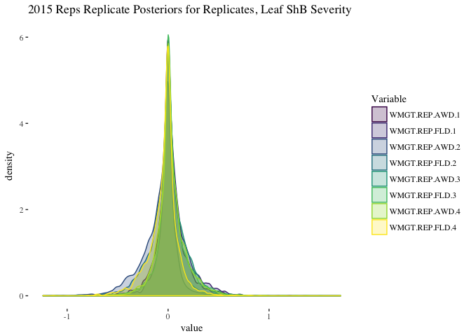

``` r
# diagnostic line plots for treatments
plot_diagnostic_lines(d = trts,
                      x = x,
                      title = "2015 Diagnostic Plots for Treatments, Leaf ShB Severity")
```

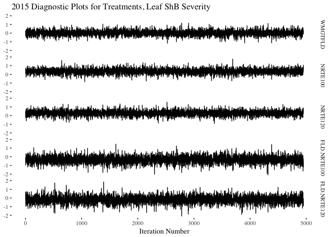

``` r
# Posterior distributions for treatment
plot_treatment_posteriors(d = trts,
                          title = "2015 Posteriors for Treatments, Leaf ShB Severity")
```

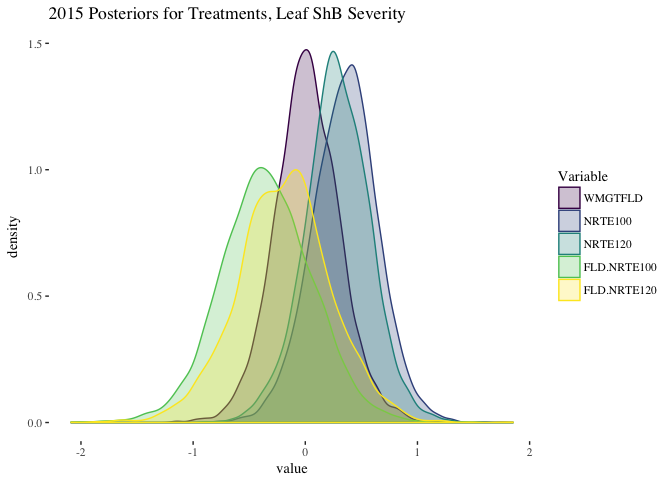

``` r
# check random effects
plotTrace(LShB_lmm_2015$VCV, log = TRUE)
```


``` r
# plot joint distibution of error
rdf <- data.frame(LShB_lmm_2015$VCV)
plot_joint_random_error_dist(d = rdf,
                             title = ("2015 Random Error Distribution for Leaf ShB Severity"))
```

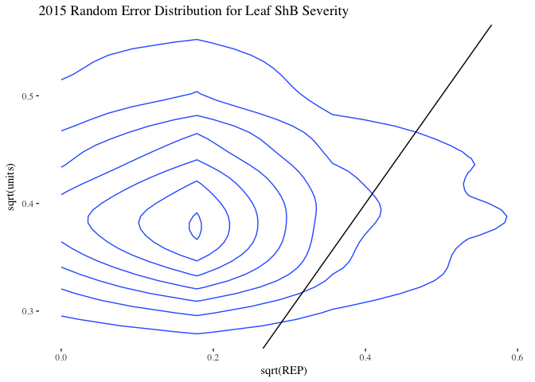

### 2015 Tiller Sheath Blight Severity Model

``` r
eprior <- list(R = list(V = 1, nu = 0.02),
               G = list(G1 = list(V = 1, nu = 0.02, alpha.V = 1000)))
TShB_severity_lmm_2015 <- MCMCglmm(TShB_AUDPS ~ WMGT * NRTE,
                                   random = ~REP, 
                          data = as.data.frame(AUDPS_2015),
                          verbose = FALSE,
                          prior = eprior,
                          nitt = 5e+05,
                          burnin = 5000,
                          thin = 100,
                          pr = TRUE)

summary(TShB_severity_lmm_2015)
```

    ## 
    ##  Iterations = 5001:499901
    ##  Thinning interval  = 100
    ##  Sample size  = 4950 
    ## 
    ##  DIC: 121.3647 
    ## 
    ##  G-structure:  ~REP
    ## 
    ##     post.mean  l-95% CI u-95% CI eff.samp
    ## REP     3.838 4.455e-08    13.63     4950
    ## 
    ##  R-structure:  ~units
    ## 
    ##       post.mean l-95% CI u-95% CI eff.samp
    ## units     7.072     2.98    12.59     5218
    ## 
    ##  Location effects: TShB_AUDPS ~ WMGT * NRTE 
    ## 
    ##                 post.mean l-95% CI u-95% CI eff.samp pMCMC
    ## (Intercept)        1.5512  -1.5066   4.6242     4950 0.271
    ## WMGTFLD           -0.4959  -4.3343   2.9956     4950 0.780
    ## NRTE100            1.6474  -1.8609   5.5490     4950 0.360
    ## NRTE120            1.9708  -1.8964   5.5139     4950 0.273
    ## WMGTFLD:NRTE100   -0.8858  -5.8375   4.6204     4950 0.745
    ## WMGTFLD:NRTE120    0.2727  -4.7269   5.6523     4950 0.903

``` r
# create data frames for generating diagnostic plots
reps <- data.frame(TShB_severity_lmm_2015$Sol[, c(1, 7:10)])
reps <- melt(reps)
```

    ## No id variables; using all as measure variables

``` r
trts <-  data.frame(TShB_severity_lmm_2015$Sol[, 2:6])
trts <- melt(trts)
```

    ## No id variables; using all as measure variables

``` r
# Create a dummy x-axis variable for plotting
x <- 1:nrow(TShB_severity_lmm_2015$Sol)

# diagnostic line plots for replicate
plot_diagnostic_lines(d = reps,
                      x = x,
                      title = "2015 Diagnostic Plots for Replicates, Tiller ShB Severity")
```

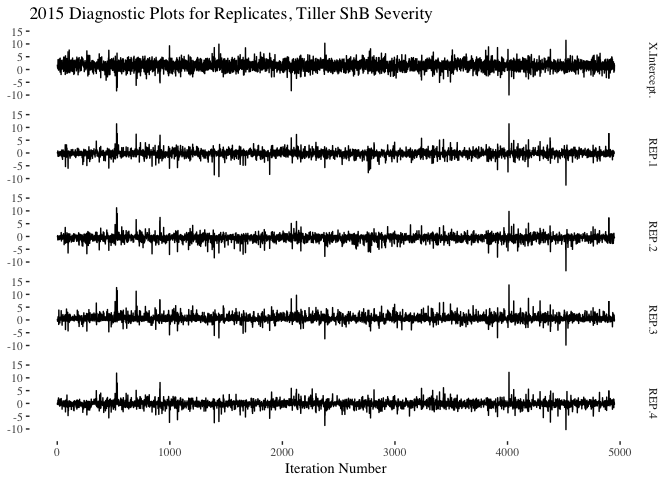

``` r
# posterior distributions for replicate
plot_replicate_posteriors(d = reps,
                          title = "2015 Reps Replicate Posteriors for Replicates, Tiller ShB Severity")
```

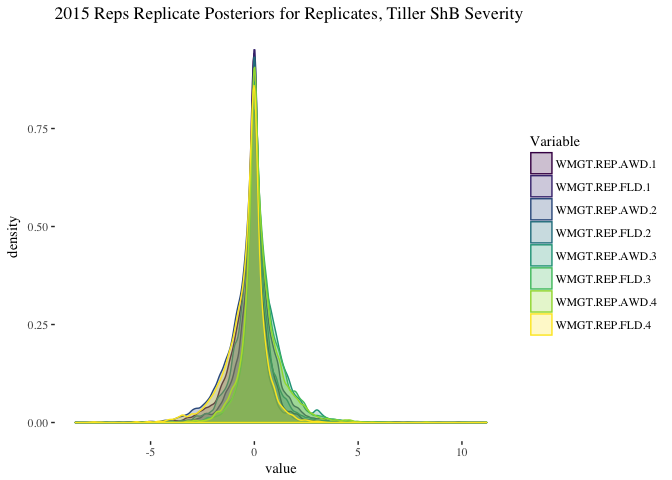

``` r
# diagnostic line plots for treatments
plot_diagnostic_lines(d = trts,
                      x = x,
                      title = "2015 Diagnostic Plots for Treatments, Tiller ShB Severity")
```

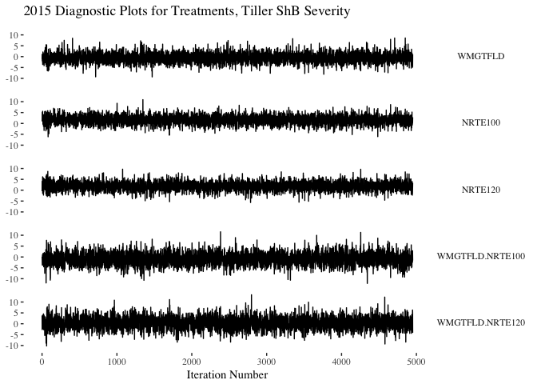

``` r
# Posterior distributions for treatment
plot_treatment_posteriors(d = trts,
                          title = "2015 Posteriors for Treatments, Tiller ShB Severity")
```

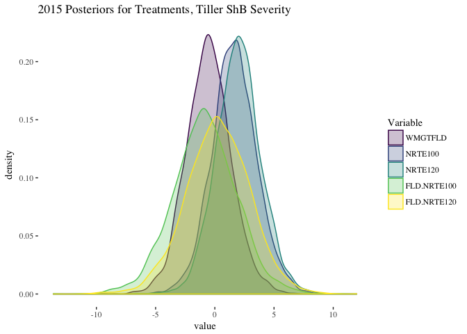

``` r
# check random effects
plotTrace(TShB_severity_lmm_2015$VCV, log = TRUE)
```

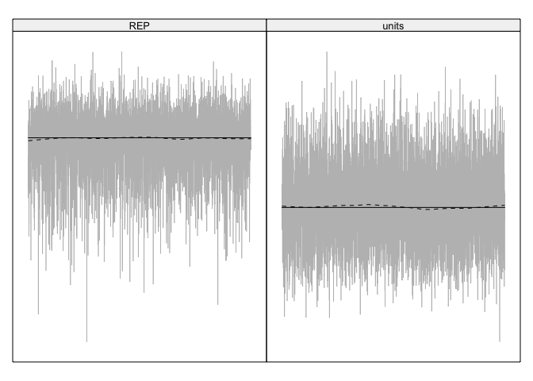

``` r
# plot joint distibution of error
rdf <- data.frame(TShB_severity_lmm_2015$VCV)
plot_joint_random_error_dist(d = rdf,
                             title = ("2015 Random Error Distribution for Tiller ShB Severity"))
```

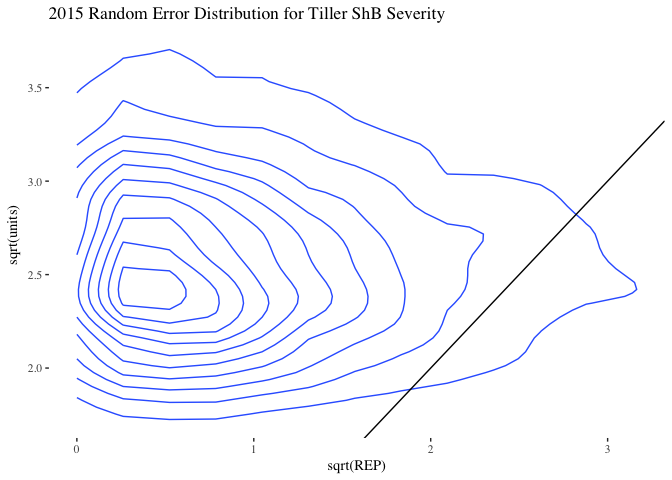

### 2015 Tiller Sheath Blight Incidence Model

``` r
eprior <- list(R = list(V = 1, nu = 0.02),
               G = list(G1 = list(V = 1, nu = 0.02, alpha.V = 1000)))
TShB_incidence_lmm_2015 <- MCMCglmm(TShB_incidence_mean ~ WMGT * NRTE,
                                    random = ~REP, 
                          data = as.data.frame(AUDPS_2015),
                          verbose = FALSE,
                          prior = eprior,
                          nitt = 5e+05,
                          burnin = 5000,
                          thin = 100,
                          pr = TRUE)

summary(TShB_incidence_lmm_2015)
```

    ## 
    ##  Iterations = 5001:499901
    ##  Thinning interval  = 100
    ##  Sample size  = 4950 
    ## 
    ##  DIC: 52.91684 
    ## 
    ##  G-structure:  ~REP
    ## 
    ##     post.mean  l-95% CI u-95% CI eff.samp
    ## REP    0.5817 3.352e-10    1.423     4950
    ## 
    ##  R-structure:  ~units
    ## 
    ##       post.mean l-95% CI u-95% CI eff.samp
    ## units    0.4012   0.1606   0.7105     4950
    ## 
    ##  Location effects: TShB_incidence_mean ~ WMGT * NRTE 
    ## 
    ##                 post.mean l-95% CI u-95% CI eff.samp pMCMC
    ## (Intercept)       0.30862 -0.53455  1.14737     4950 0.395
    ## WMGTFLD           0.17858 -0.70971  1.03754     4950 0.684
    ## NRTE100           0.22314 -0.66777  1.09792     4950 0.600
    ## NRTE120           0.57763 -0.29675  1.49782     4950 0.196
    ## WMGTFLD:NRTE100  -0.06425 -1.26695  1.22434     4950 0.917
    ## WMGTFLD:NRTE120  -0.38576 -1.54844  0.96010     4950 0.544

``` r
# create data frames for generating diagnostic plots
reps <- data.frame(TShB_incidence_lmm_2015$Sol[, c(1, 7:10)])
reps <- melt(reps)
```

    ## No id variables; using all as measure variables

``` r
trts <-  data.frame(TShB_incidence_lmm_2015$Sol[, 2:6])
trts <- melt(trts)
```

    ## No id variables; using all as measure variables

``` r
# Create a dummy x-axis variable for plotting
x <- 1:nrow(TShB_incidence_lmm_2015$Sol)

# diagnostic line plots for replicate
plot_diagnostic_lines(d = reps,
                      x = x,
                      title = "2015 Diagnostic Plots for Replicates, Tiller ShB Incidence")
```


``` r
# posterior distributions for replicate
plot_replicate_posteriors(d = reps,
                          title = "2015 Reps Replicate Posteriors for Replicates, Tiller ShB Incidence")
```


``` r
# diagnostic line plots for treatments
plot_diagnostic_lines(d = trts,
                      x = x,
                      title = "2015 Diagnostic Plots for Treatments, Tiller ShB Incidence")
```


``` r
# Posterior distributions for treatment
plot_treatment_posteriors(d = trts,
                          title = "2015 Posteriors for Treatments, Tiller ShB Incidence")
```


``` r
# check random effects
plotTrace(TShB_incidence_lmm_2015$VCV, log = TRUE)
```


``` r
# plot joint distibution of error
rdf <- data.frame(TShB_incidence_lmm_2015$VCV)
plot_joint_random_error_dist(d = rdf,
                             title = ("2015 Random Error Distribution for Tiller ShB Incidence"))
```


------------------------------------------------------------------------

2016
----

### 2016 Leaf Sheath Blight Severity Model

``` r
eprior <- list(R = list(V = 1, nu = 0.02),
               G = list(G1 = list(V = 1, nu = 0.02, alpha.V = 1000)))
LShB_lmm_2016 <- MCMCglmm(LShB_AUDPS ~ WMGT * NRTE,
                          random = ~REP, 
                          data = as.data.frame(AUDPS_2016),
                          verbose = FALSE,
                          nitt = 5e+05,
                          burnin = 5000,
                          thin = 100,
                          prior = eprior,
                          pr = TRUE)

summary(LShB_lmm_2016)
```

    ## 
    ##  Iterations = 5001:499901
    ##  Thinning interval  = 100
    ##  Sample size  = 4950 
    ## 
    ##  DIC: 32.25566 
    ## 
    ##  G-structure:  ~REP
    ## 
    ##     post.mean l-95% CI u-95% CI eff.samp
    ## REP    0.7996 8.26e-09    2.457     4950
    ## 
    ##  R-structure:  ~units
    ## 
    ##       post.mean l-95% CI u-95% CI eff.samp
    ## units    0.3342   0.1045   0.6858     4619
    ## 
    ##  Location effects: LShB_AUDPS ~ WMGT * NRTE 
    ## 
    ##                 post.mean l-95% CI u-95% CI eff.samp  pMCMC  
    ## (Intercept)        1.2195   0.3022   2.1000     4950 0.0251 *
    ## WMGTFLD           -0.2005  -0.9936   0.6705     4950 0.6077  
    ## NRTE180            0.0789  -0.7059   0.8956     4950 0.8356  
    ## WMGTFLD:NRTE180    0.4464  -0.6741   1.5097     4950 0.4085  
    ## ---
    ## Signif. codes:  0 '***' 0.001 '**' 0.01 '*' 0.05 '.' 0.1 ' ' 1

``` r
# create data frames for generating diagnostic plots
reps <- data.frame(LShB_lmm_2016$Sol[, c(1, 5:8)])
reps <- melt(reps)
```

    ## No id variables; using all as measure variables

``` r
trts <-  data.frame(LShB_lmm_2016$Sol[, 2:4])
trts <- melt(trts)
```

    ## No id variables; using all as measure variables

``` r
# Create a dummy x-axis variable for plotting
x <- 1:nrow(LShB_lmm_2016$Sol)

# diagnostic line plots for replicate
plot_diagnostic_lines(d = reps,
                      x = x,
                      title = "2016 Diagnostic Plots for Replicates, Leaf ShB Severity")
```

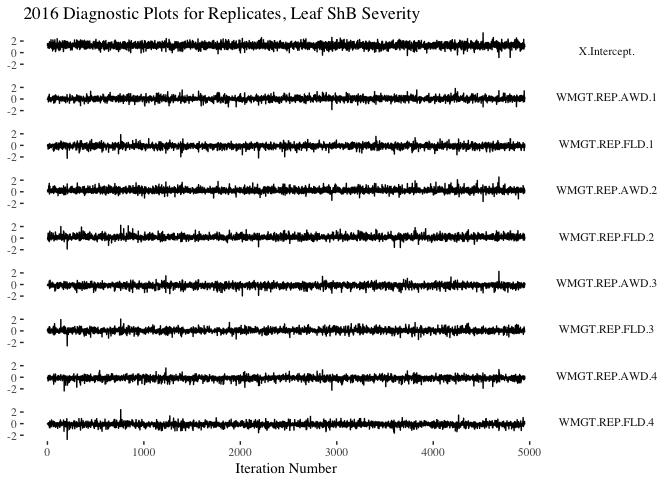

``` r
# posterior distributions for replicate
plot_replicate_posteriors(d = reps,
                          title = "2016 Reps Replicate Posteriors for Replicates, Leaf ShB Severity")
```

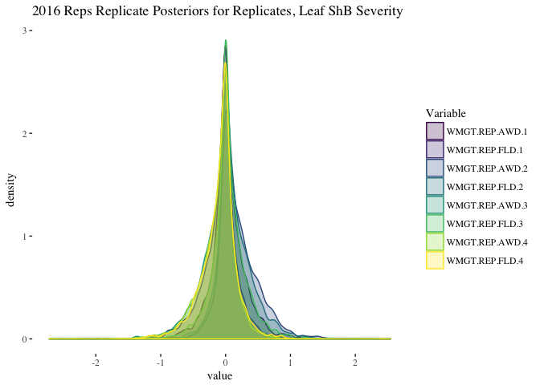

``` r
# diagnostic line plots for treatments
plot_diagnostic_lines(d = trts,
                      x = x,
                      title = "2016 Diagnostic Plots for Treatments, Leaf ShB Severity")
```


``` r
# Posterior distributions for treatment
plot_treatment_posteriors(d = trts,
                          title = "2016 Posteriors for Treatments, Leaf ShB Severity")
```

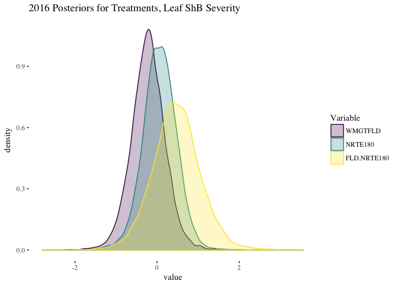

``` r
# check random effects
plotTrace(LShB_lmm_2016$VCV, log = TRUE)
```

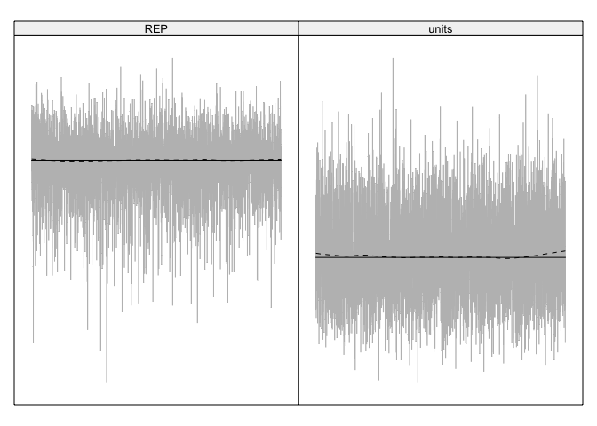

``` r
# plot joint distibution of error
rdf <- data.frame(LShB_lmm_2016$VCV)
plot_joint_random_error_dist(d = rdf,
                             title = ("2016 Random Error Distribution for Leaf ShB Severity"))
```

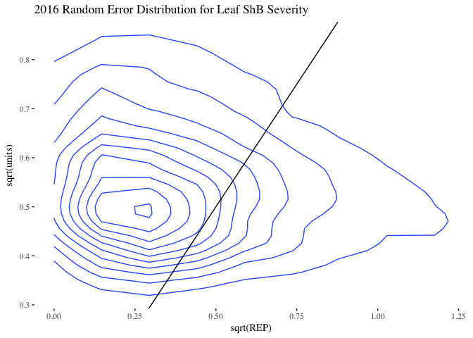

### 2016 Tiller Sheath Blight Severity Model

``` r
eprior <- list(R = list(V = 1, nu = 0.02),
               G = list(G1 = list(V = 1, nu = 0.02, alpha.V = 1000)))
TShB_severity_lmm_2016 <- MCMCglmm(TShB_AUDPS ~ WMGT * NRTE,
                                   random = ~REP, 
                          data = as.data.frame(AUDPS_2016),
                          verbose = FALSE,
                          nitt = 5e+05,
                          burnin = 5000,
                          thin = 100,
                          prior = eprior,
                          pr = TRUE)

summary(TShB_severity_lmm_2016)
```

    ## 
    ##  Iterations = 5001:499901
    ##  Thinning interval  = 100
    ##  Sample size  = 4950 
    ## 
    ##  DIC: 96.59792 
    ## 
    ##  G-structure:  ~REP
    ## 
    ##     post.mean  l-95% CI u-95% CI eff.samp
    ## REP     45.25 5.925e-05      148     4473
    ## 
    ##  R-structure:  ~units
    ## 
    ##       post.mean l-95% CI u-95% CI eff.samp
    ## units     18.99     4.86    42.07     5484
    ## 
    ##  Location effects: TShB_AUDPS ~ WMGT * NRTE 
    ## 
    ##                 post.mean l-95% CI u-95% CI eff.samp   pMCMC   
    ## (Intercept)      19.80760 12.05199 27.09265     4950 0.00162 **
    ## WMGTFLD           0.68904 -5.22026  6.67068     5554 0.79596   
    ## NRTE180           0.02273 -6.21960  6.13512     5254 0.99960   
    ## WMGTFLD:NRTE180   3.73864 -4.71647 12.16492     5279 0.34263   
    ## ---
    ## Signif. codes:  0 '***' 0.001 '**' 0.01 '*' 0.05 '.' 0.1 ' ' 1

``` r
# create data frames for generating diagnostic plots
reps <- data.frame(TShB_severity_lmm_2016$Sol[, c(1, 5:8)])
reps <- melt(reps)
```

    ## No id variables; using all as measure variables

``` r
trts <-  data.frame(TShB_severity_lmm_2016$Sol[, 2:4])
trts <- melt(trts)
```

    ## No id variables; using all as measure variables

``` r
# Create a dummy x-axis variable for plotting
x <- 1:nrow(TShB_severity_lmm_2016$Sol)
# diagnostic line plots for replicate
plot_diagnostic_lines(d = reps,
                      x = x,
                      title = "2016 Diagnostic Plots for Replicates, Tiller ShB Severity")
```

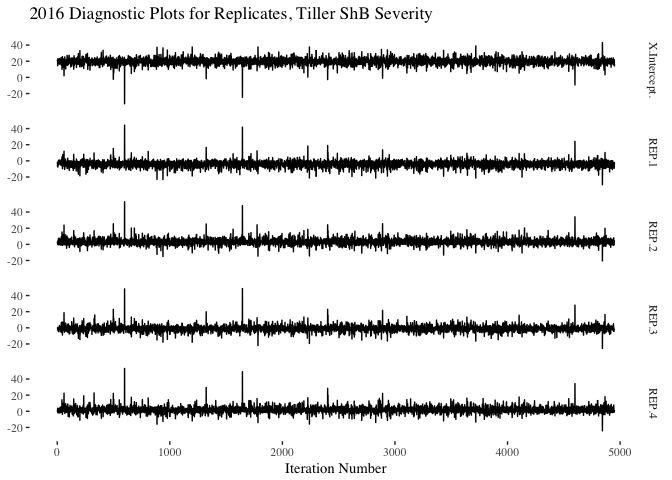

``` r
# posterior distributions for replicate
plot_replicate_posteriors(d = reps,
                          title = "2016 Reps Replicate Posteriors for Replicates, Tiller ShB Severity")
```

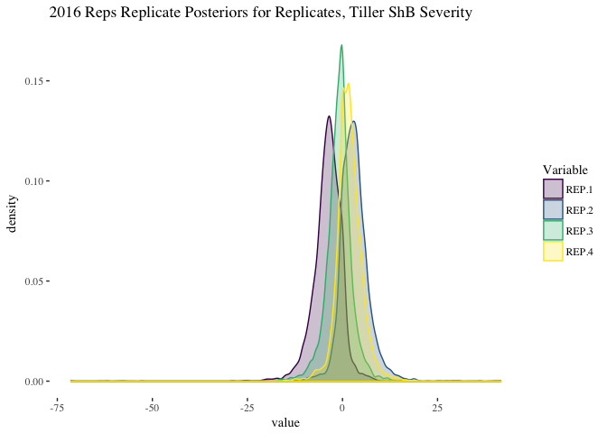

``` r
# diagnostic line plots for treatments
plot_diagnostic_lines(d = trts,
                      x = x,
                      title = "2016 Diagnostic Plots for Treatments, Tiller ShB Severity")
```

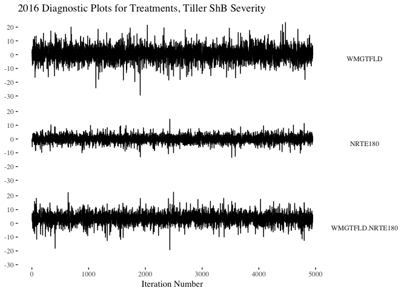

``` r
# Posterior distributions for treatment
plot_treatment_posteriors(d = trts,
                          title = "2016 Posteriors for Treatments, Tiller ShB Severity")
```

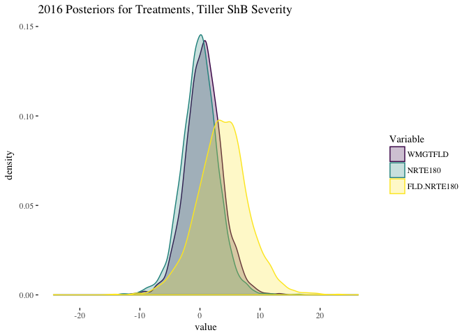

``` r
# check random effects
plotTrace(TShB_severity_lmm_2016$VCV, log = TRUE)
```


``` r
# plot joint distibution of error
rdf <- data.frame(TShB_severity_lmm_2016$VCV)
plot_joint_random_error_dist(d = rdf,
                             title = ("2016 Random Error Distribution for Tiller ShB Severity"))
```


### 2016 Tiller Sheath Blight Incidence Model

``` r
eprior <- list(R = list(V = 1, nu = 0.02),
               G = list(G1 = list(V = 1, nu = 0.02, alpha.V = 1000)))
TShB_incidence_lmm_2016 <- MCMCglmm(TShB_incidence_mean ~ WMGT * NRTE, 
                                    random = ~REP, 
                          data = as.data.frame(AUDPS_2016),
                          verbose = FALSE,
                          prior = eprior,
                          nitt = 5e+05,
                          burnin = 5000,
                          thin = 100,
                          pr = TRUE)

summary(TShB_incidence_lmm_2016)
```

    ## 
    ##  Iterations = 5001:499901
    ##  Thinning interval  = 100
    ##  Sample size  = 4950 
    ## 
    ##  DIC: 60.16531 
    ## 
    ##  G-structure:  ~REP
    ## 
    ##     post.mean  l-95% CI u-95% CI eff.samp
    ## REP     3.757 9.814e-08    13.33     4577
    ## 
    ##  R-structure:  ~units
    ## 
    ##       post.mean l-95% CI u-95% CI eff.samp
    ## units     1.906   0.5744    3.958     4950
    ## 
    ##  Location effects: TShB_incidence_mean ~ WMGT * NRTE 
    ## 
    ##                 post.mean l-95% CI u-95% CI eff.samp    pMCMC    
    ## (Intercept)       11.1450   8.9223  13.3652     4950 0.000808 ***
    ## WMGTFLD           -0.7830  -2.6862   1.1982     5447 0.384646    
    ## NRTE180            1.5331  -0.4276   3.4791     4950 0.105859    
    ## WMGTFLD:NRTE180    0.8049  -1.9439   3.7234     4950 0.534545    
    ## ---
    ## Signif. codes:  0 '***' 0.001 '**' 0.01 '*' 0.05 '.' 0.1 ' ' 1

``` r
# create data frames for generating diagnostic plots
reps <- data.frame(TShB_incidence_lmm_2016$Sol[, c(1, 5:8)])
reps <- melt(reps)
```

    ## No id variables; using all as measure variables

``` r
trts <-  data.frame(TShB_incidence_lmm_2016$Sol[, 2:4])
trts <- melt(trts)
```

    ## No id variables; using all as measure variables

``` r
# Create a dummy x-axis variable for plotting
x <- 1:nrow(TShB_incidence_lmm_2016$Sol)

# diagnostic line plots for replicate
plot_diagnostic_lines(d = reps,
                      x = x,
                      title = "2016 Diagnostic Plots for Replicates, Tiller ShB Incidence")
```


``` r
# posterior distributions for replicate
plot_replicate_posteriors(d = reps,
                          title = "2016 Reps Replicate Posteriors for Replicates, Tiller ShB Incidence")
```


``` r
# diagnostic line plots for treatments
plot_diagnostic_lines(d = trts,
                      x = x,
                      title = "2016 Diagnostic Plots for Treatments, Tiller ShB Incidence")
```


``` r
# Posterior distributions for treatment
plot_treatment_posteriors(d = trts,
                          title = "2016 Posteriors for Treatments, Tiller ShB Incidence")
```


``` r
# check random effects
plotTrace(TShB_incidence_lmm_2016$VCV, log = TRUE)
```


``` r
# plot joint distibution of error
rdf <- data.frame(TShB_incidence_lmm_2016$VCV)
plot_joint_random_error_dist(d = rdf,
                             title = ("2016 Random Error Distribution for Tiller ShB Incidence"))
```


Conclusions
===========

The models all appear to be good fits.

None of the diagnostic plots show any signs of autocorrelation or any other obvious patterns.

None of the treatments in either year, 2015 or 2016, were significant. The see `pMCMC` values and also posterior graphs. There is a large amount of overlap in all of the posterior graphs.

The random effects all appear to be acceptable, the dotted line stays near to the solid line with no discernable patterns.

The random effects are all fairly equally distributed except for 2016 tiller sheath blight severity where water management:replicate has a larger effect. This is not surprising given that the plot and replicate sizes were different in 2016 due to the use of two fields in the IRRI experiment station, see the [2016 plot layout plan](https://github.com/adamhsparks/AWD_ShB_Interaction/blob/master/doc/Metadata/2016%20AWD%20ShB%20Metadata/ExptLayoutAWD2016.pdf).

R Session Info
==============

``` r
sessionInfo()
```

    ## R version 3.4.0 (2017-04-21)
    ## Platform: x86_64-apple-darwin16.5.0 (64-bit)
    ## Running under: macOS Sierra 10.12.4
    ## 
    ## Matrix products: default
    ## BLAS/LAPACK: /usr/local/Cellar/openblas/0.2.19/lib/libopenblasp-r0.2.19.dylib
    ## 
    ## locale:
    ## [1] en_AU.UTF-8/en_AU.UTF-8/en_AU.UTF-8/C/en_AU.UTF-8/en_AU.UTF-8
    ## 
    ## attached base packages:
    ## [1] stats     graphics  grDevices utils     datasets  methods   base     
    ## 
    ## other attached packages:
    ##  [1] plotMCMC_2.0-0      fitdistrplus_1.0-9  survival_2.41-3    
    ##  [4] lattice_0.20-35     MCMCglmm_2.24       ape_4.1            
    ##  [7] coda_0.19-1         Matrix_1.2-9        car_2.1-4          
    ## [10] MASS_7.3-47         dplyr_0.5.0         purrr_0.2.2        
    ## [13] readr_1.1.0         tidyr_0.6.1         tibble_1.3.0       
    ## [16] ggplot2_2.2.1       tidyverse_1.1.1     viridis_0.4.0      
    ## [19] viridisLite_0.2.0   agricolae_1.2-4     lubridate_1.6.0    
    ## [22] ggthemes_3.4.0      plyr_1.8.4          reshape2_1.4.2     
    ## [25] ProjectTemplate_0.7
    ## 
    ## loaded via a namespace (and not attached):
    ##  [1] nlme_3.1-131       bitops_1.0-6       pbkrtest_0.4-7    
    ##  [4] gmodels_2.16.2     httr_1.2.1         rprojroot_1.2     
    ##  [7] tensorA_0.36       tools_3.4.0        backports_1.0.5   
    ## [10] R6_2.2.0           KernSmooth_2.23-15 AlgDesign_1.1-7.3 
    ## [13] DBI_0.6-1          lazyeval_0.2.0     mgcv_1.8-17       
    ## [16] colorspace_1.3-2   nnet_7.3-12        sp_1.2-4          
    ## [19] gridExtra_2.2.1    mnormt_1.5-5       klaR_0.6-12       
    ## [22] compiler_3.4.0     rvest_0.3.2        quantreg_5.33     
    ## [25] SparseM_1.77       expm_0.999-2       xml2_1.1.1        
    ## [28] labeling_0.3       caTools_1.17.1     scales_0.4.1      
    ## [31] psych_1.7.3.21     stringr_1.2.0      digest_0.6.12     
    ## [34] foreign_0.8-67     minqa_1.2.4        rmarkdown_1.4     
    ## [37] htmltools_0.3.5    lme4_1.1-13        readxl_1.0.0      
    ## [40] combinat_0.0-8     jsonlite_1.4       gtools_3.5.0      
    ## [43] spdep_0.6-12       magrittr_1.5       Rcpp_0.12.10      
    ## [46] munsell_0.4.3      stringi_1.1.5      yaml_2.1.14       
    ## [49] gplots_3.0.1       grid_3.4.0         parallel_3.4.0    
    ## [52] gdata_2.17.0       forcats_0.2.0      deldir_0.1-14     
    ## [55] haven_1.0.0        splines_3.4.0      hms_0.3           
    ## [58] knitr_1.15.1       boot_1.3-19        cubature_1.3-6    
    ## [61] corpcor_1.6.9      LearnBayes_2.15    packrat_0.4.8-1   
    ## [64] evaluate_0.10      modelr_0.1.0       nloptr_1.0.4      
    ## [67] MatrixModels_0.4-1 cellranger_1.1.0   gtable_0.2.0      
    ## [70] assertthat_0.2.0   broom_0.4.2        cluster_2.0.6
