Analysis
================

Notes on this analysis before starting
--------------------------------------

#### How to interpret these analyses

For a quick overview, see this thread on Stack Overflow that walks through the output of `summary.MCMCglmm`, which is used below. [R: Making sense of the output of a MCMCglmm](http://stackoverflow.com/questions/20993643/r-making-sense-of-the-output-of-a-mcmcglmm)

The MCMCglmm documentation is more in-depth but should still be referenced.

``` r
library(MCMCglmm)
vignette("Overview")
vignette("CourseNotes")
```

#### Changes between 2015 and 2016

Before the analysis, note that due to changes between the years, the analysis must be carried out on each year separately. The 2015 data and 2016 data cannot be combined due to changes in inoculation methods; there are other changes too, but the main one is this. Therefore, the analyses will be conducted separately for leaf severity and Leaf severity for 2015 dry season and 2016 dry season. Comparisons will only be observational and cannot be statistically compared.

#### Iterations

Fitting the models with the default iterations resulted in some less than acceptable models. Because of this, the number of iterations has been increased, `nitt = 5e+05` and `burnin = 5000` and `thin = 100`. This results in much smaller errors for random effects and better models.

2015
----

### 2015 Leaf Sheath Blight Severity Model

``` r
eprior <- list(R = list(V = 1, nu = 0.02),
               G = list(G1 = list(V = 1, nu = 0.02, alpha.V = 1000)))
LShB_lmm_2015 <- MCMCglmm(LShB_AUDPS ~ WMGT * NRTE, ~REP, 
                          data = as.data.frame(AUDPS_2015),
                          verbose = FALSE,
                          prior = eprior,
                          nitt = 5e+05,
                          burnin = 5000,
                          thin = 100,
                          pr = TRUE)

summary(LShB_lmm_2015)
```

    ## 
    ##  Iterations = 5001:499901
    ##  Thinning interval  = 100
    ##  Sample size  = 4950 
    ## 
    ##  DIC: 32.52142 
    ## 
    ##  G-structure:  ~REP
    ## 
    ##     post.mean  l-95% CI u-95% CI eff.samp
    ## REP    0.2505 2.082e-09   0.6627     4950
    ## 
    ##  R-structure:  ~units
    ## 
    ##       post.mean l-95% CI u-95% CI eff.samp
    ## units    0.1727  0.06739    0.305     4950
    ## 
    ##  Location effects: LShB_AUDPS ~ WMGT * NRTE 
    ## 
    ##                 post.mean l-95% CI u-95% CI eff.samp pMCMC
    ## (Intercept)       0.18378 -0.38279  0.72144     4715 0.446
    ## WMGTFLD           0.01186 -0.59805  0.59815     4950 0.973
    ## NRTE100           0.35832 -0.21182  0.94091     4950 0.219
    ## NRTE120           0.29471 -0.26917  0.92038     4683 0.301
    ## WMGTFLD:NRTE100  -0.33872 -1.11560  0.52907     4950 0.415
    ## WMGTFLD:NRTE120  -0.19259 -1.02264  0.66138     4950 0.623

``` r
# create data frames for generating diagnostic plots
reps <- data.frame(LShB_lmm_2015$Sol[, c(1, 7:10)])
x <- 1:nrow(reps)
reps <- melt(reps)
```

    ## No id variables; using all as measure variables

``` r
trts <-  data.frame(LShB_lmm_2015$Sol[, 2:6])
names(trts)[names(trts) == "WMGTFLD.NRTE100"] <- "FLD.NRTE100"
names(trts)[names(trts) == "WMGTFLD.NRTE120"] <- "FLD.NRTE120"
trts <- melt(trts)
```

    ## No id variables; using all as measure variables

``` r
# Create a dummy x-axis variable for plotting
x <- 1:nrow(LShB_lmm_2015$Sol)

# diagnostic line plots for replicate
plot_diagnostic_lines(d = reps,
                      x = x,
                      title = "2015 Diagnostic Plots for Replicates, Leaf ShB Severity")
```

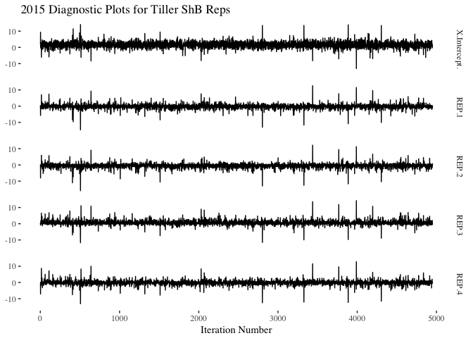

``` r
# posterior distributions for replicate
plot_replicate_posteriors(d = reps,
                          title = "2015 Reps Replicate Posteriors for Replicates, Leaf ShB Severity")
```

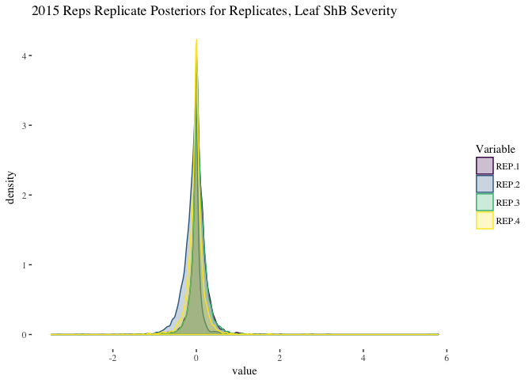

``` r
# diagnostic line plots for treatments
plot_diagnostic_lines(d = trts,
                      x = x,
                      title = "2015 Diagnostic Plots for Treatments, Leaf ShB Severity")
```

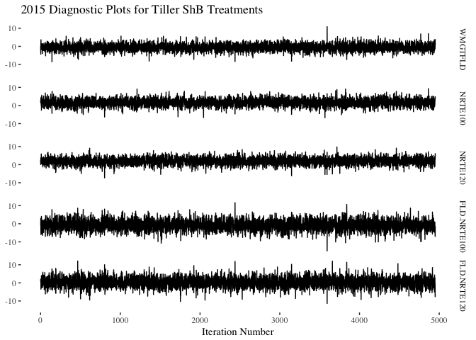

``` r
# Posterior distributions for treatment
plot_treatment_posteriors(d = trts,
                          title = "2015 Posteriors for Treatments, Leaf ShB Severity")
```

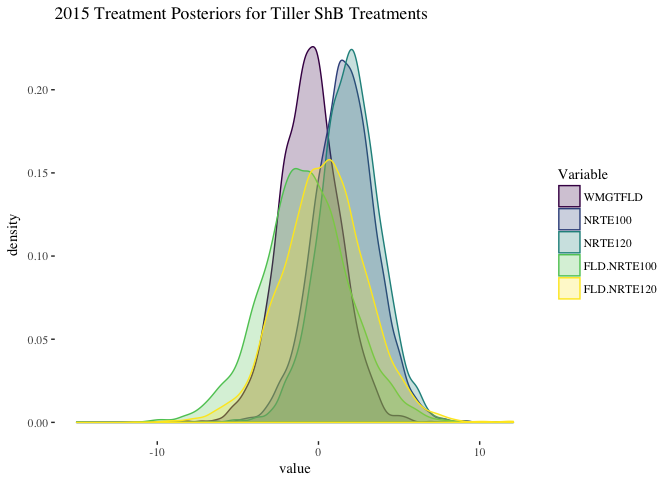

``` r
# check random effects
plotTrace(LShB_lmm_2015$VCV, log = TRUE)
```

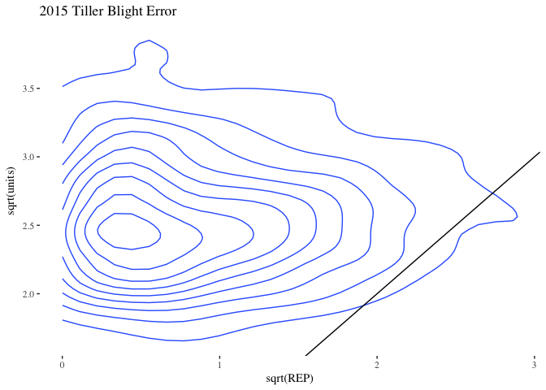

``` r
# plot joint distibution of error
rdf <- data.frame(LShB_lmm_2015$VCV)
plot_joint_random_error_dist(d = rdf,
                             title = ("2015 Random Error Distribution for Leaf ShB Severity"))
```

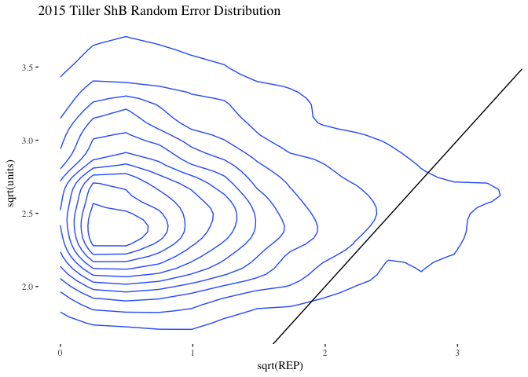

### 2015 Tiller Sheath Blight Severity Model

``` r
eprior <- list(R = list(V = 1, nu = 0.02),
               G = list(G1 = list(V = 1, nu = 0.02, alpha.V = 1000)))
TShB_severity_lmm_2015 <- MCMCglmm(TShB_AUDPS ~ WMGT * NRTE, ~REP, 
                          data = as.data.frame(AUDPS_2015),
                          verbose = FALSE,
                          prior = eprior,
                          nitt = 5e+05,
                          burnin = 5000,
                          thin = 100,
                          pr = TRUE)

summary(TShB_severity_lmm_2015)
```

    ## 
    ##  Iterations = 5001:499901
    ##  Thinning interval  = 100
    ##  Sample size  = 4950 
    ## 
    ##  DIC: 121.3566 
    ## 
    ##  G-structure:  ~REP
    ## 
    ##     post.mean  l-95% CI u-95% CI eff.samp
    ## REP     3.555 1.543e-08    13.24     4950
    ## 
    ##  R-structure:  ~units
    ## 
    ##       post.mean l-95% CI u-95% CI eff.samp
    ## units     7.012    2.763    12.16     4950
    ## 
    ##  Location effects: TShB_AUDPS ~ WMGT * NRTE 
    ## 
    ##                 post.mean l-95% CI u-95% CI eff.samp pMCMC
    ## (Intercept)        1.5892  -1.5797   4.5794     4950 0.272
    ## WMGTFLD           -0.5590  -4.2390   2.9891     4852 0.737
    ## NRTE100            1.6501  -2.0089   5.3403     4864 0.355
    ## NRTE120            1.9695  -1.6405   5.5595     4875 0.266
    ## WMGTFLD:NRTE100   -0.8149  -6.1382   4.3489     5225 0.752
    ## WMGTFLD:NRTE120    0.3464  -4.6088   5.7516     4950 0.882

``` r
# create data frames for generating diagnostic plots
reps <- data.frame(TShB_severity_lmm_2015$Sol[, c(1, 7:10)])
reps <- melt(reps)
```

    ## No id variables; using all as measure variables

``` r
trts <-  data.frame(TShB_severity_lmm_2015$Sol[, 2:6])
names(trts)[names(trts) == "WMGTFLD.NRTE100"] <- "FLD.NRTE100"
names(trts)[names(trts) == "WMGTFLD.NRTE120"] <- "FLD.NRTE120"
trts <- melt(trts)
```

    ## No id variables; using all as measure variables

``` r
# Create a dummy x-axis variable for plotting
x <- 1:nrow(TShB_severity_lmm_2015$Sol)

# diagnostic line plots for replicate
plot_diagnostic_lines(d = reps,
                      x = x,
                      title = "2015 Diagnostic Plots for Replicates, Tiller ShB Severity")
```

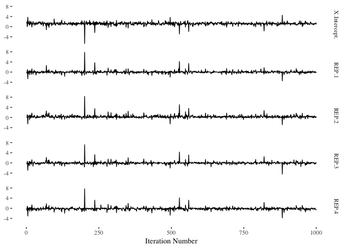

``` r
# posterior distributions for replicate
plot_replicate_posteriors(d = reps,
                          title = "2015 Reps Replicate Posteriors for Replicates, Tiller ShB Severity")
```

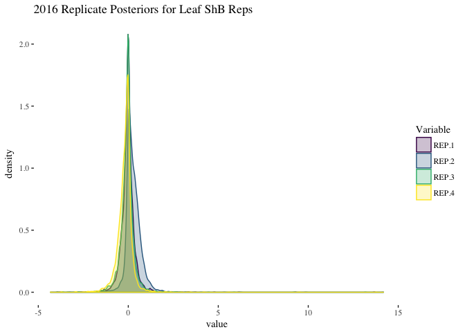

``` r
# diagnostic line plots for treatments
plot_diagnostic_lines(d = trts,
                      x = x,
                      title = "2015 Diagnostic Plots for Treatments, Tiller ShB Severity")
```

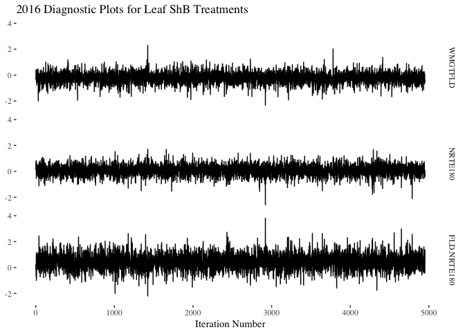

``` r
# Posterior distributions for treatment
plot_treatment_posteriors(d = trts,
                          title = "2015 Posteriors for Treatments, Tiller ShB Severity")
```

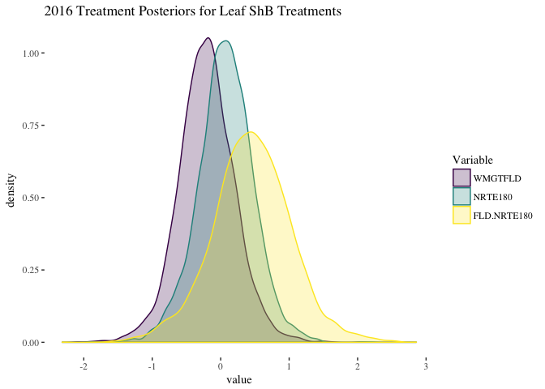

``` r
# check random effects
plotTrace(TShB_severity_lmm_2015$VCV, log = TRUE)
```


``` r
# plot joint distibution of error
rdf <- data.frame(TShB_severity_lmm_2015$VCV)
plot_joint_random_error_dist(d = rdf,
                             title = ("2015 Random Error Distribution for Tiller ShB Severity"))
```

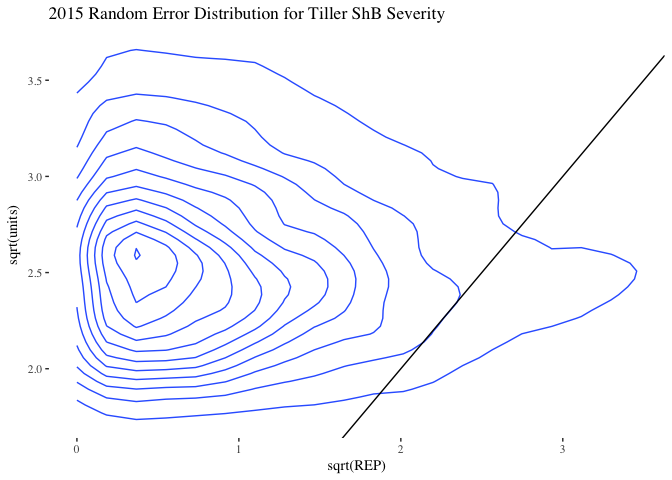

### 2015 Tiller Sheath Blight Incidence Model

``` r
eprior <- list(R = list(V = 1, nu = 0.02),
               G = list(G1 = list(V = 1, nu = 0.02, alpha.V = 1000)))
TShB_incidence_lmm_2015 <- MCMCglmm(TShB_incidence_mean ~ WMGT * NRTE, ~REP, 
                          data = as.data.frame(AUDPS_2015),
                          verbose = FALSE,
                          prior = eprior,
                          nitt = 5e+05,
                          burnin = 5000,
                          thin = 100,
                          pr = TRUE)

summary(TShB_incidence_lmm_2015)
```

    ## 
    ##  Iterations = 5001:499901
    ##  Thinning interval  = 100
    ##  Sample size  = 4950 
    ## 
    ##  DIC: 52.94686 
    ## 
    ##  G-structure:  ~REP
    ## 
    ##     post.mean  l-95% CI u-95% CI eff.samp
    ## REP    0.5167 8.512e-12    1.681     4659
    ## 
    ##  R-structure:  ~units
    ## 
    ##       post.mean l-95% CI u-95% CI eff.samp
    ## units    0.4055   0.1668   0.7351     4950
    ## 
    ##  Location effects: TShB_incidence_mean ~ WMGT * NRTE 
    ## 
    ##                 post.mean l-95% CI u-95% CI eff.samp pMCMC
    ## (Intercept)       0.29426 -0.57690  1.13556     4950 0.447
    ## WMGTFLD           0.18634 -0.69717  1.05519     5384 0.667
    ## NRTE100           0.23552 -0.67152  1.11803     4950 0.605
    ## NRTE120           0.58260 -0.28845  1.47090     4950 0.181
    ## WMGTFLD:NRTE100  -0.08003 -1.36229  1.13701     4950 0.882
    ## WMGTFLD:NRTE120  -0.40218 -1.60883  0.86245     4950 0.507

``` r
# create data frames for generating diagnostic plots
reps <- data.frame(TShB_incidence_lmm_2015$Sol[, c(1, 7:10)])
reps <- melt(reps)
```

    ## No id variables; using all as measure variables

``` r
trts <-  data.frame(TShB_incidence_lmm_2015$Sol[, 2:6])
names(trts)[names(trts) == "WMGTFLD.NRTE100"] <- "FLD.NRTE100"
names(trts)[names(trts) == "WMGTFLD.NRTE120"] <- "FLD.NRTE120"
trts <- melt(trts)
```

    ## No id variables; using all as measure variables

``` r
# Create a dummy x-axis variable for plotting
x <- 1:nrow(TShB_incidence_lmm_2015$Sol)

# diagnostic line plots for replicate
plot_diagnostic_lines(d = reps,
                      x = x,
                      title = "2015 Diagnostic Plots for Replicates, Tiller ShB Incidence")
```

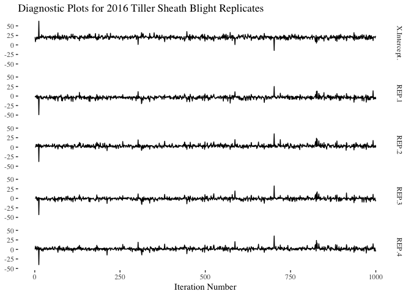

``` r
# posterior distributions for replicate
plot_replicate_posteriors(d = reps,
                          title = "2015 Reps Replicate Posteriors for Replicates, Tiller ShB Incidence")
```

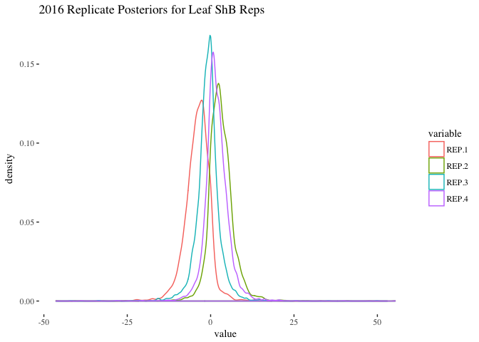

``` r
# diagnostic line plots for treatments
plot_diagnostic_lines(d = trts,
                      x = x,
                      title = "2015 Diagnostic Plots for Treatments, Tiller ShB Incidence")
```

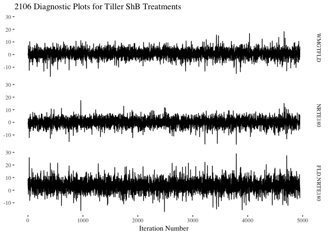

``` r
# Posterior distributions for treatment
plot_treatment_posteriors(d = trts,
                          title = "2015 Posteriors for Treatments, Tiller ShB Incidence")
```


``` r
# check random effects
plotTrace(TShB_incidence_lmm_2015$VCV, log = TRUE)
```

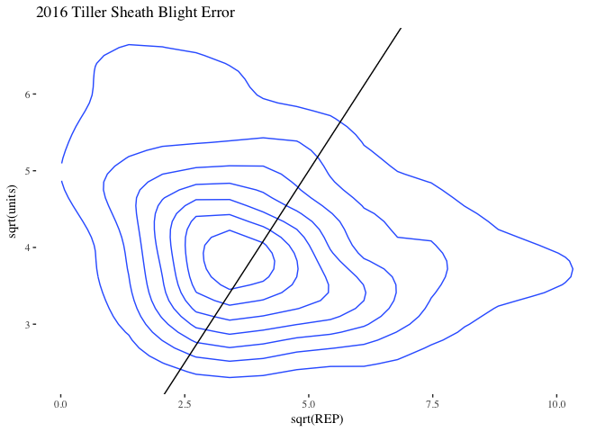

``` r
# plot joint distibution of error
rdf <- data.frame(TShB_incidence_lmm_2015$VCV)
plot_joint_random_error_dist(d = rdf,
                             title = ("2015 Random Error Distribution for Tiller ShB Incidence"))
```

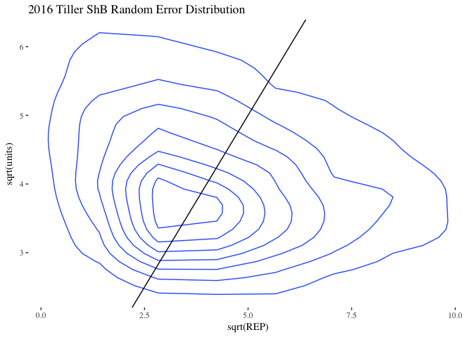

------------------------------------------------------------------------

2016
----

### 2016 Leaf Sheath Blight Severity Model

``` r
eprior <- list(R = list(V = 1, nu = 0.02),
               G = list(G1 = list(V = 1, nu = 0.02, alpha.V = 1000)))
LShB_lmm_2016 <- MCMCglmm(LShB_AUDPS ~ WMGT * NRTE, ~REP, 
                          data = as.data.frame(AUDPS_2016),
                          verbose = FALSE,
                          nitt = 5e+05,
                          burnin = 5000,
                          thin = 100,
                          prior = eprior,
                          pr = TRUE)

summary(LShB_lmm_2016)
```

    ## 
    ##  Iterations = 5001:499901
    ##  Thinning interval  = 100
    ##  Sample size  = 4950 
    ## 
    ##  DIC: 32.25408 
    ## 
    ##  G-structure:  ~REP
    ## 
    ##     post.mean  l-95% CI u-95% CI eff.samp
    ## REP    0.7845 1.715e-07    2.341     4950
    ## 
    ##  R-structure:  ~units
    ## 
    ##       post.mean l-95% CI u-95% CI eff.samp
    ## units    0.3362   0.1024    0.689     4950
    ## 
    ##  Location effects: LShB_AUDPS ~ WMGT * NRTE 
    ## 
    ##                 post.mean l-95% CI u-95% CI eff.samp  pMCMC  
    ## (Intercept)       1.21267  0.33576  2.11965     4950 0.0259 *
    ## WMGTFLD          -0.20601 -1.01240  0.63787     4950 0.6004  
    ## NRTE180           0.07461 -0.71785  0.92277     4714 0.8420  
    ## WMGTFLD:NRTE180   0.45681 -0.72441  1.63095     4950 0.4012  
    ## ---
    ## Signif. codes:  0 '***' 0.001 '**' 0.01 '*' 0.05 '.' 0.1 ' ' 1

``` r
# create data frames for generating diagnostic plots
reps <- data.frame(LShB_lmm_2016$Sol[, c(1, 5:8)])
reps <- melt(reps)
```

    ## No id variables; using all as measure variables

``` r
trts <-  data.frame(LShB_lmm_2016$Sol[, 2:4])
names(trts)[names(trts) == "WMGTFLD.NRTE180"] <- "FLD.NRTE180"
trts <- melt(trts)
```

    ## No id variables; using all as measure variables

``` r
# Create a dummy x-axis variable for plotting
x <- 1:nrow(LShB_lmm_2016$Sol)

# diagnostic line plots for replicate
plot_diagnostic_lines(d = reps,
                      x = x,
                      title = "2016 Diagnostic Plots for Replicates, Leaf ShB Severity")
```

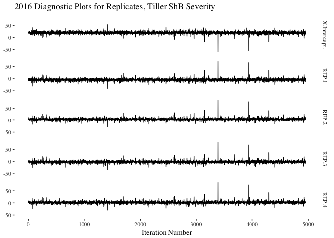

``` r
# posterior distributions for replicate
plot_replicate_posteriors(d = reps,
                          title = "2016 Reps Replicate Posteriors for Replicates, Leaf ShB Severity")
```

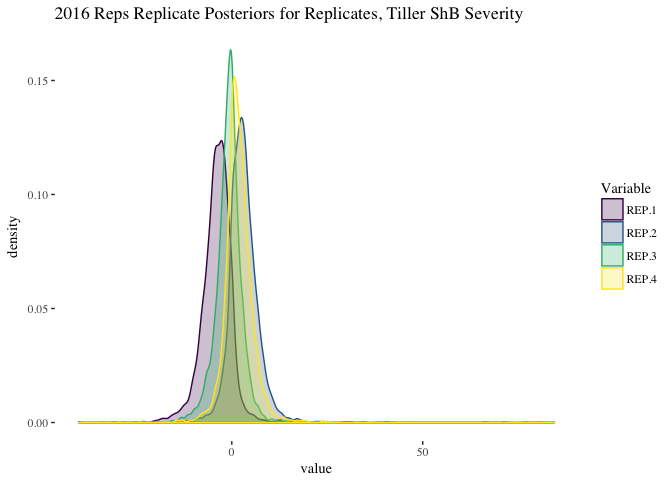

``` r
# diagnostic line plots for treatments
plot_diagnostic_lines(d = trts,
                      x = x,
                      title = "2016 Diagnostic Plots for Treatments, Leaf ShB Severity")
```

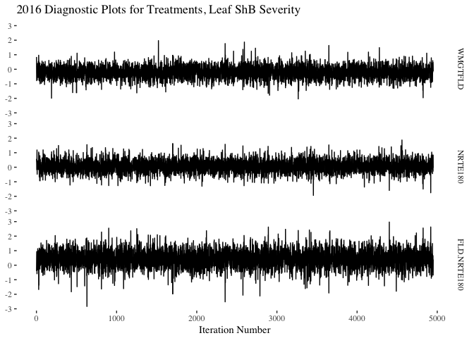

``` r
# Posterior distributions for treatment
plot_treatment_posteriors(d = trts,
                          title = "2016 Posteriors for Treatments, Leaf ShB Severity")
```

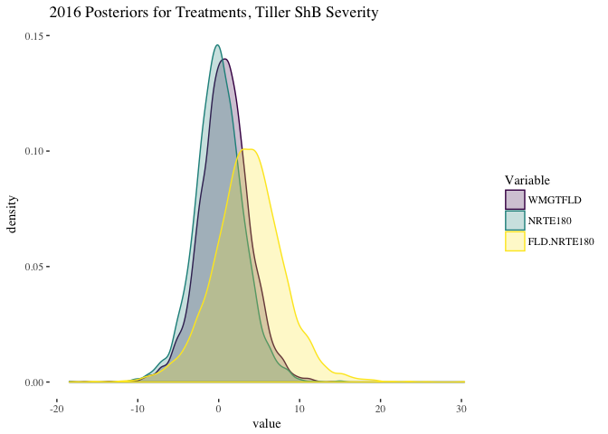

``` r
# check random effects
plotTrace(LShB_lmm_2016$VCV, log = TRUE)
```

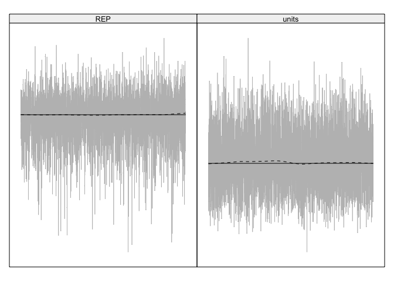

``` r
# plot joint distibution of error
rdf <- data.frame(LShB_lmm_2016$VCV)
plot_joint_random_error_dist(d = rdf,
                             title = ("2016 Random Error Distribution for Leaf ShB Severity"))
```

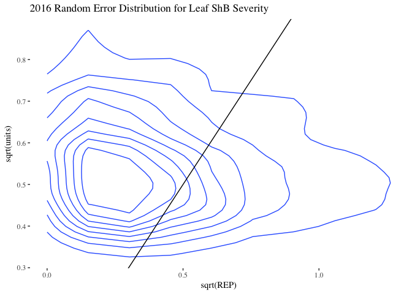

### 2016 Tiller Sheath Blight Severity Model

``` r
eprior <- list(R = list(V = 1, nu = 0.02),
               G = list(G1 = list(V = 1, nu = 0.02, alpha.V = 1000)))
TShB_severity_lmm_2016 <- MCMCglmm(TShB_AUDPS ~ WMGT * NRTE, ~REP, 
                          data = as.data.frame(AUDPS_2016),
                          verbose = FALSE,
                          nitt = 5e+05,
                          burnin = 5000,
                          thin = 100,
                          prior = eprior,
                          pr = TRUE)

summary(TShB_severity_lmm_2016)
```

    ## 
    ##  Iterations = 5001:499901
    ##  Thinning interval  = 100
    ##  Sample size  = 4950 
    ## 
    ##  DIC: 96.59314 
    ## 
    ##  G-structure:  ~REP
    ## 
    ##     post.mean l-95% CI u-95% CI eff.samp
    ## REP     49.93  1.7e-06    138.8     4950
    ## 
    ##  R-structure:  ~units
    ## 
    ##       post.mean l-95% CI u-95% CI eff.samp
    ## units     18.79    5.035    41.19     4644
    ## 
    ##  Location effects: TShB_AUDPS ~ WMGT * NRTE 
    ## 
    ##                 post.mean l-95% CI u-95% CI eff.samp   pMCMC   
    ## (Intercept)      19.84784 12.28505 27.38135     4950 0.00242 **
    ## WMGTFLD           0.68188 -5.47881  6.54749     4950 0.80000   
    ## NRTE180           0.05395 -5.85199  6.48373     4950 0.96848   
    ## WMGTFLD:NRTE180   3.63815 -4.86090 11.99705     4950 0.36283   
    ## ---
    ## Signif. codes:  0 '***' 0.001 '**' 0.01 '*' 0.05 '.' 0.1 ' ' 1

``` r
# create data frames for generating diagnostic plots
reps <- data.frame(TShB_severity_lmm_2016$Sol[, c(1, 5:8)])
reps <- melt(reps)
```

    ## No id variables; using all as measure variables

``` r
trts <-  data.frame(TShB_severity_lmm_2016$Sol[, 2:4])
names(trts)[names(trts) == "WMGTFLD.NRTE180"] <- "FLD.NRTE180"
trts <- melt(trts)
```

    ## No id variables; using all as measure variables

``` r
# Create a dummy x-axis variable for plotting
x <- 1:nrow(TShB_severity_lmm_2016$Sol)
# diagnostic line plots for replicate
plot_diagnostic_lines(d = reps,
                      x = x,
                      title = "2016 Diagnostic Plots for Replicates, Tiller ShB Severity")
```

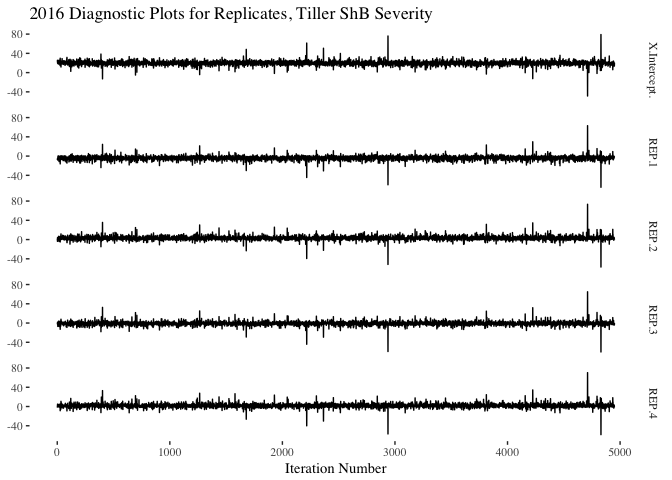

``` r
# posterior distributions for replicate
plot_replicate_posteriors(d = reps,
                          title = "2016 Reps Replicate Posteriors for Replicates, Tiller ShB Severity")
```

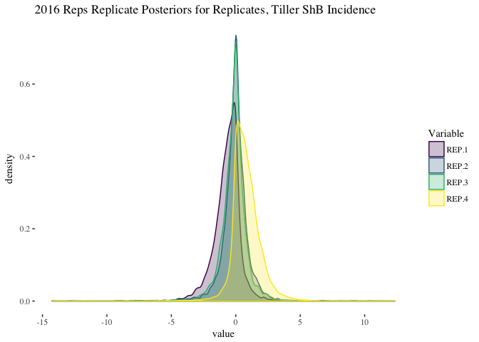

``` r
# diagnostic line plots for treatments
plot_diagnostic_lines(d = trts,
                      x = x,
                      title = "2016 Diagnostic Plots for Treatments, Tiller ShB Severity")
```

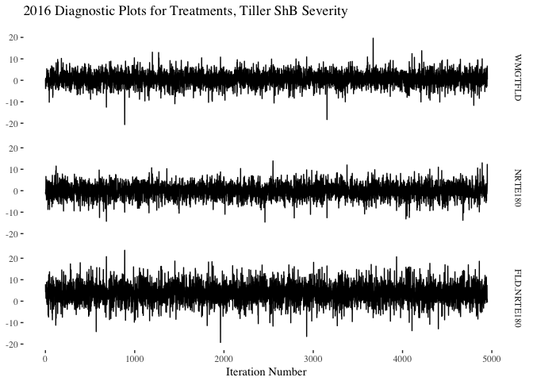

``` r
# Posterior distributions for treatment
plot_treatment_posteriors(d = trts,
                          title = "2016 Posteriors for Treatments, Tiller ShB Severity")
```


``` r
# check random effects
plotTrace(TShB_severity_lmm_2016$VCV, log = TRUE)
```

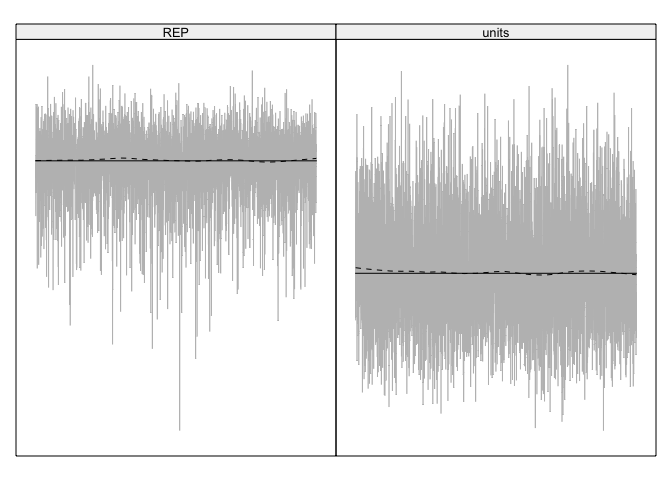

``` r
# plot joint distibution of error
rdf <- data.frame(TShB_severity_lmm_2016$VCV)
plot_joint_random_error_dist(d = rdf,
                             title = ("2016 Random Error Distribution for Tiller ShB Severity"))
```

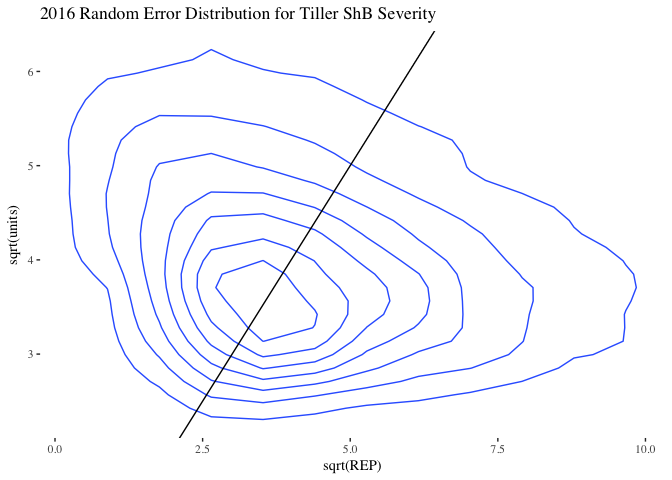

### 2016 Tiller Sheath Blight Incidence Model

``` r
eprior <- list(R = list(V = 1, nu = 0.02),
               G = list(G1 = list(V = 1, nu = 0.02, alpha.V = 1000)))
TShB_incidence_lmm_2016 <- MCMCglmm(TShB_incidence_mean ~ WMGT * NRTE, ~REP, 
                          data = as.data.frame(AUDPS_2016),
                          verbose = FALSE,
                          prior = eprior,
                          nitt = 5e+05,
                          burnin = 5000,
                          thin = 100,
                          pr = TRUE)

summary(TShB_incidence_lmm_2016)
```

    ## 
    ##  Iterations = 5001:499901
    ##  Thinning interval  = 100
    ##  Sample size  = 4950 
    ## 
    ##  DIC: 60.14119 
    ## 
    ##  G-structure:  ~REP
    ## 
    ##     post.mean  l-95% CI u-95% CI eff.samp
    ## REP     3.965 3.097e-07    13.16     4950
    ## 
    ##  R-structure:  ~units
    ## 
    ##       post.mean l-95% CI u-95% CI eff.samp
    ## units     1.923   0.5135     4.04     4950
    ## 
    ##  Location effects: TShB_incidence_mean ~ WMGT * NRTE 
    ## 
    ##                 post.mean l-95% CI u-95% CI eff.samp    pMCMC    
    ## (Intercept)       11.1480   8.9061  13.3845     4950 0.000808 ***
    ## WMGTFLD           -0.7818  -2.7109   1.1913     4950 0.386263    
    ## NRTE180            1.5363  -0.3868   3.4275     4950 0.107879    
    ## WMGTFLD:NRTE180    0.7749  -2.0750   3.4342     5289 0.545859    
    ## ---
    ## Signif. codes:  0 '***' 0.001 '**' 0.01 '*' 0.05 '.' 0.1 ' ' 1

``` r
# create data frames for generating diagnostic plots
reps <- data.frame(TShB_incidence_lmm_2016$Sol[, c(1, 5:8)])
reps <- melt(reps)
```

    ## No id variables; using all as measure variables

``` r
trts <-  data.frame(TShB_incidence_lmm_2016$Sol[, 2:4])
names(trts)[names(trts) == "WMGTFLD.NRTE100"] <- "FLD.NRTE100"
names(trts)[names(trts) == "WMGTFLD.NRTE120"] <- "FLD.NRTE120"
trts <- melt(trts)
```

    ## No id variables; using all as measure variables

``` r
# Create a dummy x-axis variable for plotting
x <- 1:nrow(TShB_incidence_lmm_2016$Sol)

# diagnostic line plots for replicate
plot_diagnostic_lines(d = reps,
                      x = x,
                      title = "2016 Diagnostic Plots for Replicates, Tiller ShB Incidence")
```

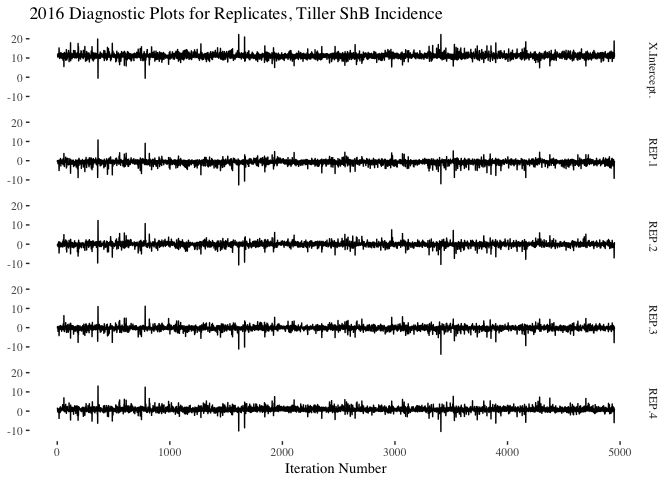

``` r
# posterior distributions for replicate
plot_replicate_posteriors(d = reps,
                          title = "2016 Reps Replicate Posteriors for Replicates, Tiller ShB Incidence")
```

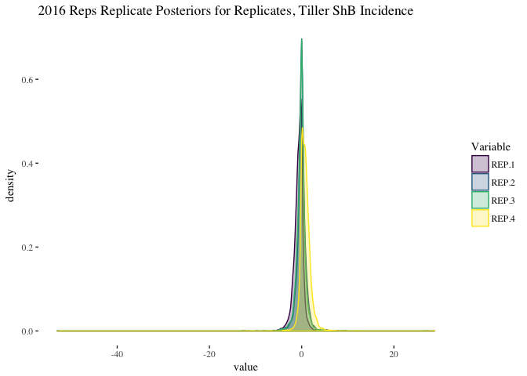

``` r
# diagnostic line plots for treatments
plot_diagnostic_lines(d = trts,
                      x = x,
                      title = "2016 Diagnostic Plots for Treatments, Tiller ShB Incidence")
```

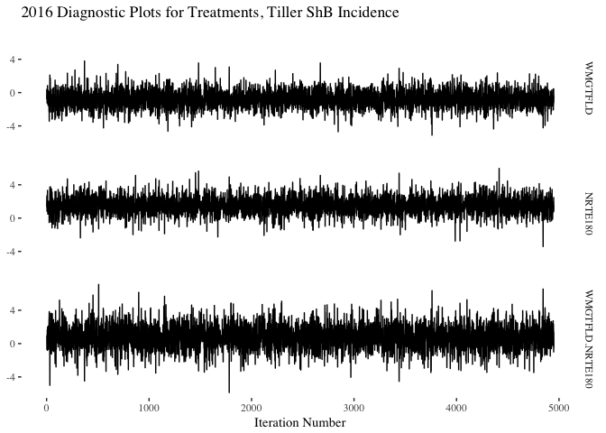

``` r
# Posterior distributions for treatment
plot_treatment_posteriors(d = trts,
                          title = "2016 Posteriors for Treatments, Tiller ShB Incidence")
```

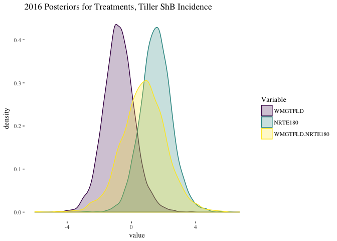

``` r
# check random effects
plotTrace(TShB_incidence_lmm_2016$VCV, log = TRUE)
```

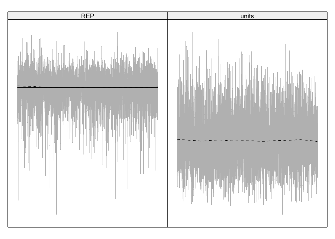

``` r
# plot joint distibution of error
rdf <- data.frame(TShB_incidence_lmm_2016$VCV)
plot_joint_random_error_dist(d = rdf,
                             title = ("2016 Random Error Distribution for Tiller ShB Incidence"))
```

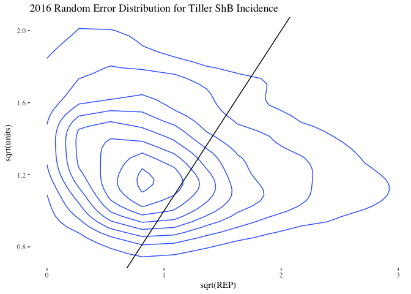

Conclusions
===========

The models all appear to be good fits after increasing the number of iterations. None of the treatments in either year, 2015 or 2016, were significant. The see `pMCMC` values and also posterior graphs. There is a large amount of overlap in all of the posterior graphs.
