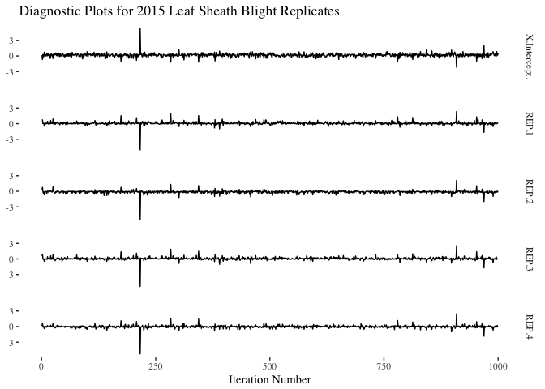
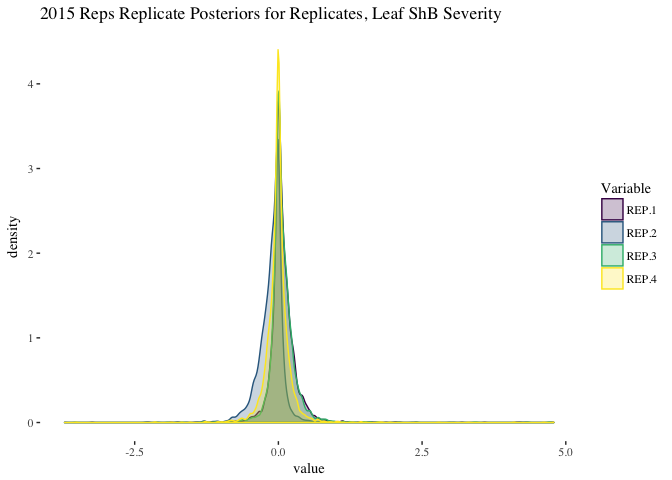
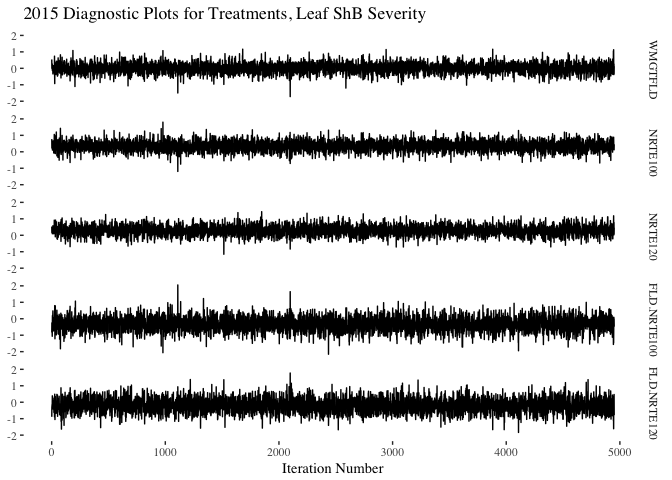
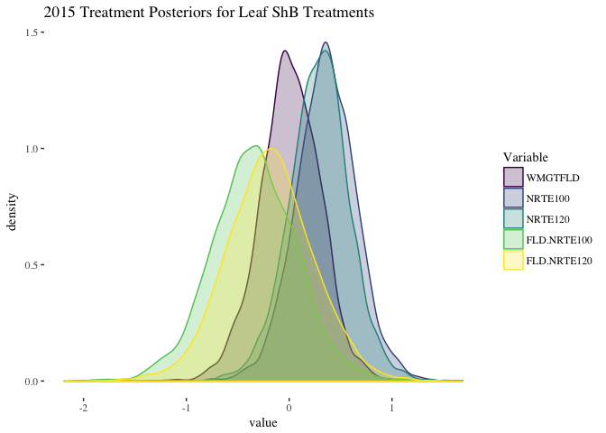
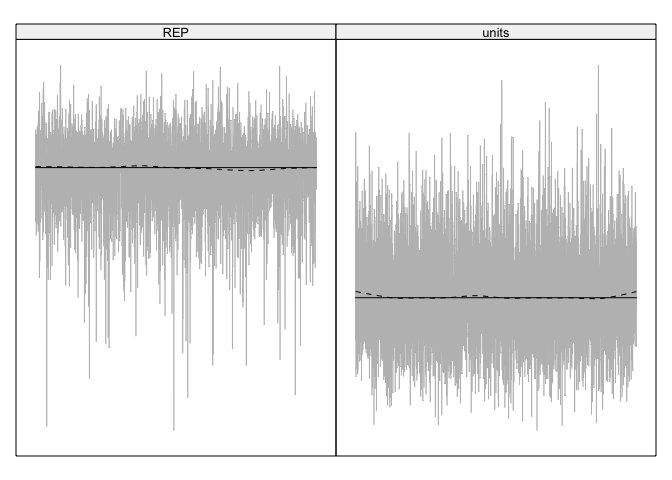

Analysis
================

2015 Leaf Sheath Blight Severity Model
--------------------------------------

``` r
eprior <- list(R = list(V = 1, nu = 0.02),
               G = list(G1 = list(V = 1, nu = 0.02, alpha.V = 1000)))
LShB_lmm_2015 <- MCMCglmm(LShB_AUDPS ~ WMGT * NRTE, ~REP, 
                 data = as.data.frame(AUDPS_2015),
                 verbose = FALSE,
                 prior = eprior,
                 pr = TRUE)

summary(LShB_lmm_2015)
```

    ## 
    ##  Iterations = 3001:12991
    ##  Thinning interval  = 10
    ##  Sample size  = 1000 
    ## 
    ##  DIC: 32.54248 
    ## 
    ##  G-structure:  ~REP
    ## 
    ##     post.mean  l-95% CI u-95% CI eff.samp
    ## REP    0.2733 1.368e-09    1.004    545.1
    ## 
    ##  R-structure:  ~units
    ## 
    ##       post.mean l-95% CI u-95% CI eff.samp
    ## units     0.174  0.06752   0.3026     1013
    ## 
    ##  Location effects: LShB_AUDPS ~ WMGT * NRTE 
    ## 
    ##                 post.mean l-95% CI u-95% CI eff.samp pMCMC
    ## (Intercept)       0.16834 -0.40326  0.68565     1000 0.476
    ## WMGTFLD           0.02751 -0.59286  0.56379     1150 0.904
    ## NRTE100           0.37183 -0.19490  0.92038     1000 0.192
    ## NRTE120           0.30907 -0.32627  0.85318     1000 0.292
    ## WMGTFLD:NRTE100  -0.35424 -1.11224  0.47087     1000 0.366
    ## WMGTFLD:NRTE120  -0.20344 -1.00988  0.64927     1103 0.644

``` r
# create data frames for generating diagnostic plots
reps <- data.frame(LShB_lmm_2015$Sol[, c(1, 7:10)])
reps <- melt(reps)
```

    ## No id variables; using all as measure variables

``` r
trts <-  data.frame(LShB_lmm_2015$Sol[, 2:6])
names(trts)[names(trts) == "WMGTFLD.NRTE100"] <- "FLD.NRTE100"
names(trts)[names(trts) == "WMGTFLD.NRTE120"] <- "FLD.NRTE120"
trts <- melt(trts)
```

    ## No id variables; using all as measure variables

``` r
# Create a dummy x-axis variable for plotting
x <- 1:nrow(LShB_lmm_2015$Sol)

# Diagnostic line plots for replicate
ggplot(data = reps, aes(x = rep(x, 5), y = value, group = variable)) +
  geom_line() +
  theme_tufte() +
  xlab("Iteration Number") +
  ylab(NULL) +
  facet_grid(variable ~ .) +
  ggtitle("Diagnostic Plots for 2015 Leaf Sheath Blight Replicates")
```



``` r
# Posterior distributions for replicate
ggplot(reps[reps$variable != "X.Intercept.", ], aes(x = value, color = variable)) + 
  geom_density() +
  theme_tufte() +
  ggtitle("2015 Replicate Posteriors for Leaf Sheath Blight")
```



``` r
# Diagnostic line plots for treatments
ggplot(data = trts, aes(x = rep(x, 5), y = value, group = variable)) +
  geom_line() +
  theme_tufte() +
  xlab("Iteration Number") +
  ylab(NULL) +
  facet_grid(variable ~ .) +
  ggtitle("Diagnostic Plots for 2015 Leaf Sheath Blight Treatments")
```



``` r
# Posterior distributions for treatment
ggplot(trts, aes(x = value, color = variable)) + 
  geom_density() +
  theme_tufte() +
  ggtitle("2015 Treatment Posteriors for Leaf Sheath Blight")
```



``` r
# joint distibution of error
rdf <- data.frame(LShB_lmm_2015$VCV)
ggplot(rdf, aes(x = sqrt(REP), y = sqrt(units))) + 
  geom_density2d() + 
  geom_abline(intercept = 0, slope = 1) +
  ggtitle("2015 Leaf Blight Error") +
  theme_tufte()
```



2015 Tiller Sheath Blight Severity Model
----------------------------------------

``` r
eprior <- list(R = list(V = 1, nu = 0.02),
               G = list(G1 = list(V = 1, nu = 0.02, alpha.V = 1000)))
TShB_lmm_2015 <- MCMCglmm(TShB_AUDPS ~ WMGT * NRTE, ~REP, 
                 data = as.data.frame(AUDPS_2015),
                 verbose = FALSE,
                 prior = eprior,
                 pr = TRUE)

summary(TShB_lmm_2015)
```

    ## 
    ##  Iterations = 3001:12991
    ##  Thinning interval  = 10
    ##  Sample size  = 1000 
    ## 
    ##  DIC: 121.2405 
    ## 
    ##  G-structure:  ~REP
    ## 
    ##     post.mean  l-95% CI u-95% CI eff.samp
    ## REP     3.872 3.239e-06    13.64    817.1
    ## 
    ##  R-structure:  ~units
    ## 
    ##       post.mean l-95% CI u-95% CI eff.samp
    ## units       7.1    3.051    13.17     1000
    ## 
    ##  Location effects: TShB_AUDPS ~ WMGT * NRTE 
    ## 
    ##                 post.mean l-95% CI u-95% CI eff.samp pMCMC
    ## (Intercept)        1.5444  -1.5212   4.4755     1000 0.300
    ## WMGTFLD           -0.4810  -4.3596   3.0736     1000 0.770
    ## NRTE100            1.7017  -1.8719   5.4948     1000 0.350
    ## NRTE120            1.9810  -1.6392   5.8819     1000 0.250
    ## WMGTFLD:NRTE100   -0.8841  -6.0206   4.7278     1000 0.716
    ## WMGTFLD:NRTE120    0.2912  -4.5290   5.9703     1143 0.880

``` r
# create data frames for generating diagnostic plots
reps <- data.frame(TShB_lmm_2015$Sol[, c(1, 7:10)])
reps <- melt(reps)
```

    ## No id variables; using all as measure variables

``` r
trts <-  data.frame(TShB_lmm_2015$Sol[, 2:6])
names(trts)[names(trts) == "WMGTFLD.NRTE100"] <- "FLD.NRTE100"
names(trts)[names(trts) == "WMGTFLD.NRTE120"] <- "FLD.NRTE120"
trts <- melt(trts)
```

    ## No id variables; using all as measure variables

``` r
# Create a dummy x-axis variable for plotting
x <- 1:nrow(TShB_lmm_2015$Sol)

# Diagnostic line plots for replicate
ggplot(data = reps, aes(x = rep(x, 5), y = value, group = variable)) +
  geom_line() +
  theme_tufte() +
  xlab("Iteration Number") +
  ylab(NULL) +
  facet_grid(variable ~ .) +
  ggtitle("Diagnostic Plots for 2015 Tiller Sheath Blight Replicates")
```


``` r
# Posterior distributions for replicate
ggplot(reps[reps$variable != "X.Intercept.", ], aes(x = value, color = variable)) + 
  geom_density() +
  theme_tufte() +
  ggtitle("2015 Replicate Posteriors for Tiller Sheath Blight")
```


``` r
# Diagnostic line plots for treatments
ggplot(data = trts, aes(x = rep(x, 5), y = value, group = variable)) +
  geom_line() +
  theme_tufte() +
  xlab("Iteration Number") +
  ylab(NULL) +
  facet_grid(variable ~ .) +
  ggtitle("Diagnostic Plots for 2015 Tiller Sheath Blight Treatments")
```


``` r
# Posterior distributions for treatment
ggplot(trts, aes(x = value, color = variable)) + 
  geom_density() +
  theme_tufte() +
  ggtitle("2015 Treatment Posteriors for Tiller Sheath Blight")
```


``` r
# joint distibution of error
rdf <- data.frame(TShB_lmm_2015$VCV)
ggplot(rdf, aes(x = sqrt(REP), y = sqrt(units))) + 
  geom_density2d() + 
  geom_abline(intercept = 0, slope = 1) +
  ggtitle("2015 Tiller Blight Error") +
  theme_tufte()
```


------------------------------------------------------------------------

2016 Leaf Sheath Blight Severity Model
--------------------------------------

``` r
eprior <- list(R = list(V = 1, nu = 0.02),
               G = list(G1 = list(V = 1, nu = 0.02, alpha.V = 1000)))
LShB_lmm_2016 <- MCMCglmm(LShB_AUDPS ~ WMGT * NRTE, ~REP, 
                 data = as.data.frame(AUDPS_2016),
                 verbose = FALSE,
                 prior = eprior,
                 pr = TRUE)

summary(LShB_lmm_2016)
```

    ## 
    ##  Iterations = 3001:12991
    ##  Thinning interval  = 10
    ##  Sample size  = 1000 
    ## 
    ##  DIC: 32.37719 
    ## 
    ##  G-structure:  ~REP
    ## 
    ##     post.mean  l-95% CI u-95% CI eff.samp
    ## REP    0.5783 1.141e-05    2.158    780.4
    ## 
    ##  R-structure:  ~units
    ## 
    ##       post.mean l-95% CI u-95% CI eff.samp
    ## units    0.3387  0.09829    0.687     1000
    ## 
    ##  Location effects: LShB_AUDPS ~ WMGT * NRTE 
    ## 
    ##                 post.mean l-95% CI u-95% CI eff.samp pMCMC  
    ## (Intercept)       1.20857  0.33030  2.05129   1000.0 0.016 *
    ## WMGTFLD          -0.18576 -1.02857  0.66786    951.4 0.608  
    ## NRTE180           0.08493 -0.72961  0.96980   1000.0 0.828  
    ## WMGTFLD:NRTE180   0.42669 -0.70388  1.60778   1000.0 0.418  
    ## ---
    ## Signif. codes:  0 '***' 0.001 '**' 0.01 '*' 0.05 '.' 0.1 ' ' 1

``` r
# create data frames for generating diagnostic plots
reps <- data.frame(LShB_lmm_2016$Sol[, c(1, 5:8)])
reps <- melt(reps)
```

    ## No id variables; using all as measure variables

``` r
trts <-  data.frame(LShB_lmm_2016$Sol[, 2:4])
names(trts)[names(trts) == "WMGTFLD.NRTE180"] <- "FLD.NRTE180"
trts <- melt(trts)
```

    ## No id variables; using all as measure variables

``` r
# Create a dummy x-axis variable for plotting
x <- 1:nrow(LShB_lmm_2016$Sol)

# Diagnostic line plots for replicate
ggplot(data = reps, aes(x = rep(x, 5), y = value, group = variable)) +
  geom_line() +
  theme_tufte() +
  xlab("Iteration Number") +
  ylab(NULL) +
  facet_grid(variable ~ .) +
  ggtitle("Diagnostic Plots for 2016 Leaf Sheath Blight Replicates")
```


``` r
# Posterior distributions for replicate
ggplot(reps[reps$variable != "X.Intercept.", ], aes(x = value, color = variable)) + 
  geom_density() +
  theme_tufte() +
  ggtitle("2016 Replicate Posteriors for Leaf Sheath Blight")
```


``` r
# Diagnostic line plots for treatments
ggplot(data = trts, aes(x = rep(x, 3), y = value, group = variable)) +
  geom_line() +
  theme_tufte() +
  xlab("Iteration Number") +
  ylab(NULL) +
  facet_grid(variable ~ .) +
  ggtitle("Diagnostic Plots for 2016 Leaf Sheath Blight Treatments")
```


``` r
# Posterior distributions for treatment
ggplot(trts, aes(x = value, color = variable)) + 
  geom_density() +
  theme_tufte() +
  ggtitle("2016 Treatment Posteriors for Leaf Sheath Blight")
```


``` r
# joint distibution of error
rdf <- data.frame(LShB_lmm_2016$VCV)
ggplot(rdf, aes(x = sqrt(REP), y = sqrt(units))) + 
  geom_density2d() + 
  geom_abline(intercept = 0, slope = 1) +
  ggtitle("2016 Leaf Blight Error") +
  theme_tufte()
```


Tiller Sheath Blight Severity Model
-----------------------------------

``` r
eprior <- list(R = list(V = 1, nu = 0.02),
               G = list(G1 = list(V = 1, nu = 0.02, alpha.V = 1000)))
TShB_lmm_2016 <- MCMCglmm(TShB_AUDPS ~ WMGT * NRTE, ~REP, 
                 data = as.data.frame(AUDPS_2016),
                 verbose = FALSE,
                 prior = eprior,
                 pr = TRUE)

summary(TShB_lmm_2016)
```

    ## 
    ##  Iterations = 3001:12991
    ##  Thinning interval  = 10
    ##  Sample size  = 1000 
    ## 
    ##  DIC: 96.61105 
    ## 
    ##  G-structure:  ~REP
    ## 
    ##     post.mean  l-95% CI u-95% CI eff.samp
    ## REP      48.7 0.0007283    141.6    941.4
    ## 
    ##  R-structure:  ~units
    ## 
    ##       post.mean l-95% CI u-95% CI eff.samp
    ## units     18.76    4.826    39.91     1000
    ## 
    ##  Location effects: TShB_AUDPS ~ WMGT * NRTE 
    ## 
    ##                 post.mean l-95% CI u-95% CI eff.samp pMCMC   
    ## (Intercept)      19.89955 11.96186 26.99250     1000 0.002 **
    ## WMGTFLD           0.50587 -6.08896  6.36393     1183 0.834   
    ## NRTE180           0.03775 -6.60349  6.62246     1000 0.994   
    ## WMGTFLD:NRTE180   3.70119 -5.49885 12.80546     1000 0.360   
    ## ---
    ## Signif. codes:  0 '***' 0.001 '**' 0.01 '*' 0.05 '.' 0.1 ' ' 1

``` r
# create data frames for generating diagnostic plots
reps <- data.frame(TShB_lmm_2016$Sol[, c(1, 5:8)])
reps <- melt(reps)
```

    ## No id variables; using all as measure variables

``` r
trts <-  data.frame(TShB_lmm_2016$Sol[, 2:4])
names(trts)[names(trts) == "WMGTFLD.NRTE180"] <- "FLD.NRTE180"
trts <- melt(trts)
```

    ## No id variables; using all as measure variables

``` r
# Create a dummy x-axis variable for plotting
x <- 1:nrow(TShB_lmm_2016$Sol)

# Diagnostic line plots for replicate
ggplot(data = reps, aes(x = rep(x, 5), y = value, group = variable)) +
  geom_line() +
  theme_tufte() +
  xlab("Iteration Number") +
  ylab(NULL) +
  facet_grid(variable ~ .) +
  ggtitle("Diagnostic Plots for 2016 Tiller Sheath Blight Replicates")
```


``` r
# Posterior distributions for replicate
ggplot(reps[reps$variable != "X.Intercept.", ], aes(x = value, color = variable)) + 
  geom_density() +
  theme_tufte() +
  ggtitle("2016 Replicate Posteriors for Tiller Sheath Blight")
```


``` r
# Diagnostic line plots for treatments
ggplot(data = trts, aes(x = rep(x, 3), y = value, group = variable)) +
  geom_line() +
  theme_tufte() +
  xlab("Iteration Number") +
  ylab(NULL) +
  facet_grid(variable ~ .) +
  ggtitle("Diagnostic Plots for 2016 Tiller Sheath Blight Treatments")
```


``` r
# Posterior distributions for treatment
ggplot(trts, aes(x = value, color = variable)) + 
  geom_density() +
  theme_tufte() +
  ggtitle("2016 Treatement Posteriors")
```


``` r
# joint distibution of error
rdf <- data.frame(TShB_lmm_2016$VCV)
ggplot(rdf, aes(x = sqrt(REP), y = sqrt(units))) + 
  geom_density2d() + 
  geom_abline(intercept = 0, slope = 1) +
  ggtitle("2016 Tiller Sheath Blight Error") +
  theme_tufte()
```


