Analysis of split plot design using MCMCglmm
================

Notes on this analysis before starting
--------------------------------------

#### How to interpret these analyses

For a quick overview, see this thread on Stack Overflow that walks through the output of `summary.MCMCglmm`, which is used below. [R: Making sense of the output of a MCMCglmm](http://stackoverflow.com/questions/20993643/r-making-sense-of-the-output-of-a-mcmcglmm)

The MCMCglmm documentation is more in-depth but should still be referenced.

``` r
library(MCMCglmm)
vignette("Overview")
vignette("CourseNotes")
```

#### Changes between 2015 and 2016

Before the analysis, note that due to changes between the years, the analysis must be carried out on each year separately. The 2015 data and 2016 data cannot be combined due to changes in inoculation methods; there are other changes too, but the main one is this. Therefore, the analyses will be conducted separately for leaf severity and Leaf severity for 2015 dry season and 2016 dry season. Comparisons will only be observational and cannot be statistically compared.

#### Iterations

Fitting the models with the default iterations resulted in some less than acceptable models. Because of this, the number of iterations has been increased, `nitt = 5e+05` and `burnin = 5000` and `thin = 100`. This results in much smaller errors for random effects and better models.

Setup
-----

Use `set.seed()` for reproducibility.

``` r
set.seed(27)
```

2015
----

### 2015 Tiller Sheath Blight Incidence Model

``` r
# Separate the TRT column into the two treatments for analysis
AUDPS <- separate(data = AUDPS, col = TRT, into = c("WMGT", "NRTE"))

eprior <- list(R = list(V = 1, nu = 0.02),
               G = list(G1 = list(V = 1, nu = 0.02, alpha.V = 1000)))
TShB_incidence_lmm_2015 <- MCMCglmm(AUDPS ~ WMGT * NRTE,
                                    random = ~REP, 
                          data = as.data.frame(AUDPS[AUDPS$YEAR == 2015, ]),
                          verbose = FALSE,
                          prior = eprior,
                          nitt = 5e+05,
                          burnin = 5000,
                          thin = 100,
                          pr = TRUE)

summary(TShB_incidence_lmm_2015)
```

    ## 
    ##  Iterations = 5001:499901
    ##  Thinning interval  = 100
    ##  Sample size  = 4950 
    ## 
    ##  DIC: 120.7347 
    ## 
    ##  G-structure:  ~REP
    ## 
    ##     post.mean l-95% CI u-95% CI eff.samp
    ## REP     2.678  9.2e-08    10.69     4950
    ## 
    ##  R-structure:  ~units
    ## 
    ##       post.mean l-95% CI u-95% CI eff.samp
    ## units     6.935    2.766    12.17     5367
    ## 
    ##  Location effects: AUDPS ~ WMGT * NRTE 
    ## 
    ##                  post.mean l-95% CI u-95% CI eff.samp  pMCMC  
    ## (Intercept)         2.3177  -0.5295   5.4005     4950 0.1176  
    ## WMGTFLD             0.5983  -2.9244   4.3426     4577 0.7543  
    ## NRTEN100            2.0712  -1.7951   5.6033     4950 0.2505  
    ## NRTEN120            3.1649  -0.6522   6.5576     5159 0.0885 .
    ## WMGTFLD:NRTEN100   -1.3002  -6.7856   3.6195     4950 0.6242  
    ## WMGTFLD:NRTEN120    0.2726  -4.7023   5.6104     4950 0.9055  
    ## ---
    ## Signif. codes:  0 '***' 0.001 '**' 0.01 '*' 0.05 '.' 0.1 ' ' 1

``` r
# create data frames for generating diagnostic plots
reps <- data.frame(TShB_incidence_lmm_2015$Sol[, c(1, 7:10)])
reps <- melt(reps)
```

    ## No id variables; using all as measure variables

``` r
trts <-  data.frame(TShB_incidence_lmm_2015$Sol[, 2:6])
trts <- melt(trts)
```

    ## No id variables; using all as measure variables

``` r
# Create a dummy x-axis variable for plotting
x <- 1:nrow(TShB_incidence_lmm_2015$Sol)

# diagnostic line plots for replicate
plot_diagnostic_lines(d = reps,
                      x = x,
                      title = "2015 Diagnostic Plots for Replicates, Tiller ShB Incidence")
```

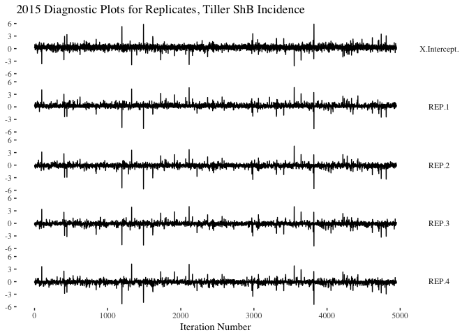

``` r
# posterior distributions for replicate
plot_replicate_posteriors(d = reps,
                          title = "2015 Reps Replicate Posteriors for Replicates, Tiller ShB Incidence")
```

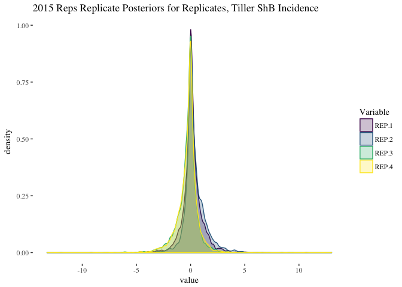

``` r
# diagnostic line plots for treatments
plot_diagnostic_lines(d = trts,
                      x = x,
                      title = "2015 Diagnostic Plots for Treatments, Tiller ShB Incidence")
```

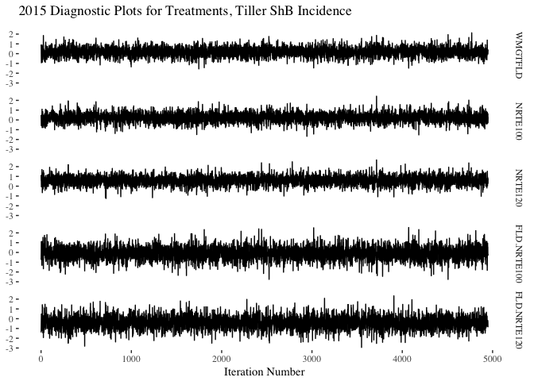

``` r
# Posterior distributions for treatment
plot_treatment_posteriors(d = trts,
                          title = "2015 Posteriors for Treatments, Tiller ShB Incidence")
```

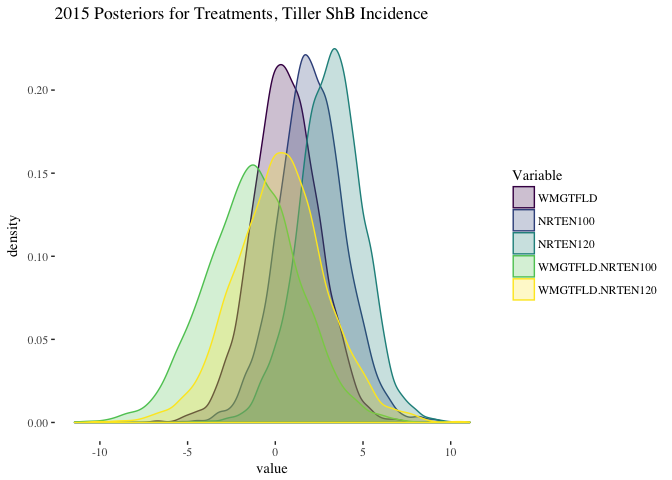

``` r
# check random effects
plotTrace(TShB_incidence_lmm_2015$VCV, log = TRUE)
```

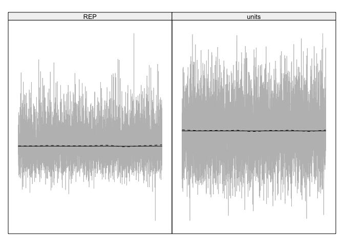

``` r
# plot joint distibution of error
rdf <- data.frame(TShB_incidence_lmm_2015$VCV)
plot_joint_random_error_dist(d = rdf,
                             title = ("2015 Random Error Distribution for Tiller ShB Incidence"))
```

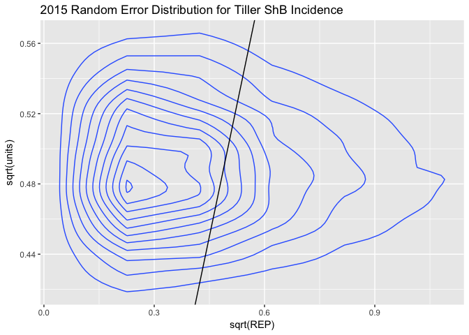

------------------------------------------------------------------------

2016
----

### 2016 Tiller Sheath Blight Incidence Model

``` r
eprior <- list(R = list(V = 1, nu = 0.02),
               G = list(G1 = list(V = 1, nu = 0.02, alpha.V = 1000)))
TShB_incidence_lmm_2016 <- MCMCglmm(AUDPS ~ WMGT * NRTE, 
                                    random = ~REP, 
                          data = as.data.frame(AUDPS[AUDPS$YEAR == 2016, ]),
                          verbose = FALSE,
                          prior = eprior,
                          nitt = 5e+05,
                          burnin = 5000,
                          thin = 100,
                          pr = TRUE)

summary(TShB_incidence_lmm_2016)
```

    ## 
    ##  Iterations = 5001:499901
    ##  Thinning interval  = 100
    ##  Sample size  = 4950 
    ## 
    ##  DIC: 71.92803 
    ## 
    ##  G-structure:  ~REP
    ## 
    ##     post.mean  l-95% CI u-95% CI eff.samp
    ## REP     28.41 6.924e-05    92.28     4950
    ## 
    ##  R-structure:  ~units
    ## 
    ##       post.mean l-95% CI u-95% CI eff.samp
    ## units     7.747    1.715    18.08     4950
    ## 
    ##  Location effects: AUDPS ~ WMGT * NRTE 
    ## 
    ##                 post.mean l-95% CI u-95% CI eff.samp  pMCMC    
    ## (Intercept)       48.8935  43.0868  54.9022     4950 <2e-04 ***
    ## WMGTFLD            1.4645  -3.0718   5.7389     4950 0.4529    
    ## NRTEN60           -5.2142  -9.5209  -0.8852     4950 0.0234 *  
    ## WMGTFLD:NRTEN60    1.1160  -5.2055   6.7414     4950 0.6869    
    ## ---
    ## Signif. codes:  0 '***' 0.001 '**' 0.01 '*' 0.05 '.' 0.1 ' ' 1

``` r
# create data frames for generating diagnostic plots
reps <- data.frame(TShB_incidence_lmm_2016$Sol[, c(1, 5:8)])
reps <- melt(reps)
```

    ## No id variables; using all as measure variables

``` r
trts <-  data.frame(TShB_incidence_lmm_2016$Sol[, 2:4])
trts <- melt(trts)
```

    ## No id variables; using all as measure variables

``` r
# Create a dummy x-axis variable for plotting
x <- 1:nrow(TShB_incidence_lmm_2016$Sol)

# diagnostic line plots for replicate
plot_diagnostic_lines(d = reps,
                      x = x,
                      title = "2016 Diagnostic Plots for Replicates, Tiller ShB Incidence")
```

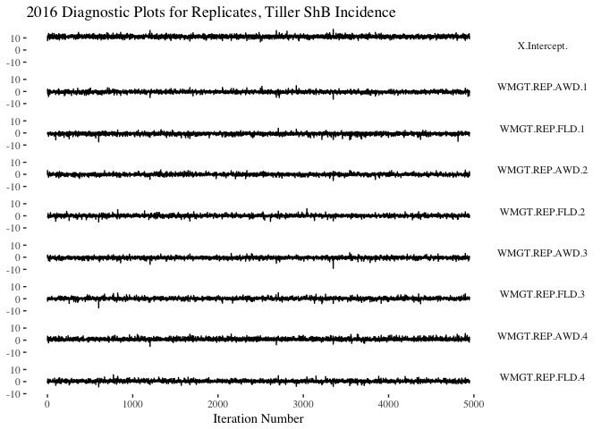

``` r
# posterior distributions for replicate
plot_replicate_posteriors(d = reps,
                          title = "2016 Reps Replicate Posteriors for Replicates, Tiller ShB Incidence")
```

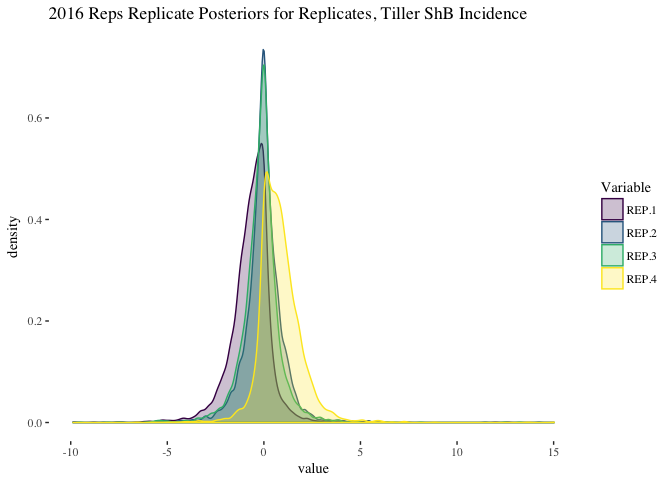

``` r
# diagnostic line plots for treatments
plot_diagnostic_lines(d = trts,
                      x = x,
                      title = "2016 Diagnostic Plots for Treatments, Tiller ShB Incidence")
```


``` r
# Posterior distributions for treatment
plot_treatment_posteriors(d = trts,
                          title = "2016 Posteriors for Treatments, Tiller ShB Incidence")
```

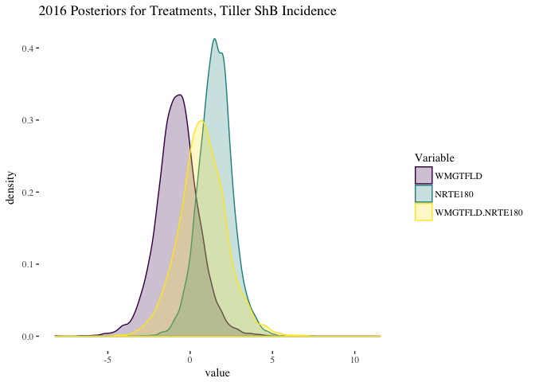

``` r
# check random effects
plotTrace(TShB_incidence_lmm_2016$VCV, log = TRUE)
```

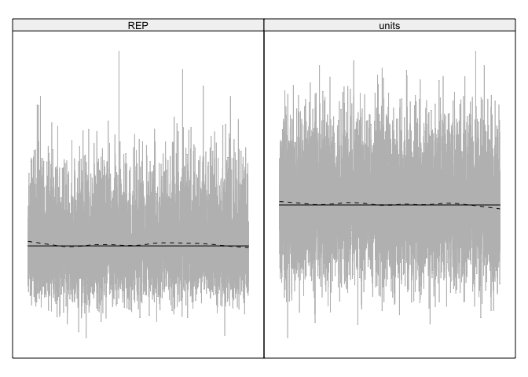

``` r
# plot joint distibution of error
rdf <- data.frame(TShB_incidence_lmm_2016$VCV)
plot_joint_random_error_dist(d = rdf,
                             title = ("2016 Random Error Distribution for Tiller ShB Incidence"))
```

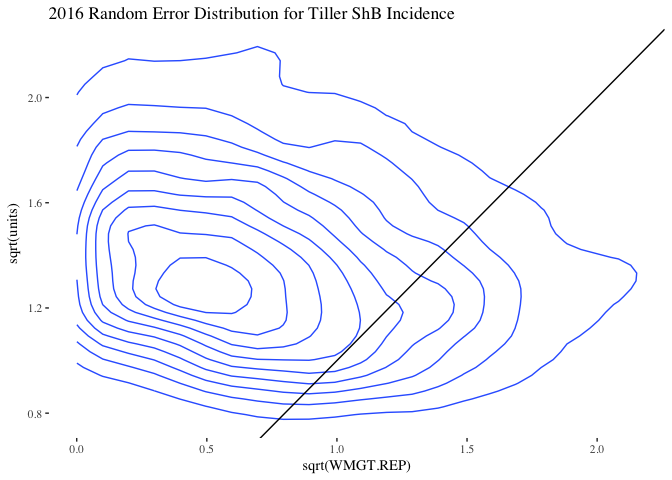

Conclusions
===========

The models all appear to be good fits.

None of the diagnostic plots show any signs of autocorrelation or any other obvious patterns.

None of the treatments in either year, 2015 or 2016, were significant. The see `pMCMC` values and also posterior graphs. There is a large amount of overlap in all of the posterior graphs.

The random effects all appear to be acceptable, the dotted line stays near to the solid line with no discernible patterns.

The random effects are all fairly equally distributed except for 2016 tiller sheath blight severity where water management:replicate has a larger effect. This is not surprising given that the plot and replicate sizes were different in 2016 due to the use of two fields in the IRRI experiment station, see the [2016 plot layout plan](https://github.com/adamhsparks/AWD_ShB_Interaction/blob/master/doc/Metadata/2016%20AWD%20ShB%20Metadata/ExptLayoutAWD2016.pdf).

R Session Info
==============

``` r
devtools::session_info()
```

    ## Session info --------------------------------------------------------------

    ##  setting  value                       
    ##  version  R version 3.4.0 (2017-04-21)
    ##  system   x86_64, darwin15.6.0        
    ##  ui       unknown                     
    ##  language (EN)                        
    ##  collate  en_AU.UTF-8                 
    ##  tz       Australia/Brisbane          
    ##  date     2017-04-28

    ## Packages ------------------------------------------------------------------

    ##  package         * version  date       source        
    ##  agricolae       * 1.2-4    2016-06-12 CRAN (R 3.4.0)
    ##  AlgDesign         1.1-7.3  2014-10-15 CRAN (R 3.4.0)
    ##  ape             * 4.1      2017-02-14 CRAN (R 3.4.0)
    ##  assertthat        0.2.0    2017-04-11 CRAN (R 3.4.0)
    ##  backports         1.0.5    2017-01-18 CRAN (R 3.4.0)
    ##  bitops            1.0-6    2013-08-17 CRAN (R 3.4.0)
    ##  boot              1.3-19   2017-02-11 CRAN (R 3.4.0)
    ##  broom             0.4.2    2017-02-13 CRAN (R 3.4.0)
    ##  car             * 2.1-4    2016-12-02 CRAN (R 3.4.0)
    ##  caTools           1.17.1   2014-09-10 CRAN (R 3.4.0)
    ##  cellranger        1.1.0    2016-07-27 CRAN (R 3.4.0)
    ##  cluster           2.0.6    2017-03-10 CRAN (R 3.4.0)
    ##  coda            * 0.19-1   2016-12-08 CRAN (R 3.4.0)
    ##  colorspace        1.3-2    2016-12-14 CRAN (R 3.4.0)
    ##  combinat          0.0-8    2012-10-29 CRAN (R 3.4.0)
    ##  corpcor           1.6.9    2017-04-01 CRAN (R 3.4.0)
    ##  cubature          1.3-6    2016-12-12 CRAN (R 3.4.0)
    ##  DBI               0.6-1    2017-04-01 CRAN (R 3.4.0)
    ##  deldir            0.1-14   2017-04-22 CRAN (R 3.4.0)
    ##  devtools          1.12.0   2016-12-05 CRAN (R 3.4.0)
    ##  digest            0.6.12   2017-01-27 CRAN (R 3.4.0)
    ##  dplyr           * 0.5.0    2016-06-24 CRAN (R 3.4.0)
    ##  evaluate          0.10     2016-10-11 CRAN (R 3.4.0)
    ##  expm              0.999-2  2017-03-29 CRAN (R 3.4.0)
    ##  fitdistrplus    * 1.0-9    2017-03-24 CRAN (R 3.4.0)
    ##  forcats           0.2.0    2017-01-23 CRAN (R 3.4.0)
    ##  foreign           0.8-67   2016-09-13 CRAN (R 3.4.0)
    ##  gdata             2.17.0   2015-07-04 CRAN (R 3.4.0)
    ##  ggplot2         * 2.2.1    2016-12-30 CRAN (R 3.4.0)
    ##  ggthemes        * 3.4.0    2017-02-19 CRAN (R 3.4.0)
    ##  gmodels           2.16.2   2015-07-22 CRAN (R 3.4.0)
    ##  gplots            3.0.1    2016-03-30 CRAN (R 3.4.0)
    ##  gridExtra         2.2.1    2016-02-29 CRAN (R 3.4.0)
    ##  gtable            0.2.0    2016-02-26 CRAN (R 3.4.0)
    ##  gtools            3.5.0    2015-05-29 CRAN (R 3.4.0)
    ##  haven             1.0.0    2016-09-23 CRAN (R 3.4.0)
    ##  hms               0.3      2016-11-22 CRAN (R 3.4.0)
    ##  htmltools         0.3.5    2016-03-21 CRAN (R 3.4.0)
    ##  httr              1.2.1    2016-07-03 CRAN (R 3.4.0)
    ##  jsonlite          1.4      2017-04-08 CRAN (R 3.4.0)
    ##  KernSmooth        2.23-15  2015-06-29 CRAN (R 3.4.0)
    ##  klaR              0.6-12   2014-08-06 CRAN (R 3.4.0)
    ##  knitr             1.15.1   2016-11-22 CRAN (R 3.4.0)
    ##  labeling          0.3      2014-08-23 CRAN (R 3.4.0)
    ##  lattice         * 0.20-35  2017-03-25 CRAN (R 3.4.0)
    ##  lazyeval          0.2.0    2016-06-12 CRAN (R 3.4.0)
    ##  LearnBayes        2.15     2014-05-29 CRAN (R 3.4.0)
    ##  lme4              1.1-13   2017-04-19 CRAN (R 3.4.0)
    ##  lubridate       * 1.6.0    2016-09-13 CRAN (R 3.4.0)
    ##  magrittr          1.5      2014-11-22 CRAN (R 3.4.0)
    ##  MASS            * 7.3-47   2017-02-26 CRAN (R 3.4.0)
    ##  Matrix          * 1.2-9    2017-03-14 CRAN (R 3.4.0)
    ##  MatrixModels      0.4-1    2015-08-22 CRAN (R 3.4.0)
    ##  MCMCglmm        * 2.24     2016-11-14 CRAN (R 3.4.0)
    ##  memoise           1.1.0    2017-04-21 CRAN (R 3.4.0)
    ##  mgcv              1.8-17   2017-02-08 CRAN (R 3.4.0)
    ##  minqa             1.2.4    2014-10-09 CRAN (R 3.4.0)
    ##  mnormt            1.5-5    2016-10-15 CRAN (R 3.4.0)
    ##  modelr            0.1.0    2016-08-31 CRAN (R 3.4.0)
    ##  munsell           0.4.3    2016-02-13 CRAN (R 3.4.0)
    ##  nlme              3.1-131  2017-02-06 CRAN (R 3.4.0)
    ##  nloptr            1.0.4    2014-08-04 CRAN (R 3.4.0)
    ##  nnet              7.3-12   2016-02-02 CRAN (R 3.4.0)
    ##  packrat           0.4.8-1  2016-09-07 CRAN (R 3.4.0)
    ##  pbkrtest          0.4-7    2017-03-15 CRAN (R 3.4.0)
    ##  plotMCMC        * 2.0-0    2014-03-12 CRAN (R 3.4.0)
    ##  plyr            * 1.8.4    2016-06-08 CRAN (R 3.4.0)
    ##  ProjectTemplate * 0.7      2016-08-11 CRAN (R 3.4.0)
    ##  psych             1.7.3.21 2017-03-22 CRAN (R 3.4.0)
    ##  purrr           * 0.2.2    2016-06-18 CRAN (R 3.4.0)
    ##  quantreg          5.33     2017-04-18 CRAN (R 3.4.0)
    ##  R6                2.2.0    2016-10-05 CRAN (R 3.4.0)
    ##  Rcpp              0.12.10  2017-03-19 CRAN (R 3.4.0)
    ##  readr           * 1.1.0    2017-03-22 CRAN (R 3.4.0)
    ##  readxl            1.0.0    2017-04-18 CRAN (R 3.4.0)
    ##  reshape2        * 1.4.2    2016-10-22 CRAN (R 3.4.0)
    ##  rmarkdown         1.4      2017-03-24 CRAN (R 3.4.0)
    ##  rprojroot         1.2      2017-01-16 CRAN (R 3.4.0)
    ##  rvest             0.3.2    2016-06-17 CRAN (R 3.4.0)
    ##  scales            0.4.1    2016-11-09 CRAN (R 3.4.0)
    ##  sp                1.2-4    2016-12-22 CRAN (R 3.4.0)
    ##  SparseM           1.77     2017-04-23 CRAN (R 3.4.0)
    ##  spdep             0.6-12   2017-04-06 CRAN (R 3.4.0)
    ##  stringi           1.1.5    2017-04-07 CRAN (R 3.4.0)
    ##  stringr           1.2.0    2017-02-18 CRAN (R 3.4.0)
    ##  survival        * 2.41-3   2017-04-04 CRAN (R 3.4.0)
    ##  tensorA           0.36     2010-12-01 CRAN (R 3.4.0)
    ##  tibble          * 1.3.0    2017-04-01 CRAN (R 3.4.0)
    ##  tidyr           * 0.6.1    2017-01-10 CRAN (R 3.4.0)
    ##  tidyverse       * 1.1.1    2017-01-27 CRAN (R 3.4.0)
    ##  viridis         * 0.4.0    2017-03-27 CRAN (R 3.4.0)
    ##  viridisLite     * 0.2.0    2017-03-24 CRAN (R 3.4.0)
    ##  withr             1.0.2    2016-06-20 CRAN (R 3.4.0)
    ##  xml2              1.1.1    2017-01-24 CRAN (R 3.4.0)
    ##  yaml              2.1.14   2016-11-12 CRAN (R 3.4.0)
