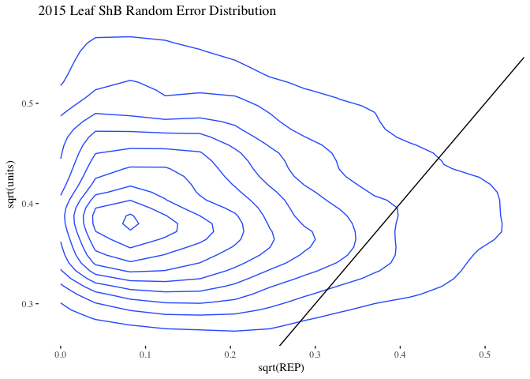

Analysis
================

Notes on this analysis before starting
--------------------------------------

#### Changes between 2015 and 2016

Before the analysis, note that due to changes between the years, the analysis must be carried out on each year separately. The 2015 data and 2016 data cannot be combined due to changes in inoculation methods; there are other changes too, but the main one is this. Therefore, the analyses will be conducted separately for leaf severity and Leaf severity for 2015 dry season and 2016 dry season. Comparisons will only be observational and cannot be statistically compared.

#### Random effects

Fitting the models with the default iterations resulted in some less than acceptable models. Because of this, the number of iterations has been increased, `nitt = 5e+05` and `burnin = 5000` and `thin = 100`. This results in much smaller errors for random effects and better models.

2015
----

### 2015 Leaf Sheath Blight Severity Model

``` r
eprior <- list(R = list(V = 1, nu = 0.02),
               G = list(G1 = list(V = 1, nu = 0.02, alpha.V = 1000)))
LShB_lmm_2015 <- MCMCglmm(LShB_AUDPS ~ WMGT * NRTE, ~REP, 
                          data = as.data.frame(AUDPS_2015),
                          verbose = FALSE,
                          prior = eprior,
                          nitt = 5e+05,
                          burnin = 5000,
                          thin = 100,
                          pr = TRUE)

summary(LShB_lmm_2015)
```

    ## 
    ##  Iterations = 5001:499901
    ##  Thinning interval  = 100
    ##  Sample size  = 4950 
    ## 
    ##  DIC: 32.5274 
    ## 
    ##  G-structure:  ~REP
    ## 
    ##     post.mean  l-95% CI u-95% CI eff.samp
    ## REP    0.2118 3.296e-09   0.6891     4950
    ## 
    ##  R-structure:  ~units
    ## 
    ##       post.mean l-95% CI u-95% CI eff.samp
    ## units    0.1734  0.07177   0.3072     4950
    ## 
    ##  Location effects: LShB_AUDPS ~ WMGT * NRTE 
    ## 
    ##                 post.mean l-95% CI u-95% CI eff.samp pMCMC
    ## (Intercept)       0.18099 -0.36258  0.74533     4227 0.446
    ## WMGTFLD           0.01463 -0.56309  0.59626     4454 0.963
    ## NRTE100           0.35597 -0.23261  0.90046     4950 0.208
    ## NRTE120           0.28523 -0.27636  0.88306     4950 0.306
    ## WMGTFLD:NRTE100  -0.34234 -1.11560  0.49252     4618 0.393
    ## WMGTFLD:NRTE120  -0.19060 -1.04527  0.59390     4950 0.629

``` r
# create data frames for generating diagnostic plots
reps <- data.frame(LShB_lmm_2015$Sol[, c(1, 7:10)])
x <- 1:nrow(reps)
reps <- melt(reps)
```

    ## No id variables; using all as measure variables

``` r
trts <-  data.frame(LShB_lmm_2015$Sol[, 2:6])
names(trts)[names(trts) == "WMGTFLD.NRTE100"] <- "FLD.NRTE100"
names(trts)[names(trts) == "WMGTFLD.NRTE120"] <- "FLD.NRTE120"
trts <- melt(trts)
```

    ## No id variables; using all as measure variables

``` r
# diagnostic line plots for replicate
plot_diagnostic_lines(d = reps,
                      x = x,
                      title = "2015 Diagnostic Plots for Leaf ShB Reps")
```


``` r
# posterior distributions for replicate
plot_replicate_posteriors(d = reps,
                          title = "2015 Replicate Posteriors for Leaf ShB Reps")
```


``` r
# diagnostic line plots for treatments
plot_diagnostic_lines(d = trts,
                      x = x,
                      title = "2015 Diagnostic Plots for Leaf ShB Treatments")
```


``` r
# Posterior distributions for treatment
plot_treatment_posteriors(d = trts,
                          title = "2015 Treatment Posteriors for Leaf ShB Treatments")
```


``` r
# check random effects
plotTrace(LShB_lmm_2015$VCV, log = TRUE)
```


``` r
# plot joint distibution of error
rdf <- data.frame(LShB_lmm_2015$VCV)
plot_joint_random_error_dist(d = rdf,
                             title = ("2015 Leaf ShB Random Error Distribution"))
```



### 2015 Tiller Sheath Blight Severity Model

``` r
eprior <- list(R = list(V = 1, nu = 0.02),
               G = list(G1 = list(V = 1, nu = 0.02, alpha.V = 1000)))
TShB_lmm_2015 <- MCMCglmm(TShB_AUDPS ~ WMGT * NRTE, ~REP, 
                          data = as.data.frame(AUDPS_2015),
                          verbose = FALSE,
                          prior = eprior,
                          nitt = 5e+05,
                          burnin = 5000,
                          thin = 100,
                          pr = TRUE)

summary(TShB_lmm_2015)
```

    ## 
    ##  Iterations = 5001:499901
    ##  Thinning interval  = 100
    ##  Sample size  = 4950 
    ## 
    ##  DIC: 121.379 
    ## 
    ##  G-structure:  ~REP
    ## 
    ##     post.mean  l-95% CI u-95% CI eff.samp
    ## REP      3.63 2.154e-07    13.66     4950
    ## 
    ##  R-structure:  ~units
    ## 
    ##       post.mean l-95% CI u-95% CI eff.samp
    ## units     7.136    2.961    12.54     4950
    ## 
    ##  Location effects: TShB_AUDPS ~ WMGT * NRTE 
    ## 
    ##                 post.mean l-95% CI u-95% CI eff.samp pMCMC
    ## (Intercept)        1.5699  -1.6696   4.7223     4950 0.291
    ## WMGTFLD           -0.5188  -4.1712   3.1179     4950 0.781
    ## NRTE100            1.6630  -2.2428   5.1900     4950 0.359
    ## NRTE120            1.9506  -1.7316   5.6296     4950 0.286
    ## WMGTFLD:NRTE100   -0.8555  -6.0188   4.3376     4950 0.746
    ## WMGTFLD:NRTE120    0.3410  -5.0759   5.4453     4950 0.899

``` r
# create data frames for generating diagnostic plots
reps <- data.frame(TShB_lmm_2015$Sol[, c(1, 7:10)])
reps <- melt(reps)
```

    ## No id variables; using all as measure variables

``` r
trts <-  data.frame(TShB_lmm_2015$Sol[, 2:6])
names(trts)[names(trts) == "WMGTFLD.NRTE100"] <- "FLD.NRTE100"
names(trts)[names(trts) == "WMGTFLD.NRTE120"] <- "FLD.NRTE120"
trts <- melt(trts)
```

    ## No id variables; using all as measure variables

``` r
# Create a dummy x-axis variable for plotting
x <- 1:nrow(TShB_lmm_2015$Sol)

# diagnostic line plots for replicate
plot_diagnostic_lines(d = reps,
                      x = x,
                      title = "2015 Diagnostic Plots for Leaf ShB Reps")
```


``` r
# posterior distributions for replicate
plot_replicate_posteriors(d = reps,
                          title = "2015 Replicate Posteriors for Leaf ShB Reps")
```


``` r
# diagnostic line plots for treatments
plot_diagnostic_lines(d = trts,
                      x = x,
                      title = "2015 Diagnostic Plots for Leaf ShB Treatments")
```


``` r
# Posterior distributions for treatment
plot_treatment_posteriors(d = trts,
                          title = "2015 Treatment Posteriors for Leaf ShB Treatments")
```


``` r
# check random effects
plotTrace(TShB_lmm_2015$VCV, log = TRUE)
```


``` r
# plot joint distibution of error
rdf <- data.frame(TShB_lmm_2015$VCV)
plot_joint_random_error_dist(d = rdf,
                             title = ("2015 Leaf ShB Random Error Distribution"))
```


------------------------------------------------------------------------

2016
----

### 2016 Leaf Sheath Blight Severity Model

``` r
eprior <- list(R = list(V = 1, nu = 0.02),
               G = list(G1 = list(V = 1, nu = 0.02, alpha.V = 1000)))
LShB_lmm_2016 <- MCMCglmm(LShB_AUDPS ~ WMGT * NRTE, ~REP, 
                          data = as.data.frame(AUDPS_2016),
                          verbose = FALSE,
                          nitt = 5e+05,
                          burnin = 5000,
                          thin = 100,
                          prior = eprior,
                          pr = TRUE)

summary(LShB_lmm_2016)
```

    ## 
    ##  Iterations = 5001:499901
    ##  Thinning interval  = 100
    ##  Sample size  = 4950 
    ## 
    ##  DIC: 32.27566 
    ## 
    ##  G-structure:  ~REP
    ## 
    ##     post.mean  l-95% CI u-95% CI eff.samp
    ## REP    0.6665 1.224e-11    2.197     4950
    ## 
    ##  R-structure:  ~units
    ## 
    ##       post.mean l-95% CI u-95% CI eff.samp
    ## units    0.3378  0.09857   0.6826     4950
    ## 
    ##  Location effects: LShB_AUDPS ~ WMGT * NRTE 
    ## 
    ##                 post.mean l-95% CI u-95% CI eff.samp  pMCMC  
    ## (Intercept)       1.22740  0.35125  2.11348     4950 0.0166 *
    ## WMGTFLD          -0.21619 -1.01911  0.60461     4950 0.5701  
    ## NRTE180           0.07523 -0.69524  0.88554     4950 0.8384  
    ## WMGTFLD:NRTE180   0.45120 -0.73546  1.57617     4950 0.4109  
    ## ---
    ## Signif. codes:  0 '***' 0.001 '**' 0.01 '*' 0.05 '.' 0.1 ' ' 1

``` r
# create data frames for generating diagnostic plots
reps <- data.frame(LShB_lmm_2016$Sol[, c(1, 5:8)])
reps <- melt(reps)
```

    ## No id variables; using all as measure variables

``` r
trts <-  data.frame(LShB_lmm_2016$Sol[, 2:4])
names(trts)[names(trts) == "WMGTFLD.NRTE180"] <- "FLD.NRTE180"
trts <- melt(trts)
```

    ## No id variables; using all as measure variables

``` r
# Create a dummy x-axis variable for plotting
x <- 1:nrow(LShB_lmm_2016$Sol)

# diagnostic line plots for replicate
plot_diagnostic_lines(d = reps,
                      x = x,
                      title = "2016 Diagnostic Plots for Leaf ShB Reps")
```


``` r
# posterior distributions for replicate
plot_replicate_posteriors(d = reps,
                          title = "2016 Replicate Posteriors for Leaf ShB Reps")
```


``` r
# diagnostic line plots for treatments
plot_diagnostic_lines(d = trts,
                      x = x,
                      title = "2016 Diagnostic Plots for Leaf ShB Treatments")
```


``` r
# Posterior distributions for treatment
plot_treatment_posteriors(d = trts,
                          title = "2016 Treatment Posteriors for Leaf ShB Treatments")
```


``` r
# check random effects
plotTrace(LShB_lmm_2016$VCV, log = TRUE)
```


``` r
# plot joint distibution of error
rdf <- data.frame(LShB_lmm_2015$VCV)
plot_joint_random_error_dist(d = rdf,
                             title = ("2016 Leaf ShB Random Error Distribution"))
```


### 2016 Tiller Sheath Blight Severity Model

``` r
eprior <- list(R = list(V = 1, nu = 0.02),
               G = list(G1 = list(V = 1, nu = 0.02, alpha.V = 1000)))
TShB_lmm_2016 <- MCMCglmm(TShB_AUDPS ~ WMGT * NRTE, ~REP, 
                          data = as.data.frame(AUDPS_2016),
                          verbose = FALSE,
                          nitt = 5e+05,
                          burnin = 5000,
                          thin = 100,
                          prior = eprior,
                          pr = TRUE)

summary(TShB_lmm_2016)
```

    ## 
    ##  Iterations = 5001:499901
    ##  Thinning interval  = 100
    ##  Sample size  = 4950 
    ## 
    ##  DIC: 96.57629 
    ## 
    ##  G-structure:  ~REP
    ## 
    ##     post.mean  l-95% CI u-95% CI eff.samp
    ## REP     49.27 7.917e-07    150.6     4950
    ## 
    ##  R-structure:  ~units
    ## 
    ##       post.mean l-95% CI u-95% CI eff.samp
    ## units        19     5.24    40.53     5229
    ## 
    ##  Location effects: TShB_AUDPS ~ WMGT * NRTE 
    ## 
    ##                 post.mean l-95% CI u-95% CI eff.samp   pMCMC   
    ## (Intercept)      19.86003 13.02485 27.95954     4818 0.00202 **
    ## WMGTFLD           0.62981 -5.73688  6.62056     4705 0.80889   
    ## NRTE180          -0.01864 -6.56664  5.76568     4684 0.99636   
    ## WMGTFLD:NRTE180   3.75569 -5.21804 12.13016     4582 0.34949   
    ## ---
    ## Signif. codes:  0 '***' 0.001 '**' 0.01 '*' 0.05 '.' 0.1 ' ' 1

``` r
# create data frames for generating diagnostic plots
reps <- data.frame(TShB_lmm_2016$Sol[, c(1, 5:8)])
reps <- melt(reps)
```

    ## No id variables; using all as measure variables

``` r
trts <-  data.frame(TShB_lmm_2016$Sol[, 2:4])
names(trts)[names(trts) == "WMGTFLD.NRTE180"] <- "FLD.NRTE180"
trts <- melt(trts)
```

    ## No id variables; using all as measure variables

``` r
# Create a dummy x-axis variable for plotting
x <- 1:nrow(TShB_lmm_2016$Sol)

# diagnostic line plots for replicate
plot_diagnostic_lines(d = reps,
                      x = x,
                      title = "2016 Diagnostic Plots for Leaf ShB Reps")
```


``` r
# posterior distributions for replicate
plot_replicate_posteriors(d = reps,
                          title = "2016 Replicate Posteriors for Leaf ShB Reps")
```


``` r
# diagnostic line plots for treatments
plot_diagnostic_lines(d = trts,
                      x = x,
                      title = "2106 Diagnostic Plots for Leaf ShB Treatments")
```


``` r
# Posterior distributions for treatment
plot_treatment_posteriors(d = trts,
                          title = "2016 Treatment Posteriors for Leaf ShB Treatments")
```


``` r
# check random effects
plotTrace(TShB_lmm_2016$VCV, log = TRUE)
```


``` r
# plot joint distibution of error
rdf <- data.frame(TShB_lmm_2016$VCV)
plot_joint_random_error_dist(d = rdf,
                             title = ("2016 Leaf ShB Random Error Distribution"))
```


Conclusions
===========

The models all appear to be good fits after increasing the number of iterations. None of the treatments in either year, 2015 or 2016, were significant. The see `pMCMC` values and also posterior graphs. There is a large amount of overlap in all of the posterior graphs.
