Analysis with nested effects
================

Notes on this analysis before starting
--------------------------------------

These analyses nest the main plot effect as a random effect with the replicate.

#### How to interpret these analyses

For a quick overview, see this thread on Stack Overflow that walks through the output of `summary.MCMCglmm`, which is used below. [R: Making sense of the output of a MCMCglmm](http://stackoverflow.com/questions/20993643/r-making-sense-of-the-output-of-a-mcmcglmm)

The MCMCglmm documentation is more in-depth but should still be referenced.

``` r
library(MCMCglmm)
vignette("Overview")
vignette("CourseNotes")
```

#### Changes between 2015 and 2016

Before the analysis, note that due to changes between the years, the analysis must be carried out on each year separately. The 2015 data and 2016 data cannot be combined due to changes in inoculation methods; there are other changes too, but the main one is this. Therefore, the analyses will be conducted separately for leaf severity and Leaf severity for 2015 dry season and 2016 dry season. Comparisons will only be observational and cannot be statistically compared.

#### Iterations

Fitting the models with the default iterations resulted in some less than acceptable models. Because of this, the number of iterations has been increased, `nitt = 5e+05` and `burnin = 5000` and `thin = 100`. This results in much smaller errors for random effects and better models.

2015
----

### 2015 Leaf Sheath Blight Severity Model

``` r
eprior <- list(R = list(V = 1, nu = 0.02),
               G = list(G1 = list(V = 1, nu = 0.02, alpha.V = 1000)))
LShB_lmm_2015 <- MCMCglmm(LShB_AUDPS ~ WMGT * NRTE,
                          random = ~REP:WMGT, 
                          data = as.data.frame(AUDPS_2015),
                          verbose = FALSE,
                          prior = eprior,
                          nitt = 5e+05,
                          burnin = 5000,
                          thin = 100,
                          pr = TRUE)

summary(LShB_lmm_2015)
```

    ## 
    ##  Iterations = 5001:499901
    ##  Thinning interval  = 100
    ##  Sample size  = 4950 
    ## 
    ##  DIC: 33.36616 
    ## 
    ##  G-structure:  ~REP:WMGT
    ## 
    ##          post.mean  l-95% CI u-95% CI eff.samp
    ## REP:WMGT   0.04461 1.372e-10   0.1663     4950
    ## 
    ##  R-structure:  ~units
    ## 
    ##       post.mean l-95% CI u-95% CI eff.samp
    ## units    0.1801  0.07535   0.3259     4950
    ## 
    ##  Location effects: LShB_AUDPS ~ WMGT * NRTE 
    ## 
    ##                 post.mean  l-95% CI  u-95% CI eff.samp pMCMC
    ## (Intercept)      0.184786 -0.282592  0.646648     4950 0.407
    ## WMGTFLD          0.009224 -0.635920  0.681903     4950 0.969
    ## NRTE100          0.353182 -0.254780  0.945437     4950 0.217
    ## NRTE120          0.288408 -0.293062  0.878069     4950 0.322
    ## WMGTFLD:NRTE100 -0.338968 -1.188823  0.471320     4950 0.397
    ## WMGTFLD:NRTE120 -0.192938 -1.005461  0.653235     4950 0.642

``` r
# create data frames for generating diagnostic plots
reps <- data.frame(LShB_lmm_2015$Sol[, c(1, 7:14)])
x <- 1:nrow(reps)
reps <- melt(reps)
```

    ## No id variables; using all as measure variables

``` r
trts <-  data.frame(LShB_lmm_2015$Sol[, 2:6])
names(trts)[names(trts) == "WMGTFLD.NRTE100"] <- "FLD.NRTE100"
names(trts)[names(trts) == "WMGTFLD.NRTE120"] <- "FLD.NRTE120"
trts <- melt(trts)
```

    ## No id variables; using all as measure variables

``` r
# Create a dummy x-axis variable for plotting
x <- 1:nrow(LShB_lmm_2015$Sol)

# diagnostic line plots for replicate
plot_diagnostic_lines(d = reps,
                      x = x,
                      title = "2015 Diagnostic Plots for Replicates, Leaf ShB Severity")
```

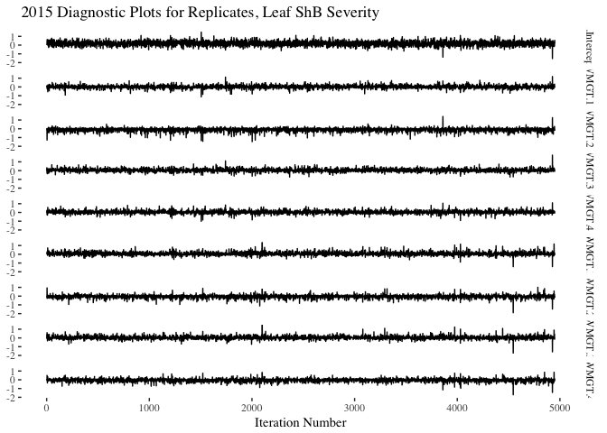

``` r
# posterior distributions for replicate
plot_replicate_posteriors(d = reps,
                          title = "2015 Reps Replicate Posteriors for Replicates, Leaf ShB Severity")
```

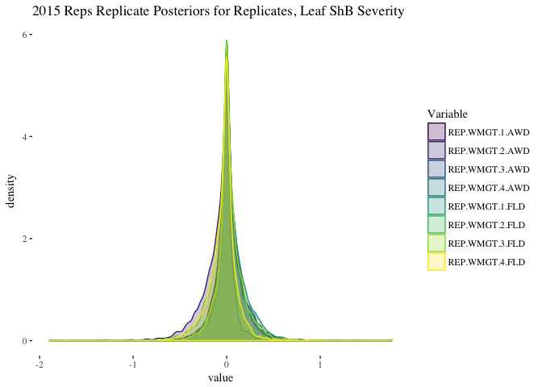

``` r
# diagnostic line plots for treatments
plot_diagnostic_lines(d = trts,
                      x = x,
                      title = "2015 Diagnostic Plots for Treatments, Leaf ShB Severity")
```

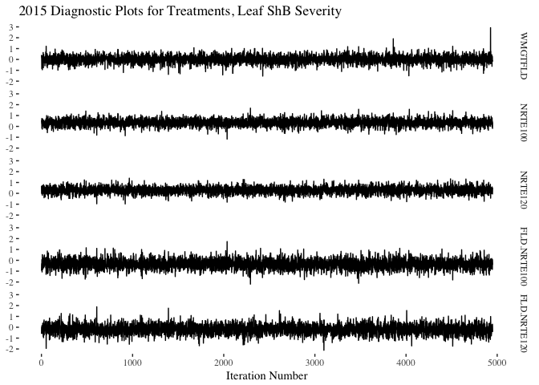

``` r
# Posterior distributions for treatment
plot_treatment_posteriors(d = trts,
                          title = "2015 Posteriors for Treatments, Leaf ShB Severity")
```

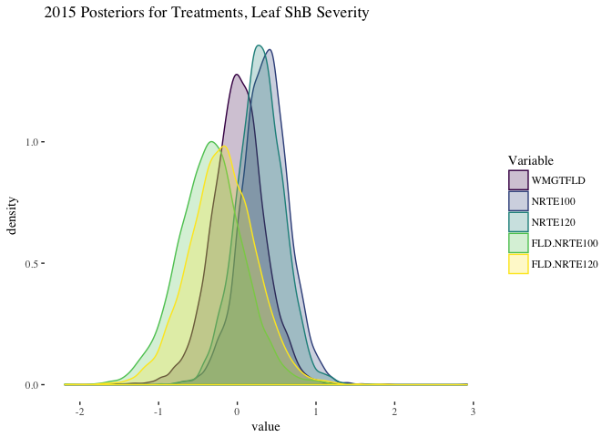

``` r
# check random effects
plotTrace(LShB_lmm_2015$VCV, log = TRUE)
```

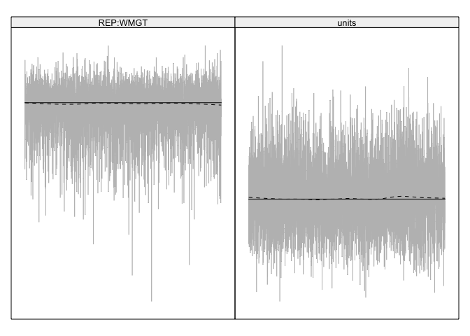

``` r
# plot joint distibution of error
rdf <- data.frame(LShB_lmm_2015$VCV)
plot_joint_random_error_dist_nested(d = rdf,
                             title = ("2015 Random Error Distribution for Leaf ShB Severity"))
```

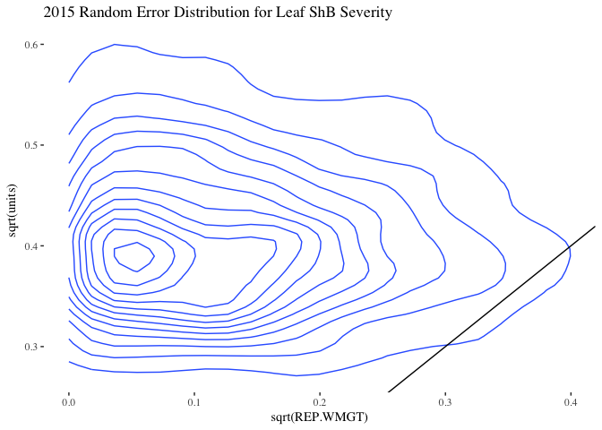

### 2015 Tiller Sheath Blight Severity Model

``` r
eprior <- list(R = list(V = 1, nu = 0.02),
               G = list(G1 = list(V = 1, nu = 0.02, alpha.V = 1000)))
TShB_severity_lmm_2015 <- MCMCglmm(TShB_AUDPS ~ WMGT * NRTE,
                                   random = ~REP:WMGT, 
                          data = as.data.frame(AUDPS_2015),
                          verbose = FALSE,
                          prior = eprior,
                          nitt = 5e+05,
                          burnin = 5000,
                          thin = 100,
                          pr = TRUE)

summary(TShB_severity_lmm_2015)
```

    ## 
    ##  Iterations = 5001:499901
    ##  Thinning interval  = 100
    ##  Sample size  = 4950 
    ## 
    ##  DIC: 121.4137 
    ## 
    ##  G-structure:  ~REP:WMGT
    ## 
    ##          post.mean  l-95% CI u-95% CI eff.samp
    ## REP:WMGT     1.475 1.172e-08    5.604     4950
    ## 
    ##  R-structure:  ~units
    ## 
    ##       post.mean l-95% CI u-95% CI eff.samp
    ## units     7.055    2.879    12.44     4950
    ## 
    ##  Location effects: TShB_AUDPS ~ WMGT * NRTE 
    ## 
    ##                 post.mean l-95% CI u-95% CI eff.samp pMCMC
    ## (Intercept)        1.5789  -1.3422   4.3449     4950 0.263
    ## WMGTFLD           -0.5336  -4.7681   3.4649     5545 0.789
    ## NRTE100            1.6747  -1.9481   5.3420     4950 0.346
    ## NRTE120            1.9704  -1.6658   5.5818     4950 0.269
    ## WMGTFLD:NRTE100   -0.8738  -6.1456   4.1794     5318 0.736
    ## WMGTFLD:NRTE120    0.2995  -4.7985   5.6475     4950 0.908

``` r
# create data frames for generating diagnostic plots
reps <- data.frame(TShB_severity_lmm_2015$Sol[, c(1, 7:14)])
reps <- melt(reps)
```

    ## No id variables; using all as measure variables

``` r
trts <-  data.frame(TShB_severity_lmm_2015$Sol[, 2:6])
names(trts)[names(trts) == "WMGTFLD.NRTE100"] <- "FLD.NRTE100"
names(trts)[names(trts) == "WMGTFLD.NRTE120"] <- "FLD.NRTE120"
trts <- melt(trts)
```

    ## No id variables; using all as measure variables

``` r
# Create a dummy x-axis variable for plotting
x <- 1:nrow(TShB_severity_lmm_2015$Sol)

# diagnostic line plots for replicate
plot_diagnostic_lines(d = reps,
                      x = x,
                      title = "2015 Diagnostic Plots for Replicates, Tiller ShB Severity")
```

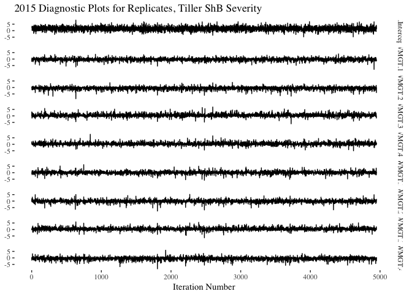

``` r
# posterior distributions for replicate
plot_replicate_posteriors(d = reps,
                          title = "2015 Reps Replicate Posteriors for Replicates, Tiller ShB Severity")
```

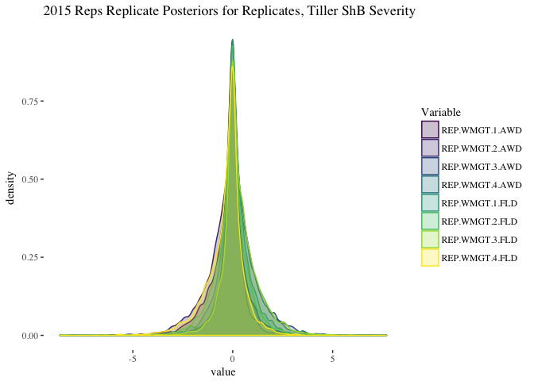

``` r
# diagnostic line plots for treatments
plot_diagnostic_lines(d = trts,
                      x = x,
                      title = "2015 Diagnostic Plots for Treatments, Tiller ShB Severity")
```

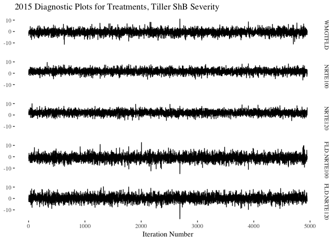

``` r
# Posterior distributions for treatment
plot_treatment_posteriors(d = trts,
                          title = "2015 Posteriors for Treatments, Tiller ShB Severity")
```

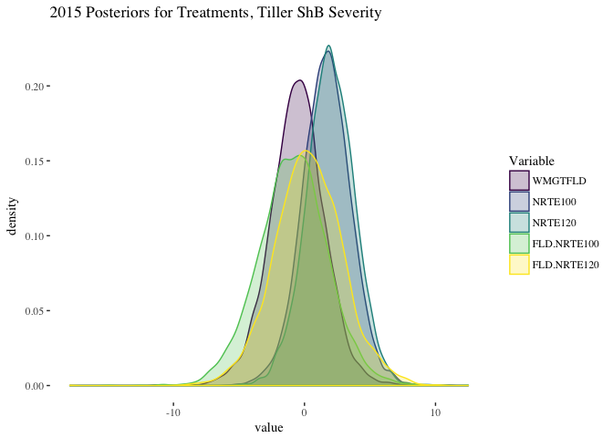

``` r
# check random effects
plotTrace(TShB_severity_lmm_2015$VCV, log = TRUE)
```

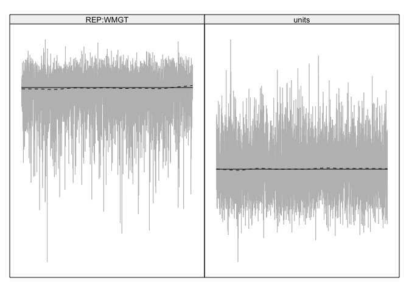

``` r
# plot joint distibution of error
rdf <- data.frame(TShB_severity_lmm_2015$VCV)
plot_joint_random_error_dist_nested(d = rdf,
                             title = ("2015 Random Error Distribution for Tiller ShB Severity"))
```

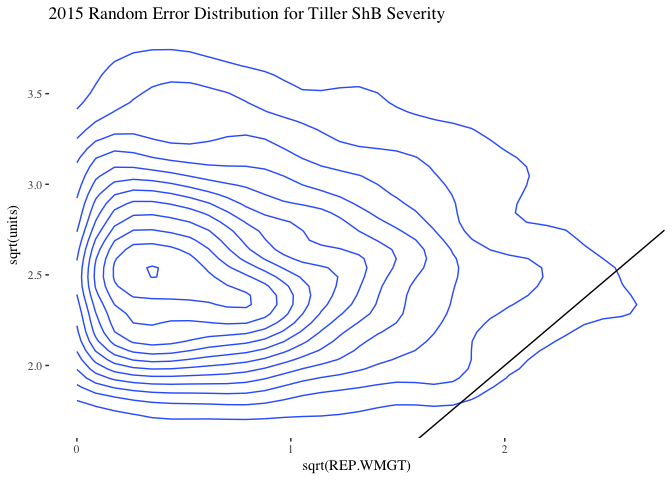

### 2015 Tiller Sheath Blight Incidence Model

``` r
eprior <- list(R = list(V = 1, nu = 0.02),
               G = list(G1 = list(V = 1, nu = 0.02, alpha.V = 1000)))
TShB_incidence_lmm_2015 <- MCMCglmm(TShB_incidence_mean ~ WMGT * NRTE,
                                    random = ~REP:WMGT, 
                          data = as.data.frame(AUDPS_2015),
                          verbose = FALSE,
                          prior = eprior,
                          nitt = 5e+05,
                          burnin = 5000,
                          thin = 100,
                          pr = TRUE)

summary(TShB_incidence_lmm_2015)
```

    ## 
    ##  Iterations = 5001:499901
    ##  Thinning interval  = 100
    ##  Sample size  = 4950 
    ## 
    ##  DIC: 54.17222 
    ## 
    ##  G-structure:  ~REP:WMGT
    ## 
    ##          post.mean  l-95% CI u-95% CI eff.samp
    ## REP:WMGT   0.09371 1.838e-11   0.3592     4950
    ## 
    ##  R-structure:  ~units
    ## 
    ##       post.mean l-95% CI u-95% CI eff.samp
    ## units    0.4284   0.1916   0.7599     4950
    ## 
    ##  Location effects: TShB_incidence_mean ~ WMGT * NRTE 
    ## 
    ##                 post.mean l-95% CI u-95% CI eff.samp pMCMC
    ## (Intercept)       0.30001 -0.39870  0.98172     4950 0.375
    ## WMGTFLD           0.18524 -0.80933  1.18357     4950 0.693
    ## NRTE100           0.22392 -0.65875  1.16858     4950 0.608
    ## NRTE120           0.59385 -0.32174  1.52009     4950 0.176
    ## WMGTFLD:NRTE100  -0.07734 -1.33075  1.21609     4950 0.891
    ## WMGTFLD:NRTE120  -0.41667 -1.68731  0.84511     4950 0.493

``` r
# create data frames for generating diagnostic plots
reps <- data.frame(TShB_incidence_lmm_2015$Sol[, c(1, 7:14)])
reps <- melt(reps)
```

    ## No id variables; using all as measure variables

``` r
trts <-  data.frame(TShB_incidence_lmm_2015$Sol[, 2:6])
names(trts)[names(trts) == "WMGTFLD.NRTE100"] <- "FLD.NRTE100"
names(trts)[names(trts) == "WMGTFLD.NRTE120"] <- "FLD.NRTE120"
trts <- melt(trts)
```

    ## No id variables; using all as measure variables

``` r
# Create a dummy x-axis variable for plotting
x <- 1:nrow(TShB_incidence_lmm_2015$Sol)

# diagnostic line plots for replicate
plot_diagnostic_lines(d = reps,
                      x = x,
                      title = "2015 Diagnostic Plots for Replicates, Tiller ShB Incidence")
```

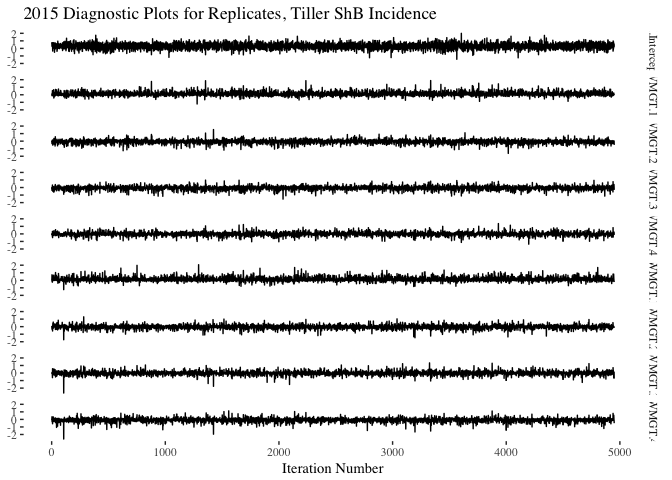

``` r
# posterior distributions for replicate
plot_replicate_posteriors(d = reps,
                          title = "2015 Reps Replicate Posteriors for Replicates, Tiller ShB Incidence")
```

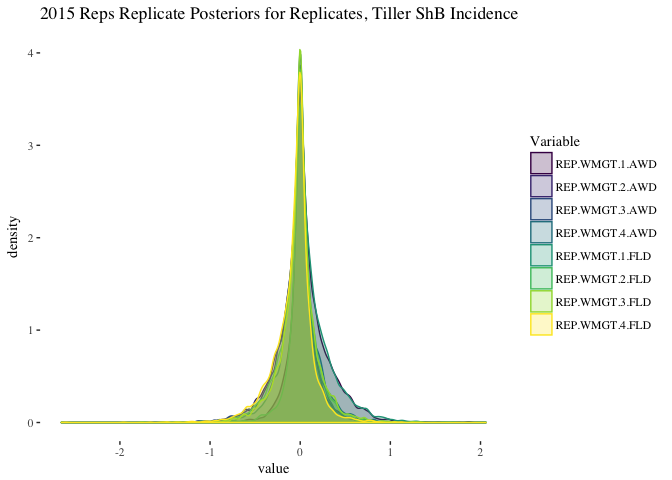

``` r
# diagnostic line plots for treatments
plot_diagnostic_lines(d = trts,
                      x = x,
                      title = "2015 Diagnostic Plots for Treatments, Tiller ShB Incidence")
```

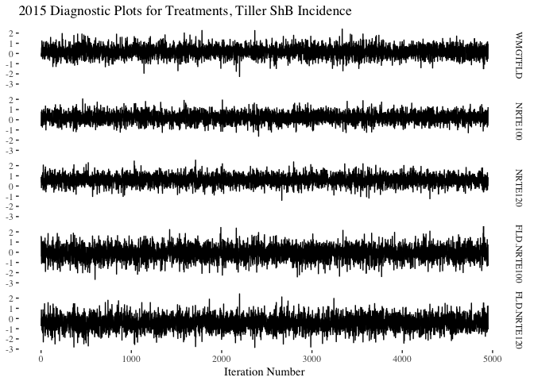

``` r
# Posterior distributions for treatment
plot_treatment_posteriors(d = trts,
                          title = "2015 Posteriors for Treatments, Tiller ShB Incidence")
```

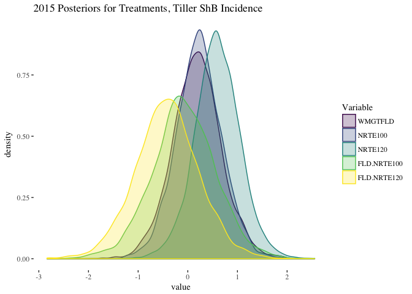

``` r
# check random effects
plotTrace(TShB_incidence_lmm_2015$VCV, log = TRUE)
```

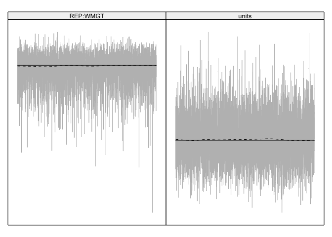

``` r
# plot joint distibution of error
rdf <- data.frame(TShB_incidence_lmm_2015$VCV)
plot_joint_random_error_dist_nested(d = rdf,
                             title = ("2015 Random Error Distribution for Tiller ShB Incidence"))
```

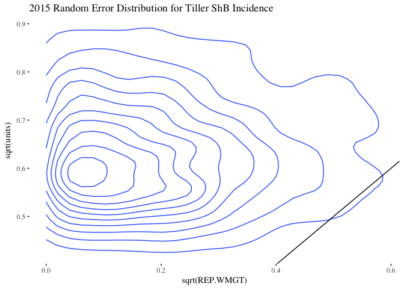

------------------------------------------------------------------------

2016
----

### 2016 Leaf Sheath Blight Severity Model

``` r
eprior <- list(R = list(V = 1, nu = 0.02),
               G = list(G1 = list(V = 1, nu = 0.02, alpha.V = 1000)))
LShB_lmm_2016 <- MCMCglmm(LShB_AUDPS ~ WMGT * NRTE,
                          random = ~REP:WMGT, 
                          data = as.data.frame(AUDPS_2016),
                          verbose = FALSE,
                          nitt = 5e+05,
                          burnin = 5000,
                          thin = 100,
                          prior = eprior,
                          pr = TRUE)

summary(LShB_lmm_2016)
```

    ## 
    ##  Iterations = 5001:499901
    ##  Thinning interval  = 100
    ##  Sample size  = 4950 
    ## 
    ##  DIC: 33.45819 
    ## 
    ##  G-structure:  ~REP:WMGT
    ## 
    ##          post.mean  l-95% CI u-95% CI eff.samp
    ## REP:WMGT    0.1583 3.068e-08   0.6006     4753
    ## 
    ##  R-structure:  ~units
    ## 
    ##       post.mean l-95% CI u-95% CI eff.samp
    ## units    0.3665  0.09457   0.7298     4950
    ## 
    ##  Location effects: LShB_AUDPS ~ WMGT * NRTE 
    ## 
    ##                 post.mean l-95% CI u-95% CI eff.samp   pMCMC   
    ## (Intercept)       1.22954  0.49592  1.92380     4729 0.00404 **
    ## WMGTFLD          -0.21565 -1.17844  0.81612     5028 0.63475   
    ## NRTE180           0.06646 -0.70651  0.98958     4950 0.85576   
    ## WMGTFLD:NRTE180   0.45466 -0.69619  1.73767     4950 0.43313   
    ## ---
    ## Signif. codes:  0 '***' 0.001 '**' 0.01 '*' 0.05 '.' 0.1 ' ' 1

``` r
# create data frames for generating diagnostic plots
reps <- data.frame(LShB_lmm_2016$Sol[, c(1, 5:12)])
reps <- melt(reps)
```

    ## No id variables; using all as measure variables

``` r
trts <-  data.frame(LShB_lmm_2016$Sol[, 2:4])
names(trts)[names(trts) == "WMGTFLD.NRTE180"] <- "FLD.NRTE180"
trts <- melt(trts)
```

    ## No id variables; using all as measure variables

``` r
# Create a dummy x-axis variable for plotting
x <- 1:nrow(LShB_lmm_2016$Sol)

# diagnostic line plots for replicate
plot_diagnostic_lines(d = reps,
                      x = x,
                      title = "2016 Diagnostic Plots for Replicates, Leaf ShB Severity")
```

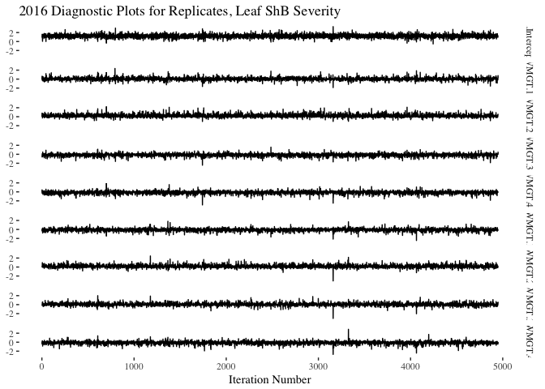

``` r
# posterior distributions for replicate
plot_replicate_posteriors(d = reps,
                          title = "2016 Reps Replicate Posteriors for Replicates, Leaf ShB Severity")
```

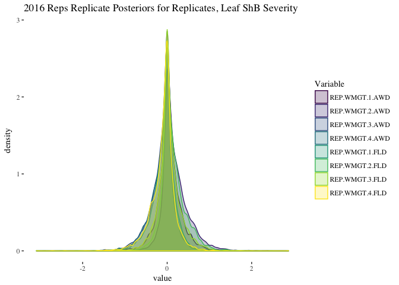

``` r
# diagnostic line plots for treatments
plot_diagnostic_lines(d = trts,
                      x = x,
                      title = "2016 Diagnostic Plots for Treatments, Leaf ShB Severity")
```

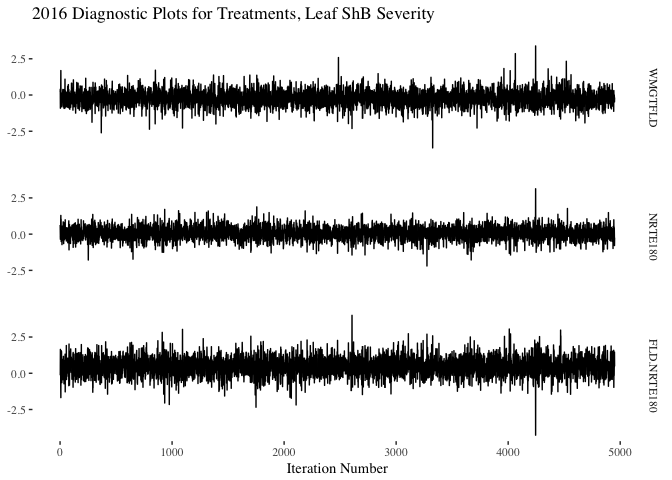

``` r
# Posterior distributions for treatment
plot_treatment_posteriors(d = trts,
                          title = "2016 Posteriors for Treatments, Leaf ShB Severity")
```

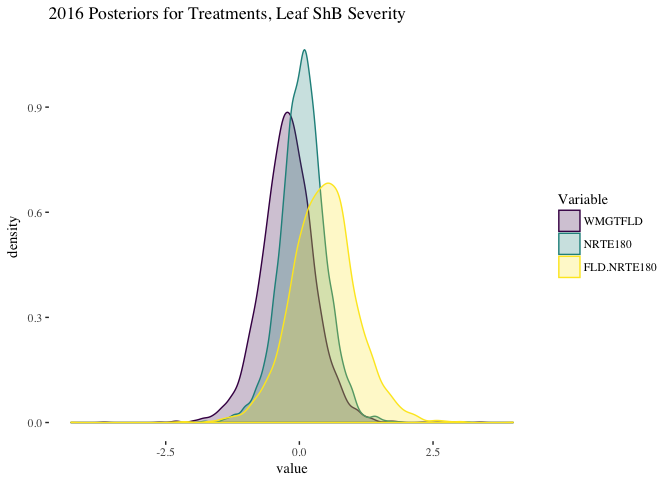

``` r
# check random effects
plotTrace(LShB_lmm_2016$VCV, log = TRUE)
```

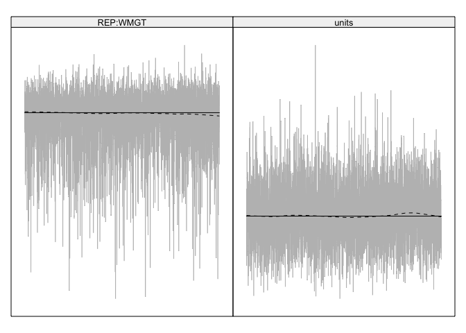

``` r
# plot joint distibution of error
rdf <- data.frame(LShB_lmm_2016$VCV)
plot_joint_random_error_dist_nested(d = rdf,
                             title = ("2016 Random Error Distribution for Leaf ShB Severity"))
```

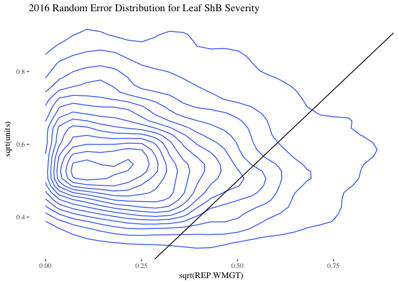

### 2016 Tiller Sheath Blight Severity Model

``` r
eprior <- list(R = list(V = 1, nu = 0.02),
               G = list(G1 = list(V = 1, nu = 0.02, alpha.V = 1000)))
TShB_severity_lmm_2016 <- MCMCglmm(TShB_AUDPS ~ WMGT * NRTE,
                                   random = ~REP:WMGT, 
                          data = as.data.frame(AUDPS_2016),
                          verbose = FALSE,
                          nitt = 5e+05,
                          burnin = 5000,
                          thin = 100,
                          prior = eprior,
                          pr = TRUE)

summary(TShB_severity_lmm_2016)
```

    ## 
    ##  Iterations = 5001:499901
    ##  Thinning interval  = 100
    ##  Sample size  = 4950 
    ## 
    ##  DIC: 88.86601 
    ## 
    ##  G-structure:  ~REP:WMGT
    ## 
    ##          post.mean  l-95% CI u-95% CI eff.samp
    ## REP:WMGT     29.65 0.0002739    82.72     4950
    ## 
    ##  R-structure:  ~units
    ## 
    ##       post.mean l-95% CI u-95% CI eff.samp
    ## units     12.29    1.939     31.7     4950
    ## 
    ##  Location effects: TShB_AUDPS ~ WMGT * NRTE 
    ## 
    ##                 post.mean  l-95% CI  u-95% CI eff.samp  pMCMC    
    ## (Intercept)     19.809514 13.593794 26.259752     4950 <2e-04 ***
    ## WMGTFLD          0.611569 -8.572912  9.676680     5373  0.878    
    ## NRTE180          0.001582 -4.936195  4.831882     4950  0.982    
    ## WMGTFLD:NRTE180  3.752690 -3.367728 10.627662     5361  0.230    
    ## ---
    ## Signif. codes:  0 '***' 0.001 '**' 0.01 '*' 0.05 '.' 0.1 ' ' 1

``` r
# create data frames for generating diagnostic plots
reps <- data.frame(TShB_severity_lmm_2016$Sol[, c(1, 5:12)])
reps <- melt(reps)
```

    ## No id variables; using all as measure variables

``` r
trts <-  data.frame(TShB_severity_lmm_2016$Sol[, 2:4])
names(trts)[names(trts) == "WMGTFLD.NRTE180"] <- "FLD.NRTE180"
trts <- melt(trts)
```

    ## No id variables; using all as measure variables

``` r
# Create a dummy x-axis variable for plotting
x <- 1:nrow(TShB_severity_lmm_2016$Sol)
# diagnostic line plots for replicate
plot_diagnostic_lines(d = reps,
                      x = x,
                      title = "2016 Diagnostic Plots for Replicates, Tiller ShB Severity")
```

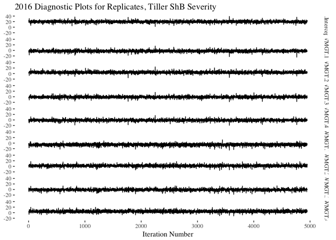

``` r
# posterior distributions for replicate
plot_replicate_posteriors(d = reps,
                          title = "2016 Reps Replicate Posteriors for Replicates, Tiller ShB Severity")
```

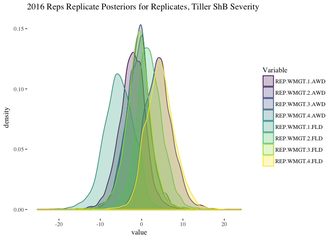

``` r
# diagnostic line plots for treatments
plot_diagnostic_lines(d = trts,
                      x = x,
                      title = "2016 Diagnostic Plots for Treatments, Tiller ShB Severity")
```

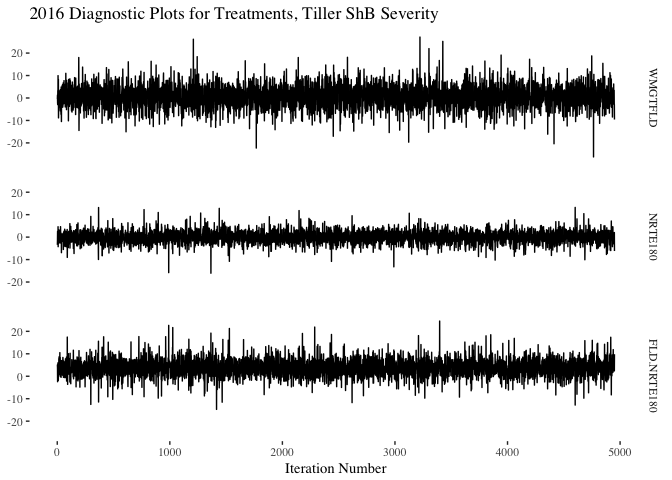

``` r
# Posterior distributions for treatment
plot_treatment_posteriors(d = trts,
                          title = "2016 Posteriors for Treatments, Tiller ShB Severity")
```

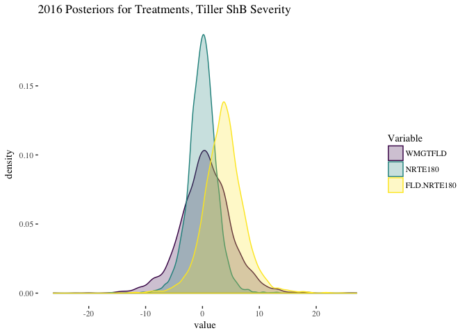

``` r
# check random effects
plotTrace(TShB_severity_lmm_2016$VCV, log = TRUE)
```

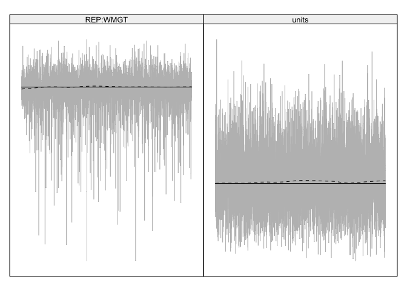

``` r
# plot joint distibution of error
rdf <- data.frame(TShB_severity_lmm_2016$VCV)
plot_joint_random_error_dist_nested(d = rdf,
                             title = ("2016 Random Error Distribution for Tiller ShB Severity"))
```

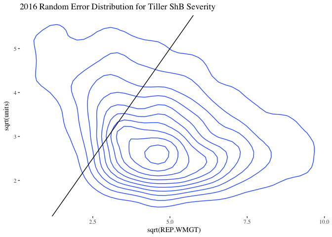

### 2016 Tiller Sheath Blight Incidence Model

``` r
eprior <- list(R = list(V = 1, nu = 0.02),
               G = list(G1 = list(V = 1, nu = 0.02, alpha.V = 1000)))
TShB_incidence_lmm_2016 <- MCMCglmm(TShB_incidence_mean ~ WMGT * NRTE, 
                                    random = ~REP:WMGT, 
                          data = as.data.frame(AUDPS_2016),
                          verbose = FALSE,
                          prior = eprior,
                          nitt = 5e+05,
                          burnin = 5000,
                          thin = 100,
                          pr = TRUE)

summary(TShB_incidence_lmm_2016)
```

    ## 
    ##  Iterations = 5001:499901
    ##  Thinning interval  = 100
    ##  Sample size  = 4950 
    ## 
    ##  DIC: 61.97954 
    ## 
    ##  G-structure:  ~REP:WMGT
    ## 
    ##          post.mean  l-95% CI u-95% CI eff.samp
    ## REP:WMGT     1.114 9.118e-08    4.024     4950
    ## 
    ##  R-structure:  ~units
    ## 
    ##       post.mean l-95% CI u-95% CI eff.samp
    ## units     2.145   0.6173    4.498     4950
    ## 
    ##  Location effects: TShB_incidence_mean ~ WMGT * NRTE 
    ## 
    ##                 post.mean l-95% CI u-95% CI eff.samp  pMCMC    
    ## (Intercept)       11.1371   9.4291  13.0264     4950 <2e-04 ***
    ## WMGTFLD           -0.7922  -3.3953   1.5598     5244  0.494    
    ## NRTE180            1.5388  -0.6171   3.5119     4950  0.125    
    ## WMGTFLD:NRTE180    0.8002  -2.1436   3.5240     4950  0.547    
    ## ---
    ## Signif. codes:  0 '***' 0.001 '**' 0.01 '*' 0.05 '.' 0.1 ' ' 1

``` r
# create data frames for generating diagnostic plots
reps <- data.frame(TShB_incidence_lmm_2016$Sol[, c(1, 5:12)])
reps <- melt(reps)
```

    ## No id variables; using all as measure variables

``` r
trts <-  data.frame(TShB_incidence_lmm_2016$Sol[, 2:4])
names(trts)[names(trts) == "WMGTFLD.NRTE100"] <- "FLD.NRTE100"
names(trts)[names(trts) == "WMGTFLD.NRTE120"] <- "FLD.NRTE120"
trts <- melt(trts)
```

    ## No id variables; using all as measure variables

``` r
# Create a dummy x-axis variable for plotting
x <- 1:nrow(TShB_incidence_lmm_2016$Sol)

# diagnostic line plots for replicate
plot_diagnostic_lines(d = reps,
                      x = x,
                      title = "2016 Diagnostic Plots for Replicates, Tiller ShB Incidence")
```

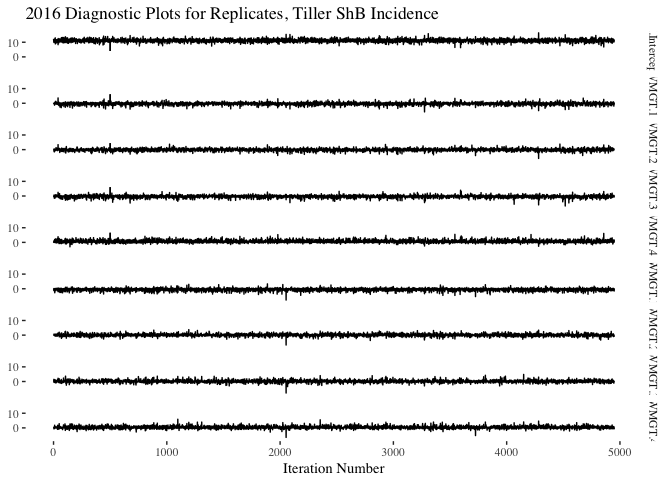

``` r
# posterior distributions for replicate
plot_replicate_posteriors(d = reps,
                          title = "2016 Reps Replicate Posteriors for Replicates, Tiller ShB Incidence")
```


``` r
# diagnostic line plots for treatments
plot_diagnostic_lines(d = trts,
                      x = x,
                      title = "2016 Diagnostic Plots for Treatments, Tiller ShB Incidence")
```

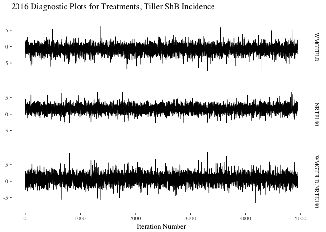

``` r
# Posterior distributions for treatment
plot_treatment_posteriors(d = trts,
                          title = "2016 Posteriors for Treatments, Tiller ShB Incidence")
```

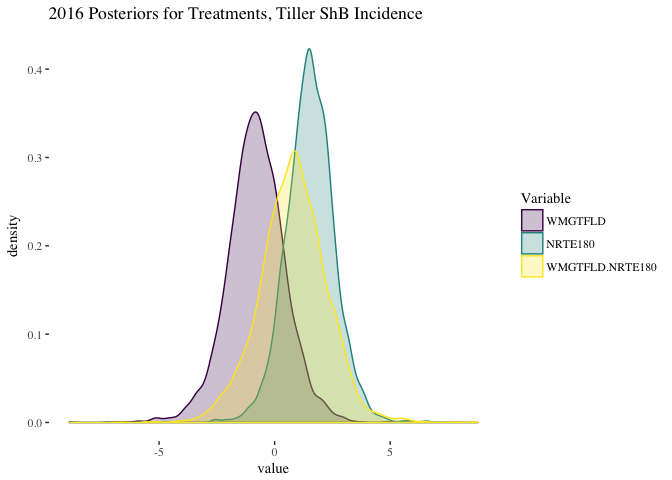

``` r
# check random effects
plotTrace(TShB_incidence_lmm_2016$VCV, log = TRUE)
```

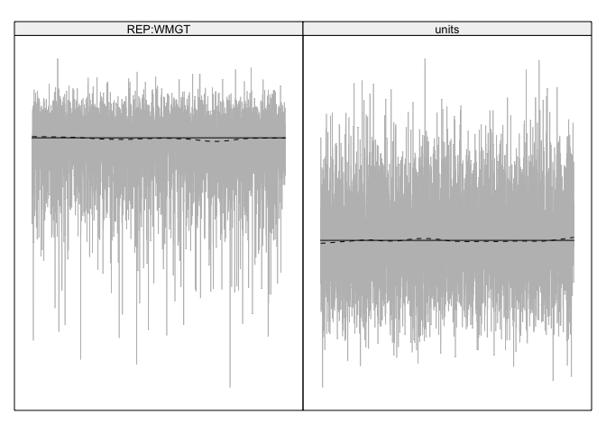

``` r
# plot joint distibution of error
rdf <- data.frame(TShB_incidence_lmm_2016$VCV)
plot_joint_random_error_dist_nested(d = rdf,
                             title = ("2016 Random Error Distribution for Tiller ShB Incidence"))
```

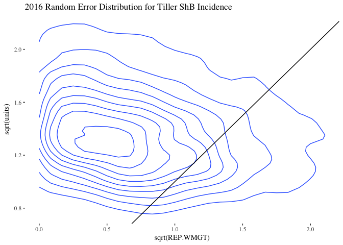

Conclusions
===========

The models all appear to be good fits after increasing the number of iterations. None of the treatments in either year, 2015 or 2016, were significant. The see `pMCMC` values and also posterior graphs. There is a large amount of overlap in all of the posterior graphs.
