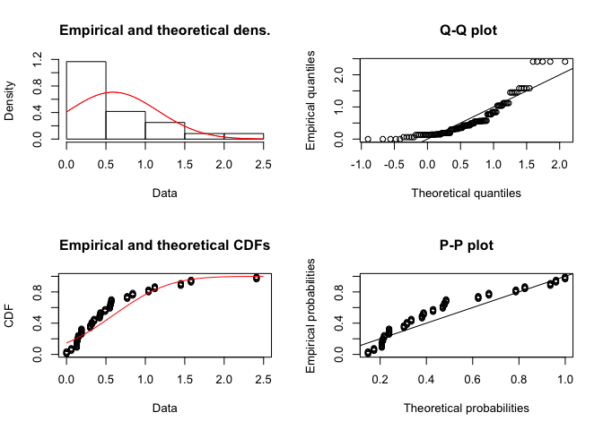
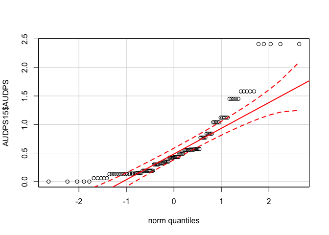
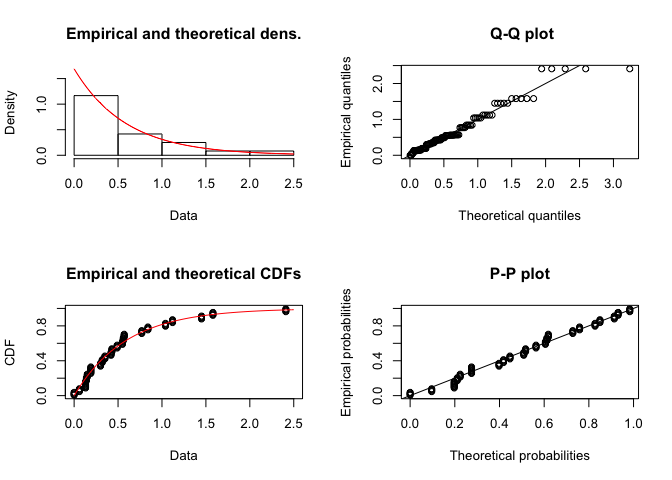
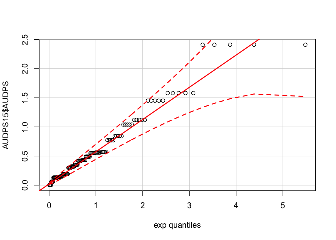

Probability Distribution Checks
================

Here we check the probability distribution that best fits these data. I'm following a method from <http://ase.tufts.edu/gsc/gradresources/guidetomixedmodelsinr/mixed%20model%20guide.html>. As you see in that guide, there are several distributions that can be checked, however, the data both fit a normal distribution.

2015 Check probability distribution fit for tiller sheath blight incidence
--------------------------------------------------------------------------

### Normal

``` r
AUDPS15 <- subset(AUDPS, YEAR == "2015")
f1 <- fitdist(AUDPS15$AUDPS, "norm")
plot(f1)
```



``` r
car::qqp(AUDPS15$AUDPS, "norm")
```



### Exponential

``` r
AUDPS15 <- subset(AUDPS, YEAR == "2015")
f1 <- fitdist(AUDPS15$AUDPS, "exp")
plot(f1)
```



``` r
car::qqp(AUDPS15$AUDPS, "exp")
```



------------------------------------------------------------------------

2016 Check probability distribution fit for tiller sheath blight incidence
--------------------------------------------------------------------------

Until the issue with more diseased tillers than tillers in a hill is addressed, this section will not work completely and properly.

``` r
AUDPS156 <- subset(AUDPS, YEAR == "2016")
# f1 <- fitdist(AUDPS156$AUDPS, "norm")
#plot(f1)
car::qqp(AUDPS156$AUDPS, "norm")
```


Conclusions
-----------

To read the graphs, we want to select a distribution where most of the points fall between the dotted red lines. On the y-axis are the observations and on the x-axis the quantiles modelled by the distribution. A perfect distribution fit is represented by the solid red line and the dashed red lines are the confidence intervals of the perfect distribution fit. Here both sets of data fit a normal distribution.
