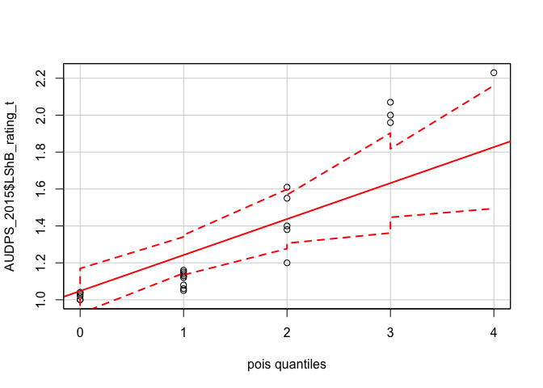
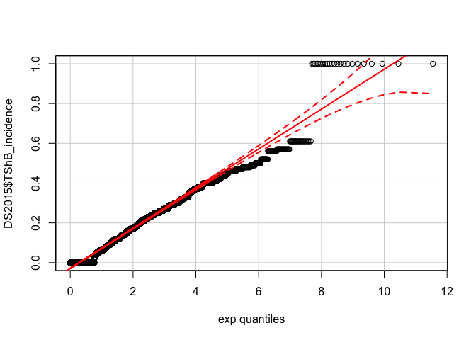
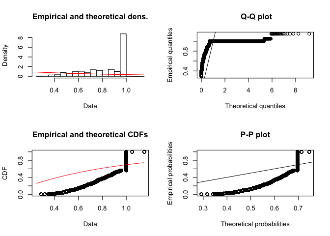
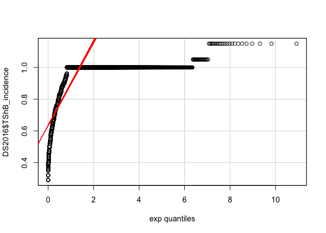
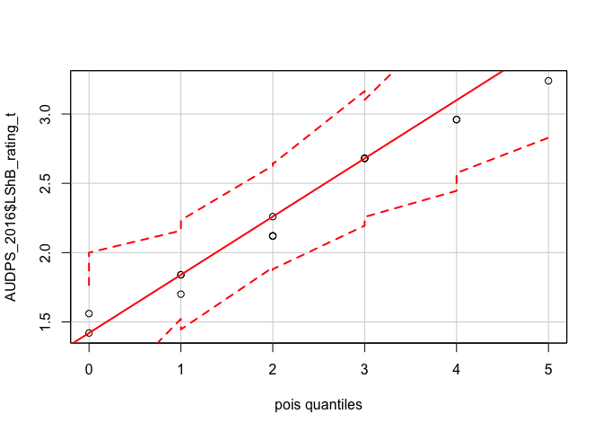
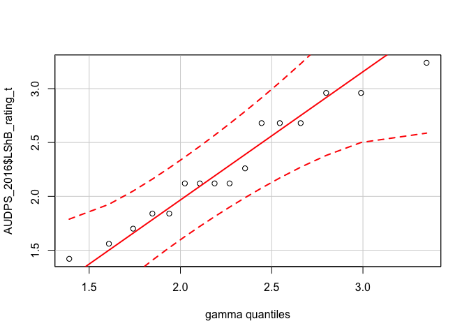
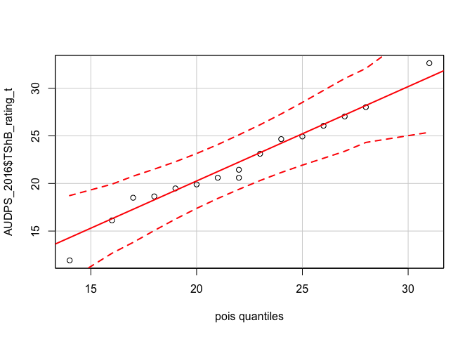
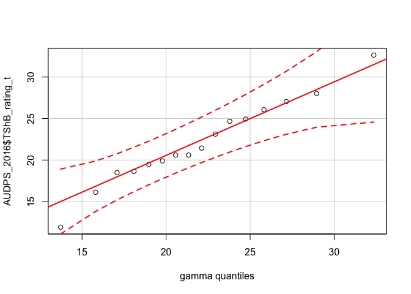

Probability Distribution Checks
================

Here we check the probability distribution that best fits these data. I'm following a method from <http://ase.tufts.edu/gsc/gradresources/guidetomixedmodelsinr/mixed%20model%20guide.html>. As you see in that guide, there are several distributions that can be checked, for my purposes normal or exponential are enough so I won't check the others.

2015 Check probability distribution fit for leaf sheath blight
--------------------------------------------------------------

``` r
f1 <- fitdist(AUDPS_2015$LShB_AUDPS, "norm")
plot(f1)
```


``` r
qqp(AUDPS_2015$LShB_AUDPS, "norm")
```


``` r
f2 <- fitdist(AUDPS_2015$LShB_AUDPS, "exp")
plot(f2)
```



``` r
qqp(AUDPS_2015$LShB_AUDPS, "exp")
```



2015 Check probability distribution fit for tiller sheath blight
----------------------------------------------------------------

``` r
f1 <- fitdist(AUDPS_2015$TShB_AUDPS, "norm")
plot(f1)
```


``` r
qqp(AUDPS_2015$TShB_AUDPS, "norm")
```


``` r
f2 <- fitdist(AUDPS_2015$TShB_AUDPS, "exp")
plot(f2)
```



``` r
qqp(AUDPS_2015$TShB_AUDPS, "exp")
```



------------------------------------------------------------------------

2016 Check probability distribution fit for leaf sheath blight
--------------------------------------------------------------

``` r
f1 <- fitdist(AUDPS_2016$LShB_AUDPS, "norm")
plot(f1)
```


``` r
qqp(AUDPS_2016$LShB_AUDPS, "norm")
```


``` r
f2 <- fitdist(AUDPS_2016$LShB_AUDPS, "exp")
plot(f2)
```



``` r
qqp(AUDPS_2015$LShB_AUDPS, "exp")
```



2016 Check probability distribution fit for tiller sheath blight
----------------------------------------------------------------

``` r
f1 <- fitdist(AUDPS_2016$TShB_AUDPS, "norm")
plot(f1)
```


``` r
qqp(AUDPS_2016$TShB_AUDPS, "norm")
```


``` r
f2 <- fitdist(AUDPS_2016$TShB_AUDPS, "exp")
plot(f2)
```



``` r
qqp(AUDPS_2015$LShB_AUDPS, "exp")
```



Conclusions
-----------

To read the graphs, we want to select a distribution where most of the points fall between the dotted red lines. On the y-axis are the observations and on the x-axis the quantiles modelled by the distribution. A perfect distribution fit is represented by the solid red line and the dashed red lines are the confidence intervals of the perfect distribution fit. In this case, for the 2015 data, the leaf data fit a lognormal distribution best or exponential, for all others a normal distribution appears to be fine. Because of the non-normal residuals of the 2015 leaf sheath blight data we'll look at using something that can handle these data like `MCMCglmm`.
