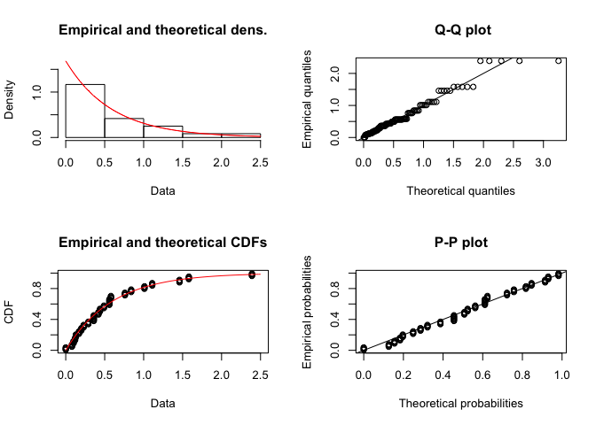
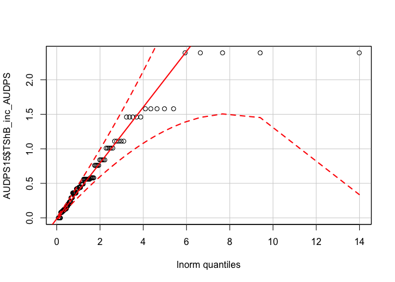

Probability Distribution Checks
================

Here we check the probability distribution that best fits these data. I'm following a method from <http://ase.tufts.edu/gsc/gradresources/guidetomixedmodelsinr/mixed%20model%20guide.html>. As you see in that guide, there are several distributions that can be checked. However, in these data only normal and exponential

2015
----

### Check probability distribution fit for tiller sheath blight incidence

#### Normal

``` r
AUDPS15 <- subset(AUDPS, YEAR == "2015")
f1 <- fitdist(AUDPS15$TShB_inc_AUDPS, "norm")
plot(f1)
```


``` r
car::qqp(AUDPS15$TShB_inc_AUDPS, "norm")
```


#### Exponential

``` r
f1 <- fitdist(AUDPS15$TShB_inc_AUDPS, "exp")
plot(f1)
```



``` r
car::qqp(AUDPS15$TShB_inc_AUDPS, "exp")
```


``` r
car::qqp(AUDPS15$TShB_inc_AUDPS, "lnorm")
```



------------------------------------------------------------------------

2016
----

### Check probability distribution fit for tiller sheath blight incidence

#### Normal

``` r
AUDPS16 <- subset(AUDPS, YEAR == "2016")
 f1 <- fitdist(AUDPS16$TShB_inc_AUDPS, "norm")
plot(f1)
```


``` r
car::qqp(AUDPS16$TShB_inc_AUDPS, "norm")
```


#### Exponential

``` r
f1 <- fitdist(AUDPS16$TShB_inc_AUDPS, "exp")
plot(f1)
```


``` r
car::qqp(AUDPS16$TShB_inc_AUDPS, "exp")
```


Conclusions
-----------

To read the graphs, we want to select a distribution where most of the points fall between the dotted red lines. On the y-axis are the observations and on the x-axis the quantiles modelled by the distribution. A perfect distribution fit is represented by the solid red line and the dashed red lines are the confidence intervals of the perfect distribution fit.

### Tiller Incidence Distributions

The 2015 data fit an exponential distribution while the 2016 data fit a normal distribution.
