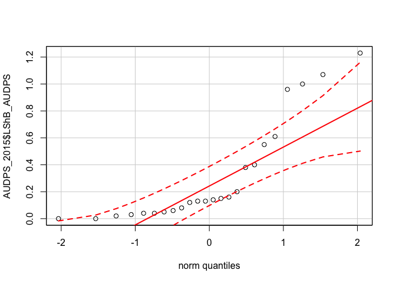
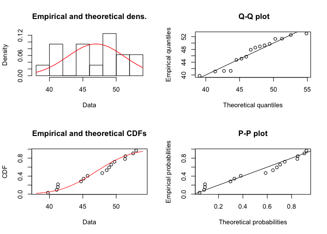
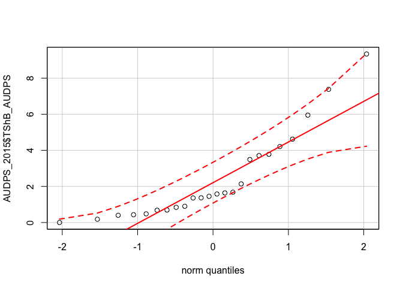
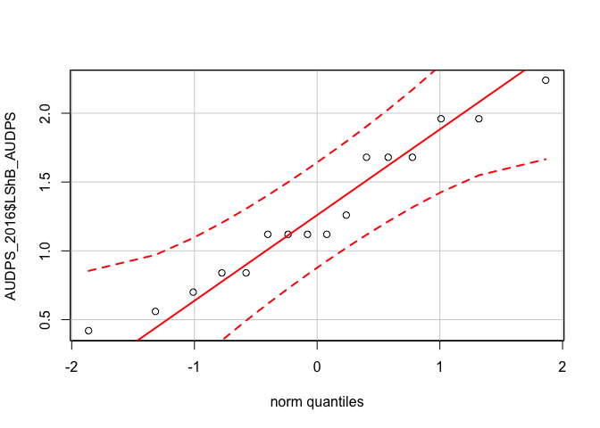
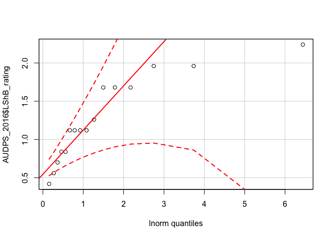
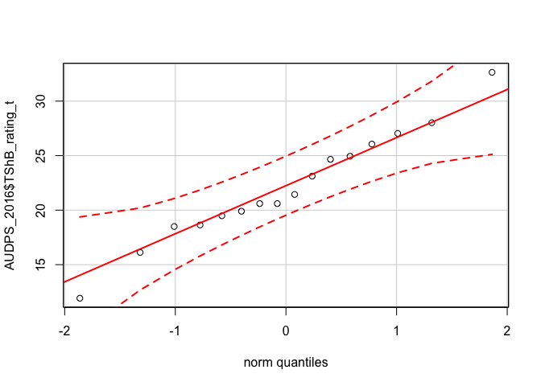
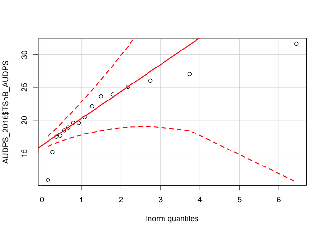

Probability Distribution Checks
================

Here we check the probability distribution that best fits these data. I'm following a method from <http://ase.tufts.edu/gsc/gradresources/guidetomixedmodelsinr/mixed%20model%20guide.html>. As you see in that guide, there are several distributions that can be checked, for my purposes normal or lognormal are enough so I won't check the others.

2015 Check probability distribution fit for leaf sheath blight
--------------------------------------------------------------

``` r
qqp(AUDPS_2015$LShB_AUDPS, "norm")
```


``` r
qqp(AUDPS_2015$LShB_AUDPS, "lnorm")
```



2015 Check probability distribution fit for tiller sheath blight
----------------------------------------------------------------

``` r
qqp(AUDPS_2015$TShB_AUDPS, "norm")
```



``` r
qqp(AUDPS_2015$TShB_AUDPS, "lnorm")
```



------------------------------------------------------------------------

2016 Check probability distribution fit for leaf sheath blight
--------------------------------------------------------------

``` r
qqp(AUDPS_2016$LShB_AUDPS, "norm")
```



``` r
qqp(AUDPS_2016$LShB_AUDPS, "lnorm")
```



2016 Check probability distribution fit for tiller sheath blight
----------------------------------------------------------------

``` r
qqp(AUDPS_2016$TShB_AUDPS, "norm")
```



``` r
qqp(AUDPS_2016$TShB_AUDPS, "lnorm")
```



Conclusions
-----------

To read the graphs, we want to select a distribution where most of the points fall between the dotted red lines. In this case, for the 2015 data, the leaf data fit a lognormal distribution best, for all others a normal distribution appears to be fine.
