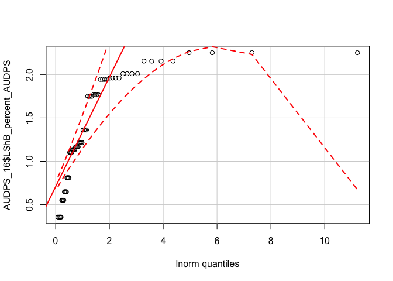
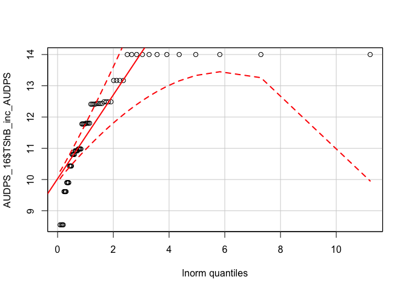

Test Residuals for Model Fits
================

``` r
require(car)
require(MASS)

# This is so that distributions that must be non-zero can make sense of my
# data
AUDPS_15 <- subset(AUDPS, YEAR == 2015)
AUDPS_16 <- subset(AUDPS, YEAR == 2016)

qqp(AUDPS_15$LShB_percent_AUDPS, "norm")
```


``` r
qqp(AUDPS_15$LShB_percent_AUDPS, "lnorm")
```


``` r
qqp(AUDPS_15$LShB_percent_AUDPS, "exp")
```


``` r
qqp(AUDPS_15$LShB_percent_AUDPS, "chisq", df = 2)
```


``` r
qqp(AUDPS_16$LShB_percent_AUDPS, "norm")
```


``` r
qqp(AUDPS_16$LShB_percent_AUDPS, "lnorm")
```



``` r
qqp(AUDPS_16$LShB_percent_AUDPS, "exp")
```


``` r
qqp(AUDPS_16$LShB_percent_AUDPS, "chisq", df = 2)
```


``` r
qqp(AUDPS_15$TShB_percent_AUDPS, "norm")
```


``` r
qqp(AUDPS_15$TShB_percent_AUDPS, "lnorm")
```


``` r
qqp(AUDPS_15$TShB_percent_AUDPS, "exp")
```


``` r
qqp(AUDPS_15$TShB_percent_AUDPS, "chisq", df = 2)
```


``` r
qqp(AUDPS_16$TShB_percent_AUDPS, "norm")
```


``` r
qqp(AUDPS_16$TShB_percent_AUDPS, "lnorm")
```


``` r
qqp(AUDPS_16$TShB_percent_AUDPS, "exp")
```


``` r
qqp(AUDPS_16$TShB_percent_AUDPS, "chisq", df = 2)
```


``` r
qqp(AUDPS_15$TShB_inc_AUDPS, "norm")
```


``` r
qqp(AUDPS_15$TShB_inc_AUDPS, "lnorm")
```


``` r
qqp(AUDPS_15$TShB_inc_AUDPS, "exp")
```


``` r
qqp(AUDPS_15$TShB_inc_AUDPS, "chisq", df = 2)
```


``` r
qqp(AUDPS_16$TShB_inc_AUDPS, "norm")
```


``` r
qqp(AUDPS_16$TShB_inc_AUDPS, "lnorm")
```



``` r
qqp(AUDPS_16$TShB_inc_AUDPS, "exp")
```


``` r
qqp(AUDPS_16$TShB_inc_AUDPS, "chisq", df = 2)
```


