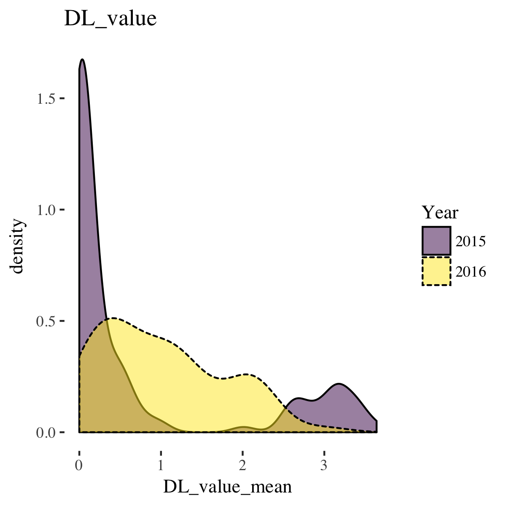
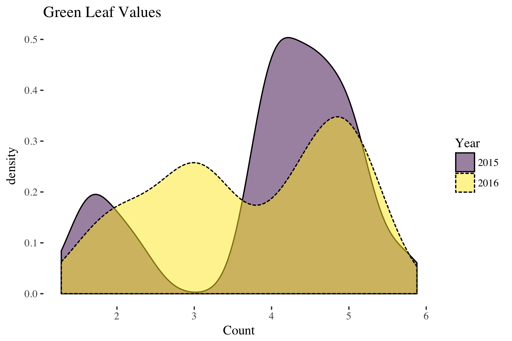
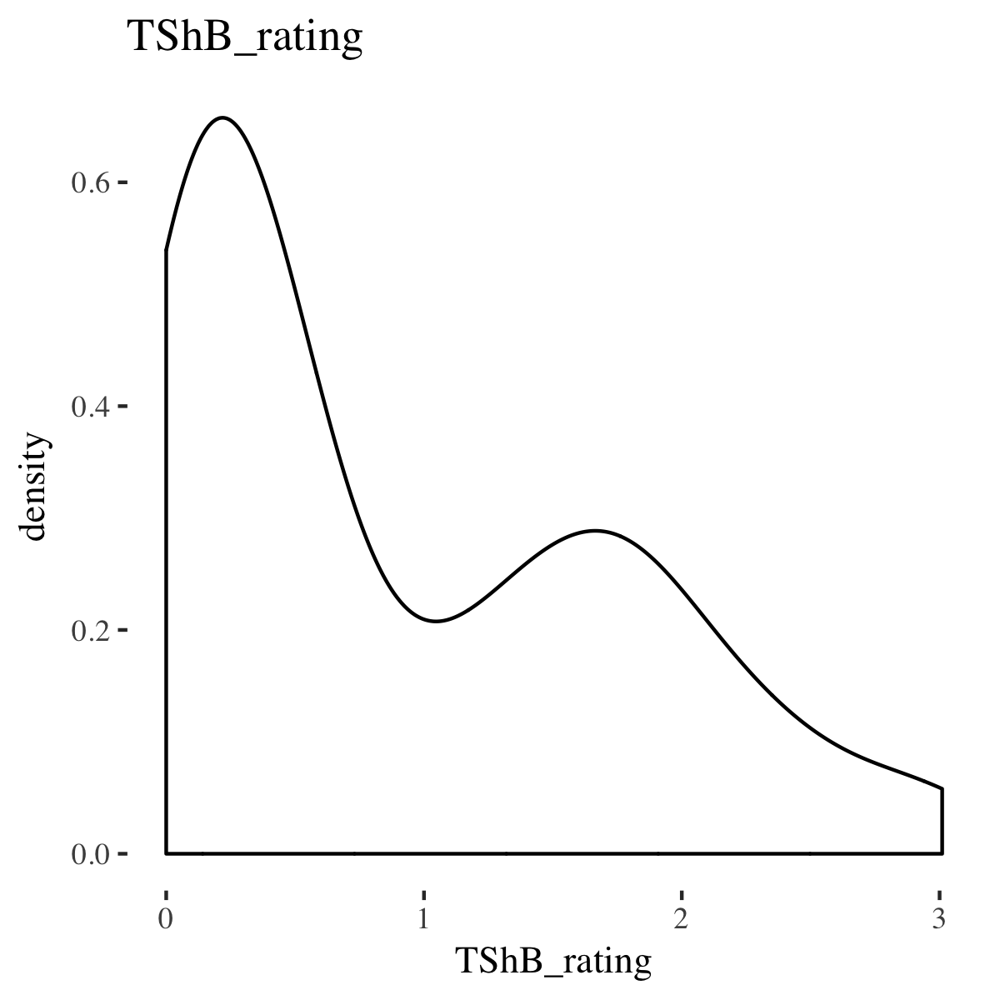
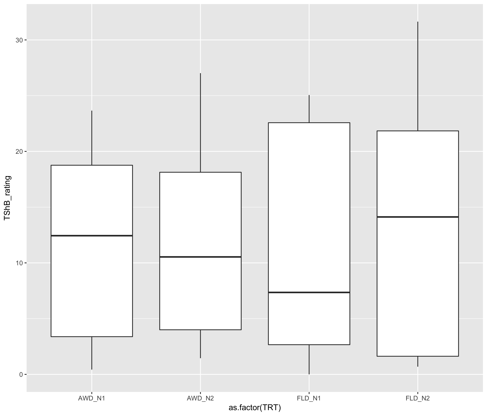
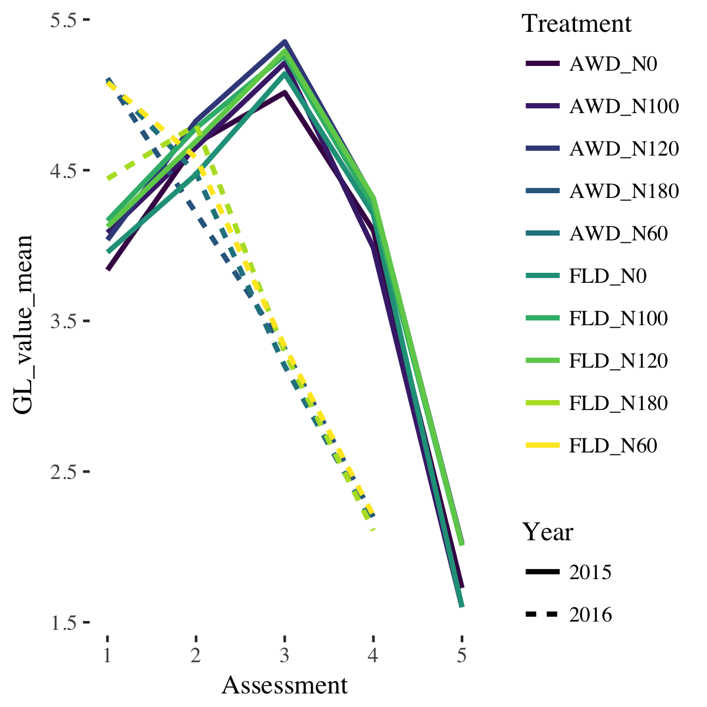
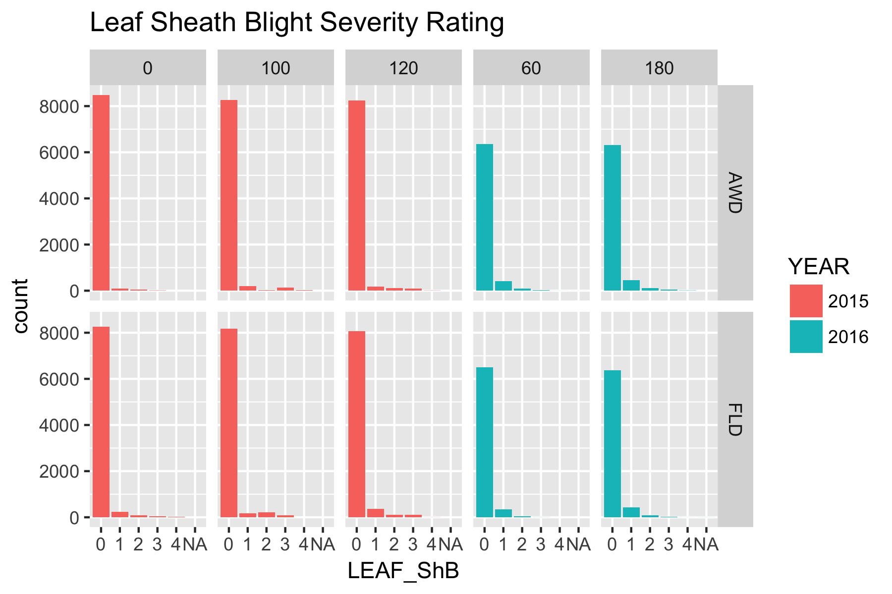
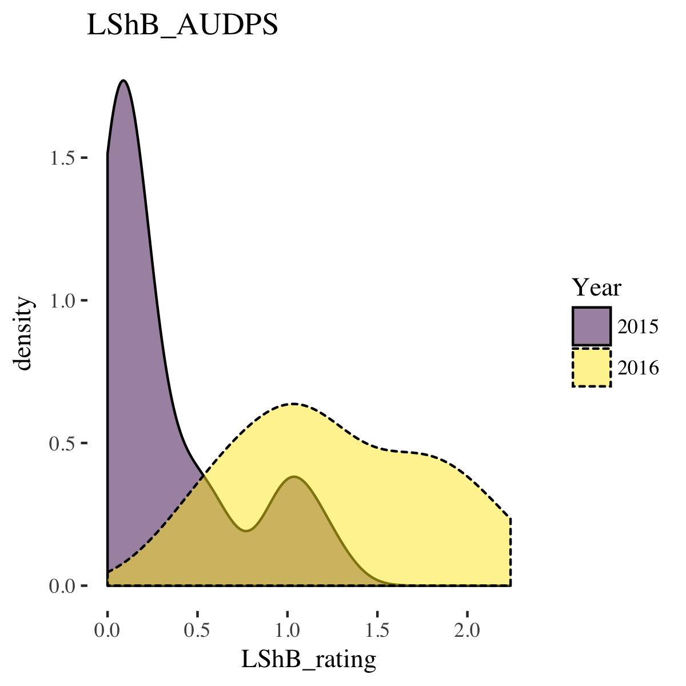
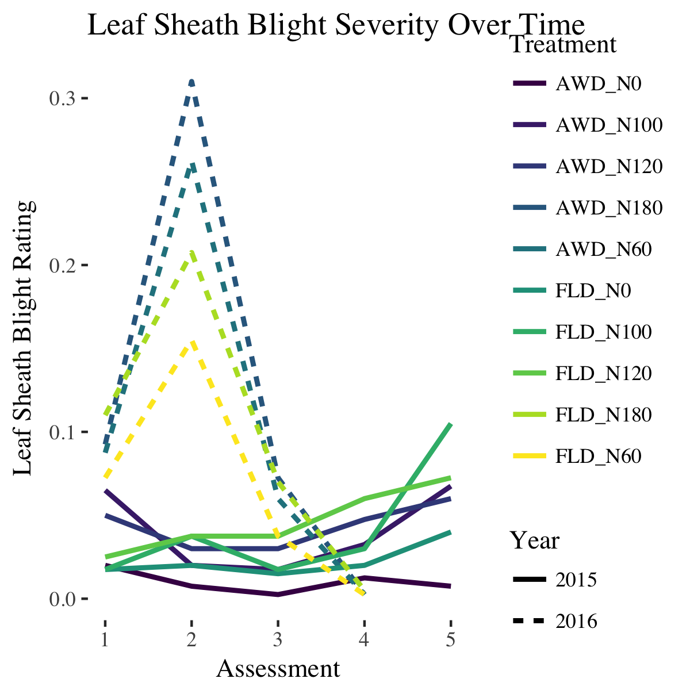

# Data visualisations

## Density plots
Raw data for green leaves and dead leaves

### Dead leaves

### Green leaves

## Tiller sheath blight ratings

Data for tiller related observations

### Tiller ShB AUDPS

### Tiller ShB over time

## Leaf sheath blight ratings

Data for leaf related observations

### Leaf ShB AUDPS

### Leaf ShB over time

