Analysis of split plot design using lme4
================

Notes on This Analysis Before Starting
--------------------------------------

The base levels for this analysis are:

-   2015 `NRTE:0`

-   2015 `WMGT:FLD`

-   2016 `NRTE:60`

-   2016 `WMGT:FLD`

#### Changes between 2015 and 2016

Before the analysis, note that due to changes between the years, the analysis must be carried out on each year separately. The 2015 data and 2016 data cannot be combined due to changes in inoculation methods; there are other changes too, but the main one is this. Therefore, the analyses will be conducted separately such that comparisons will only be observational and cannot be statistically compared.

Setup
-----

The `AUDPS` object is created when the project is loaded, in the file [munge/03\_preprocess\_data.R](./munge/03_preprocess_data.R). However, because it is a `tibble` and the treatments exist in a single column for graphing the raw data, this object needs a few minor changes to be usable for the analysis.

First, separate the TRT column into the two treatments for analysis.

``` r
AUDPS <- separate(data = AUDPS, col = TRT, sep = "_", into = c("WMGT", "NRTE"))
AUDPS <- mutate_at(.tbl = AUDPS, .funs = factor, .vars = c("WMGT", "NRTE"))
```

Now create individual data frames for the analysis.

``` r
AUDPS_2015 <- as.data.frame(AUDPS[AUDPS$YEAR == 2015, ])
AUDPS_2015 <- droplevels(AUDPS_2015)

# relevel factors for easier interpretation of  analysis
AUDPS_2015 <- within(AUDPS_2015, NRTE <- relevel(NRTE, ref = "N0"))
AUDPS_2015 <- within(AUDPS_2015, WMGT <- relevel(WMGT, ref = "FLD"))

AUDPS_2016 <- as.data.frame(AUDPS[AUDPS$YEAR == 2016, ])
AUDPS_2016 <- droplevels(AUDPS_2016)

# relevel factors for easier interpretation of  analysis
AUDPS_2016 <- within(AUDPS_2016, NRTE <- relevel(NRTE, ref = "N60"))
AUDPS_2016 <- within(AUDPS_2016, WMGT <- relevel(WMGT, ref = "FLD"))
```

Now that the `AUDPS_2015` and `AUDPS_2016` `data.frames` exist, we can start the analysis.

2015
----

### 2015 Tiller Sheath Blight Incidence Model

``` r
library(lme4)
library(lsmeans)
```

    ## Loading required package: estimability

``` r
TShB_inc_AUDPS <- lmer(TShB_inc_AUDPS ~ WMGT * NRTE + (1|REP), data = AUDPS_2015)
summary(TShB_inc_AUDPS)
```

    ## Linear mixed model fit by REML ['lmerMod']
    ## Formula: TShB_inc_AUDPS ~ WMGT * NRTE + (1 | REP)
    ##    Data: AUDPS_2015
    ## 
    ## REML criterion at convergence: 327.2
    ## 
    ## Scaled residuals: 
    ##     Min      1Q  Median      3Q     Max 
    ## -2.2566 -0.6199 -0.1448  0.7987  1.6508 
    ## 
    ## Random effects:
    ##  Groups   Name        Variance Std.Dev.
    ##  REP      (Intercept) 0.1474   0.3839  
    ##  Residual             0.8406   0.9168  
    ## Number of obs: 120, groups:  REP, 4
    ## 
    ## Fixed effects:
    ##                  Estimate Std. Error t value
    ## (Intercept)        1.2925     0.2809   4.602
    ## WMGTAWD           -0.2275     0.2899  -0.785
    ## NRTEN100           0.4050     0.2899   1.397
    ## NRTEN120           0.7175     0.2899   2.475
    ## WMGTAWD:NRTEN100   0.4525     0.4100   1.104
    ## WMGTAWD:NRTEN120   0.5875     0.4100   1.433
    ## 
    ## Correlation of Fixed Effects:
    ##                 (Intr) WMGTAWD NRTEN10 NRTEN12 WMGTAWD:NRTEN10
    ## WMGTAWD         -0.516                                        
    ## NRTEN100        -0.516  0.500                                 
    ## NRTEN120        -0.516  0.500   0.500                         
    ## WMGTAWD:NRTEN10  0.365 -0.707  -0.707  -0.354                 
    ## WMGTAWD:NRTEN12  0.365 -0.707  -0.354  -0.707   0.500

``` r
plot(TShB_inc_AUDPS)
```

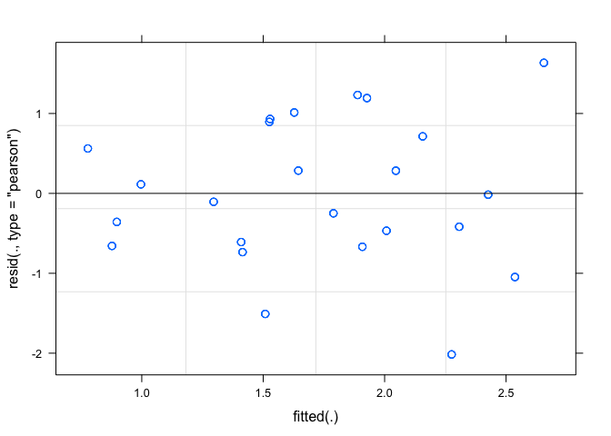

``` r
qqnorm(resid(TShB_inc_AUDPS))
qqline(resid(TShB_inc_AUDPS))
```

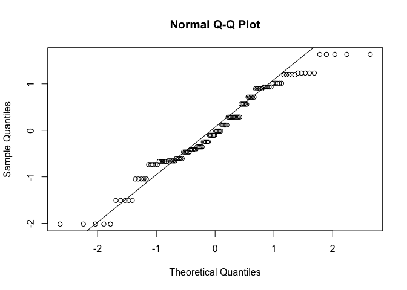

``` r
print(lsmeans(TShB_inc_AUDPS, list(pairwise ~ NRTE)), adjust = c("tukey"))
```

    ## Loading required namespace: lmerTest

    ## NOTE: Results may be misleading due to involvement in interactions

    ## $`lsmeans of NRTE`
    ##  NRTE  lsmean        SE   df  lower.CL upper.CL
    ##  N0   1.17875 0.2405456 5.21 0.3472165 2.010283
    ##  N100 1.81000 0.2405456 5.21 0.9784665 2.641533
    ##  N120 2.19000 0.2405456 5.21 1.3584665 3.021533
    ## 
    ## Results are averaged over the levels of: WMGT 
    ## Degrees-of-freedom method: satterthwaite 
    ## Confidence level used: 0.95 
    ## Conf-level adjustment: sidak method for 3 estimates 
    ## 
    ## $`pairwise differences of contrast`
    ##  contrast    estimate        SE  df t.ratio p.value
    ##  N0 - N100   -0.63125 0.2050136 111  -3.079  0.0073
    ##  N0 - N120   -1.01125 0.2050136 111  -4.933  <.0001
    ##  N100 - N120 -0.38000 0.2050136 111  -1.854  0.1572
    ## 
    ## Results are averaged over the levels of: WMGT 
    ## P value adjustment: tukey method for comparing a family of 3 estimates

``` r
print(lsmeans(TShB_inc_AUDPS, list(pairwise ~ WMGT)), adjust = c("tukey"))
```

    ## NOTE: Results may be misleading due to involvement in interactions

    ## $`lsmeans of WMGT`
    ##  WMGT   lsmean        SE   df  lower.CL upper.CL
    ##  FLD  1.666667 0.2255152 4.03 0.8847587 2.448575
    ##  AWD  1.785833 0.2255152 4.03 1.0039253 2.567741
    ## 
    ## Results are averaged over the levels of: NRTE 
    ## Degrees-of-freedom method: satterthwaite 
    ## Confidence level used: 0.95 
    ## Conf-level adjustment: sidak method for 2 estimates 
    ## 
    ## $`pairwise differences of contrast`
    ##  contrast    estimate        SE  df t.ratio p.value
    ##  FLD - AWD -0.1191667 0.1673929 111  -0.712  0.4780
    ## 
    ## Results are averaged over the levels of: NRTE

``` r
print(lsmeans(TShB_inc_AUDPS, list(pairwise ~ WMGT | NRTE)), adjust = c("tukey"))
```

    ## $`lsmeans of WMGT | NRTE`
    ## NRTE = N0:
    ##  WMGT lsmean        SE   df  lower.CL upper.CL
    ##  FLD  1.2925 0.2808514 9.54 0.5487673 2.036233
    ##  AWD  1.0650 0.2808514 9.54 0.3212673 1.808733
    ## 
    ## NRTE = N100:
    ##  WMGT lsmean        SE   df  lower.CL upper.CL
    ##  FLD  1.6975 0.2808514 9.54 0.9537673 2.441233
    ##  AWD  1.9225 0.2808514 9.54 1.1787673 2.666233
    ## 
    ## NRTE = N120:
    ##  WMGT lsmean        SE   df  lower.CL upper.CL
    ##  FLD  2.0100 0.2808514 9.54 1.2662673 2.753733
    ##  AWD  2.3700 0.2808514 9.54 1.6262673 3.113733
    ## 
    ## Degrees-of-freedom method: satterthwaite 
    ## Confidence level used: 0.95 
    ## Conf-level adjustment: sidak method for 2 estimates 
    ## 
    ## $`pairwise differences of contrast, NRTE | NRTE`
    ## NRTE = N0:
    ##  contrast  estimate       SE  df t.ratio p.value
    ##  FLD - AWD   0.2275 0.289933 111   0.785  0.4343
    ## 
    ## NRTE = N100:
    ##  contrast  estimate       SE  df t.ratio p.value
    ##  FLD - AWD  -0.2250 0.289933 111  -0.776  0.4394
    ## 
    ## NRTE = N120:
    ##  contrast  estimate       SE  df t.ratio p.value
    ##  FLD - AWD  -0.3600 0.289933 111  -1.242  0.2170

### 2015 Tiller Sheath Blight Severity Model

``` r
TShB_sev_AUDPS <- lmer(TShB_percent_AUDPS ~ WMGT * NRTE + (1|REP), data = AUDPS_2015)
summary(TShB_sev_AUDPS)
```

    ## Linear mixed model fit by REML ['lmerMod']
    ## Formula: TShB_percent_AUDPS ~ WMGT * NRTE + (1 | REP)
    ##    Data: AUDPS_2015
    ## 
    ## REML criterion at convergence: 941.8
    ## 
    ## Scaled residuals: 
    ##      Min       1Q   Median       3Q      Max 
    ## -2.19204 -0.61005  0.01013  0.81810  2.03823 
    ## 
    ## Random effects:
    ##  Groups   Name        Variance Std.Dev.
    ##  REP      (Intercept)  10.11    3.18   
    ##  Residual             188.79   13.74   
    ## Number of obs: 120, groups:  REP, 4
    ## 
    ## Fixed effects:
    ##                  Estimate Std. Error t value
    ## (Intercept)         6.573      3.459   1.900
    ## WMGTAWD             4.310      4.345   0.992
    ## NRTEN100           10.360      4.345   2.384
    ## NRTEN120           17.352      4.345   3.994
    ## WMGTAWD:NRTEN100   13.288      6.145   2.162
    ## WMGTAWD:NRTEN120   -1.237      6.145  -0.201
    ## 
    ## Correlation of Fixed Effects:
    ##                 (Intr) WMGTAWD NRTEN10 NRTEN12 WMGTAWD:NRTEN10
    ## WMGTAWD         -0.628                                        
    ## NRTEN100        -0.628  0.500                                 
    ## NRTEN120        -0.628  0.500   0.500                         
    ## WMGTAWD:NRTEN10  0.444 -0.707  -0.707  -0.354                 
    ## WMGTAWD:NRTEN12  0.444 -0.707  -0.354  -0.707   0.500

``` r
plot(TShB_sev_AUDPS)
```

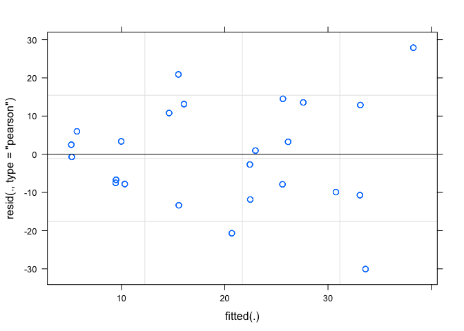

``` r
qqnorm(resid(TShB_sev_AUDPS))
qqline(resid(TShB_sev_AUDPS))
```

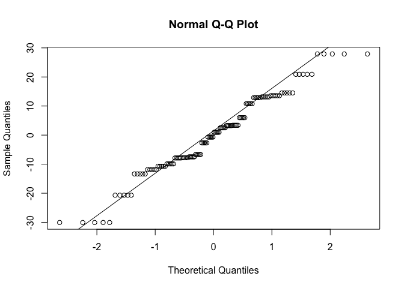

``` r
print(lsmeans(TShB_sev_AUDPS, list(pairwise ~ NRTE)), adjust = c("tukey"))
```

    ## NOTE: Results may be misleading due to involvement in interactions

    ## $`lsmeans of NRTE`
    ##  NRTE   lsmean       SE   df   lower.CL upper.CL
    ##  N0    8.72750 2.692054 9.22  0.9004082 16.55459
    ##  N100 25.73125 2.692054 9.22 17.9041582 33.55834
    ##  N120 25.46125 2.692054 9.22 17.6341582 33.28834
    ## 
    ## Results are averaged over the levels of: WMGT 
    ## Degrees-of-freedom method: satterthwaite 
    ## Confidence level used: 0.95 
    ## Conf-level adjustment: sidak method for 3 estimates 
    ## 
    ## $`pairwise differences of contrast`
    ##  contrast     estimate       SE  df t.ratio p.value
    ##  N0 - N100   -17.00375 3.072351 111  -5.534  <.0001
    ##  N0 - N120   -16.73375 3.072351 111  -5.447  <.0001
    ##  N100 - N120   0.27000 3.072351 111   0.088  0.9958
    ## 
    ## Results are averaged over the levels of: WMGT 
    ## P value adjustment: tukey method for comparing a family of 3 estimates

``` r
print(lsmeans(TShB_sev_AUDPS, list(pairwise ~ WMGT)), adjust = c("tukey"))
```

    ## NOTE: Results may be misleading due to involvement in interactions

    ## $`lsmeans of WMGT`
    ##  WMGT   lsmean       SE   df  lower.CL upper.CL
    ##  FLD  15.81000 2.382001 5.72  8.653931 22.96607
    ##  AWD  24.13667 2.382001 5.72 16.980598 31.29274
    ## 
    ## Results are averaged over the levels of: NRTE 
    ## Degrees-of-freedom method: satterthwaite 
    ## Confidence level used: 0.95 
    ## Conf-level adjustment: sidak method for 2 estimates 
    ## 
    ## $`pairwise differences of contrast`
    ##  contrast   estimate       SE  df t.ratio p.value
    ##  FLD - AWD -8.326667 2.508564 111  -3.319  0.0012
    ## 
    ## Results are averaged over the levels of: NRTE

``` r
print(lsmeans(TShB_sev_AUDPS, list(pairwise ~ WMGT | NRTE)), adjust = c("tukey"))
```

    ## $`lsmeans of WMGT | NRTE`
    ## NRTE = N0:
    ##  WMGT  lsmean      SE    df lower.CL upper.CL
    ##  FLD   6.5725 3.45931 23.24 -1.69632 14.84132
    ##  AWD  10.8825 3.45931 23.24  2.61368 19.15132
    ## 
    ## NRTE = N100:
    ##  WMGT  lsmean      SE    df lower.CL upper.CL
    ##  FLD  16.9325 3.45931 23.24  8.66368 25.20132
    ##  AWD  34.5300 3.45931 23.24 26.26118 42.79882
    ## 
    ## NRTE = N120:
    ##  WMGT  lsmean      SE    df lower.CL upper.CL
    ##  FLD  23.9250 3.45931 23.24 15.65618 32.19382
    ##  AWD  26.9975 3.45931 23.24 18.72868 35.26632
    ## 
    ## Degrees-of-freedom method: satterthwaite 
    ## Confidence level used: 0.95 
    ## Conf-level adjustment: sidak method for 2 estimates 
    ## 
    ## $`pairwise differences of contrast, NRTE | NRTE`
    ## NRTE = N0:
    ##  contrast  estimate      SE  df t.ratio p.value
    ##  FLD - AWD  -4.3100 4.34496 111  -0.992  0.3234
    ## 
    ## NRTE = N100:
    ##  contrast  estimate      SE  df t.ratio p.value
    ##  FLD - AWD -17.5975 4.34496 111  -4.050  0.0001
    ## 
    ## NRTE = N120:
    ##  contrast  estimate      SE  df t.ratio p.value
    ##  FLD - AWD  -3.0725 4.34496 111  -0.707  0.4810

### 2015 Leaf Sheath Blight Severity Model

``` r
LShB_sev_AUDPS <- lmer(LShB_percent_AUDPS ~ WMGT * NRTE + (1|REP), data = AUDPS_2015)
summary(LShB_sev_AUDPS)
```

    ## Linear mixed model fit by REML ['lmerMod']
    ## Formula: LShB_percent_AUDPS ~ WMGT * NRTE + (1 | REP)
    ##    Data: AUDPS_2015
    ## 
    ## REML criterion at convergence: 537.5
    ## 
    ## Scaled residuals: 
    ##     Min      1Q  Median      3Q     Max 
    ## -2.1665 -0.6896  0.1581  0.3810  1.6540 
    ## 
    ## Random effects:
    ##  Groups   Name        Variance Std.Dev.
    ##  REP      (Intercept) 2.192    1.481   
    ##  Residual             5.209    2.282   
    ## Number of obs: 120, groups:  REP, 4
    ## 
    ## Fixed effects:
    ##                  Estimate Std. Error t value
    ## (Intercept)        1.8950     0.8992   2.107
    ## WMGTAWD           -1.2100     0.7218  -1.676
    ## NRTEN100           0.8475     0.7218   1.174
    ## NRTEN120           1.9050     0.7218   2.639
    ## WMGTAWD:NRTEN100   4.2725     1.0207   4.186
    ## WMGTAWD:NRTEN120   2.4400     1.0207   2.390
    ## 
    ## Correlation of Fixed Effects:
    ##                 (Intr) WMGTAWD NRTEN10 NRTEN12 WMGTAWD:NRTEN10
    ## WMGTAWD         -0.401                                        
    ## NRTEN100        -0.401  0.500                                 
    ## NRTEN120        -0.401  0.500   0.500                         
    ## WMGTAWD:NRTEN10  0.284 -0.707  -0.707  -0.354                 
    ## WMGTAWD:NRTEN12  0.284 -0.707  -0.354  -0.707   0.500

``` r
plot(LShB_sev_AUDPS)
```

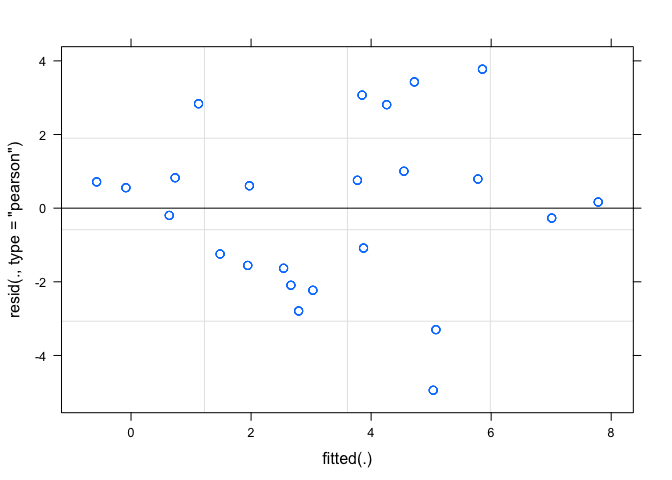

``` r
qqnorm(resid(LShB_sev_AUDPS))
qqline(resid(LShB_sev_AUDPS))
```

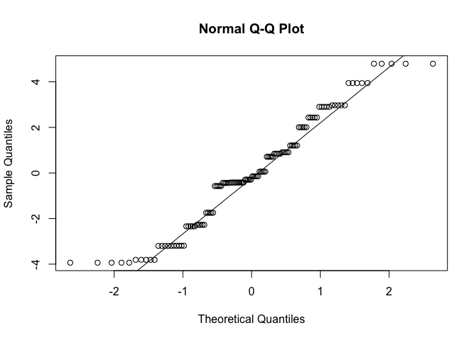

``` r
print(lsmeans(LShB_sev_AUDPS, list(pairwise ~ NRTE)), adjust = c("tukey"))
```

    ## NOTE: Results may be misleading due to involvement in interactions

    ## $`lsmeans of NRTE`
    ##  NRTE  lsmean        SE   df  lower.CL upper.CL
    ##  N0   1.29000 0.8235945 3.94 -1.982859 4.562859
    ##  N100 4.27375 0.8235945 3.94  1.000891 7.546609
    ##  N120 4.41500 0.8235945 3.94  1.142141 7.687859
    ## 
    ## Results are averaged over the levels of: WMGT 
    ## Degrees-of-freedom method: satterthwaite 
    ## Confidence level used: 0.95 
    ## Conf-level adjustment: sidak method for 3 estimates 
    ## 
    ## $`pairwise differences of contrast`
    ##  contrast    estimate       SE  df t.ratio p.value
    ##  N0 - N100   -2.98375 0.510364 111  -5.846  <.0001
    ##  N0 - N120   -3.12500 0.510364 111  -6.123  <.0001
    ##  N100 - N120 -0.14125 0.510364 111  -0.277  0.9587
    ## 
    ## Results are averaged over the levels of: WMGT 
    ## P value adjustment: tukey method for comparing a family of 3 estimates

``` r
print(lsmeans(LShB_sev_AUDPS, list(pairwise ~ WMGT)), adjust = c("tukey"))
```

    ## NOTE: Results may be misleading due to involvement in interactions

    ## $`lsmeans of WMGT`
    ##  WMGT lsmean        SE   df   lower.CL upper.CL
    ##  FLD  2.8125 0.7968036 3.46 -0.1982742 5.823274
    ##  AWD  3.8400 0.7968036 3.46  0.8292258 6.850774
    ## 
    ## Results are averaged over the levels of: NRTE 
    ## Degrees-of-freedom method: satterthwaite 
    ## Confidence level used: 0.95 
    ## Conf-level adjustment: sidak method for 2 estimates 
    ## 
    ## $`pairwise differences of contrast`
    ##  contrast  estimate        SE  df t.ratio p.value
    ##  FLD - AWD  -1.0275 0.4167105 111  -2.466  0.0152
    ## 
    ## Results are averaged over the levels of: NRTE

``` r
print(lsmeans(LShB_sev_AUDPS, list(pairwise ~ WMGT | NRTE)), adjust = c("tukey"))
```

    ## $`lsmeans of WMGT | NRTE`
    ## NRTE = N0:
    ##  WMGT lsmean        SE   df    lower.CL upper.CL
    ##  FLD  1.8950 0.8991905 5.59 -0.82797838 4.617978
    ##  AWD  0.6850 0.8991905 5.59 -2.03797838 3.407978
    ## 
    ## NRTE = N100:
    ##  WMGT lsmean        SE   df    lower.CL upper.CL
    ##  FLD  2.7425 0.8991905 5.59  0.01952162 5.465478
    ##  AWD  5.8050 0.8991905 5.59  3.08202162 8.527978
    ## 
    ## NRTE = N120:
    ##  WMGT lsmean        SE   df    lower.CL upper.CL
    ##  FLD  3.8000 0.8991905 5.59  1.07702162 6.522978
    ##  AWD  5.0300 0.8991905 5.59  2.30702162 7.752978
    ## 
    ## Degrees-of-freedom method: satterthwaite 
    ## Confidence level used: 0.95 
    ## Conf-level adjustment: sidak method for 2 estimates 
    ## 
    ## $`pairwise differences of contrast, NRTE | NRTE`
    ## NRTE = N0:
    ##  contrast  estimate        SE  df t.ratio p.value
    ##  FLD - AWD   1.2100 0.7217638 111   1.676  0.0965
    ## 
    ## NRTE = N100:
    ##  contrast  estimate        SE  df t.ratio p.value
    ##  FLD - AWD  -3.0625 0.7217638 111  -4.243  <.0001
    ## 
    ## NRTE = N120:
    ##  contrast  estimate        SE  df t.ratio p.value
    ##  FLD - AWD  -1.2300 0.7217638 111  -1.704  0.0911

------------------------------------------------------------------------

2016
----

### 2016 Tiller Sheath Blight Incidence Model

``` r
TShB_inc_AUDPS <- lmer(TShB_inc_AUDPS ~ WMGT * NRTE + (1|REP), data = AUDPS_2016)
summary(TShB_inc_AUDPS)
```

    ## Linear mixed model fit by REML ['lmerMod']
    ## Formula: TShB_inc_AUDPS ~ WMGT * NRTE + (1 | REP)
    ##    Data: AUDPS_2016
    ## 
    ## REML criterion at convergence: 186.3
    ## 
    ## Scaled residuals: 
    ##     Min      1Q  Median      3Q     Max 
    ## -1.7825 -0.5549 -0.1991  0.2983  2.1760 
    ## 
    ## Random effects:
    ##  Groups   Name        Variance Std.Dev.
    ##  REP      (Intercept) 0.8576   0.9261  
    ##  Residual             0.9460   0.9726  
    ## Number of obs: 64, groups:  REP, 4
    ## 
    ## Fixed effects:
    ##                  Estimate Std. Error t value
    ## (Intercept)       10.3600     0.5230  19.809
    ## WMGTAWD            0.7700     0.3439   2.239
    ## NRTEN180           2.3100     0.3439   6.718
    ## WMGTAWD:NRTEN180  -0.7700     0.4863  -1.583
    ## 
    ## Correlation of Fixed Effects:
    ##             (Intr) WMGTAWD NRTEN1
    ## WMGTAWD     -0.329               
    ## NRTEN180    -0.329  0.500        
    ## WMGTAWD:NRT  0.232 -0.707  -0.707

``` r
plot(TShB_inc_AUDPS)
```

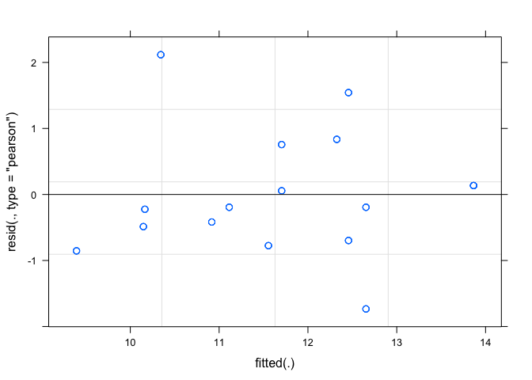

``` r
qqnorm(resid(TShB_inc_AUDPS))
qqline(resid(TShB_inc_AUDPS))
```


``` r
print(lsmeans(TShB_inc_AUDPS, list(pairwise ~ NRTE)), adjust = c("tukey"))
```

    ## NOTE: Results may be misleading due to involvement in interactions

    ## $`lsmeans of NRTE`
    ##  NRTE lsmean        SE  df  lower.CL upper.CL
    ##  N60  10.745 0.4939207 3.4  8.859208 12.63079
    ##  N180 12.670 0.4939207 3.4 10.784208 14.55579
    ## 
    ## Results are averaged over the levels of: WMGT 
    ## Degrees-of-freedom method: satterthwaite 
    ## Confidence level used: 0.95 
    ## Conf-level adjustment: sidak method for 2 estimates 
    ## 
    ## $`pairwise differences of contrast`
    ##  contrast   estimate        SE df t.ratio p.value
    ##  N60 - N180   -1.925 0.2431509 57  -7.917  <.0001
    ## 
    ## Results are averaged over the levels of: WMGT

``` r
print(lsmeans(TShB_inc_AUDPS, list(pairwise ~ WMGT)), adjust = c("tukey"))
```

    ## NOTE: Results may be misleading due to involvement in interactions

    ## $`lsmeans of WMGT`
    ##  WMGT lsmean        SE  df  lower.CL upper.CL
    ##  FLD  11.515 0.4939207 3.4  9.629208 13.40079
    ##  AWD  11.900 0.4939207 3.4 10.014208 13.78579
    ## 
    ## Results are averaged over the levels of: NRTE 
    ## Degrees-of-freedom method: satterthwaite 
    ## Confidence level used: 0.95 
    ## Conf-level adjustment: sidak method for 2 estimates 
    ## 
    ## $`pairwise differences of contrast`
    ##  contrast  estimate        SE df t.ratio p.value
    ##  FLD - AWD   -0.385 0.2431509 57  -1.583  0.1189
    ## 
    ## Results are averaged over the levels of: NRTE

``` r
print(lsmeans(TShB_inc_AUDPS, list(pairwise ~ WMGT | NRTE)), adjust = c("tukey"))
```

    ## $`lsmeans of WMGT | NRTE`
    ## NRTE = N60:
    ##  WMGT lsmean        SE   df lower.CL upper.CL
    ##  FLD   10.36 0.5229903 4.26   8.5956  12.1244
    ##  AWD   11.13 0.5229903 4.26   9.3656  12.8944
    ## 
    ## NRTE = N180:
    ##  WMGT lsmean        SE   df lower.CL upper.CL
    ##  FLD   12.67 0.5229903 4.26  10.9056  14.4344
    ##  AWD   12.67 0.5229903 4.26  10.9056  14.4344
    ## 
    ## Degrees-of-freedom method: satterthwaite 
    ## Confidence level used: 0.95 
    ## Conf-level adjustment: sidak method for 2 estimates 
    ## 
    ## $`pairwise differences of contrast, NRTE | NRTE`
    ## NRTE = N60:
    ##  contrast       estimate        SE df t.ratio p.value
    ##  FLD - AWD -7.700000e-01 0.3438673 57  -2.239  0.0291
    ## 
    ## NRTE = N180:
    ##  contrast       estimate        SE df t.ratio p.value
    ##  FLD - AWD -1.332268e-15 0.3438673 57   0.000  1.0000

### 2016 Tiller Sheath Blight Severity Model

``` r
TShB_sev_AUDPS <- lmer(TShB_percent_AUDPS ~ WMGT * NRTE + (1|REP), data = AUDPS_2016)
summary(TShB_sev_AUDPS)
```

    ## Linear mixed model fit by REML ['lmerMod']
    ## Formula: TShB_percent_AUDPS ~ WMGT * NRTE + (1 | REP)
    ##    Data: AUDPS_2016
    ## 
    ## REML criterion at convergence: 445.6
    ## 
    ## Scaled residuals: 
    ##      Min       1Q   Median       3Q      Max 
    ## -1.52988 -0.64657 -0.04153  0.51213  2.10115 
    ## 
    ## Random effects:
    ##  Groups   Name        Variance Std.Dev.
    ##  REP      (Intercept) 85.84    9.265   
    ##  Residual             70.33    8.386   
    ## Number of obs: 64, groups:  REP, 4
    ## 
    ## Fixed effects:
    ##                  Estimate Std. Error t value
    ## (Intercept)        29.750      5.085   5.851
    ## WMGTAWD            -3.710      2.965  -1.251
    ## NRTEN180            9.240      2.965   3.116
    ## WMGTAWD:NRTEN180   -9.030      4.193  -2.154
    ## 
    ## Correlation of Fixed Effects:
    ##             (Intr) WMGTAWD NRTEN1
    ## WMGTAWD     -0.292               
    ## NRTEN180    -0.292  0.500        
    ## WMGTAWD:NRT  0.206 -0.707  -0.707

``` r
plot(TShB_sev_AUDPS)
```

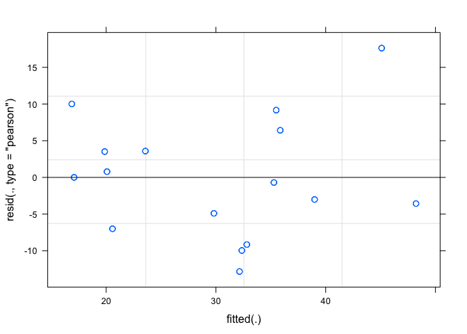

``` r
qqnorm(resid(TShB_sev_AUDPS))
qqline(resid(TShB_sev_AUDPS))
```

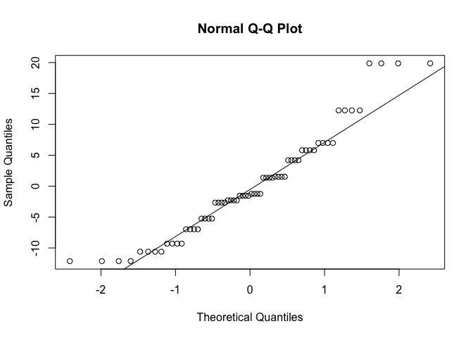

``` r
print(lsmeans(TShB_sev_AUDPS, list(pairwise ~ NRTE)), adjust = c("tukey"))
```

    ## NOTE: Results may be misleading due to involvement in interactions

    ## $`lsmeans of NRTE`
    ##  NRTE lsmean       SE  df  lower.CL upper.CL
    ##  N60  27.895 4.863963 3.3  8.967166 46.82283
    ##  N180 32.620 4.863963 3.3 13.692166 51.54783
    ## 
    ## Results are averaged over the levels of: WMGT 
    ## Degrees-of-freedom method: satterthwaite 
    ## Confidence level used: 0.95 
    ## Conf-level adjustment: sidak method for 2 estimates 
    ## 
    ## $`pairwise differences of contrast`
    ##  contrast   estimate       SE df t.ratio p.value
    ##  N60 - N180   -4.725 2.096512 57  -2.254  0.0281
    ## 
    ## Results are averaged over the levels of: WMGT

``` r
print(lsmeans(TShB_sev_AUDPS, list(pairwise ~ WMGT)), adjust = c("tukey"))
```

    ## NOTE: Results may be misleading due to involvement in interactions

    ## $`lsmeans of WMGT`
    ##  WMGT lsmean       SE  df  lower.CL upper.CL
    ##  FLD  34.370 4.863963 3.3 15.442166 53.29783
    ##  AWD  26.145 4.863963 3.3  7.217166 45.07283
    ## 
    ## Results are averaged over the levels of: NRTE 
    ## Degrees-of-freedom method: satterthwaite 
    ## Confidence level used: 0.95 
    ## Conf-level adjustment: sidak method for 2 estimates 
    ## 
    ## $`pairwise differences of contrast`
    ##  contrast  estimate       SE df t.ratio p.value
    ##  FLD - AWD    8.225 2.096512 57   3.923  0.0002
    ## 
    ## Results are averaged over the levels of: NRTE

``` r
print(lsmeans(TShB_sev_AUDPS, list(pairwise ~ WMGT | NRTE)), adjust = c("tukey"))
```

    ## $`lsmeans of WMGT | NRTE`
    ## NRTE = N60:
    ##  WMGT lsmean       SE   df  lower.CL upper.CL
    ##  FLD   29.75 5.084862 3.94 11.900901  47.5991
    ##  AWD   26.04 5.084862 3.94  8.190901  43.8891
    ## 
    ## NRTE = N180:
    ##  WMGT lsmean       SE   df  lower.CL upper.CL
    ##  FLD   38.99 5.084862 3.94 21.140901  56.8391
    ##  AWD   26.25 5.084862 3.94  8.400901  44.0991
    ## 
    ## Degrees-of-freedom method: satterthwaite 
    ## Confidence level used: 0.95 
    ## Conf-level adjustment: sidak method for 2 estimates 
    ## 
    ## $`pairwise differences of contrast, NRTE | NRTE`
    ## NRTE = N60:
    ##  contrast  estimate       SE df t.ratio p.value
    ##  FLD - AWD     3.71 2.964916 57   1.251  0.2159
    ## 
    ## NRTE = N180:
    ##  contrast  estimate       SE df t.ratio p.value
    ##  FLD - AWD    12.74 2.964916 57   4.297  0.0001

### 2016 Leaf Sheath Blight Severity Model

``` r
LShB_sev_AUDPS <- lmer(LShB_percent_AUDPS ~ WMGT * NRTE + (1|REP), data = AUDPS_2016)
summary(LShB_sev_AUDPS)
```

    ## Linear mixed model fit by REML ['lmerMod']
    ## Formula: LShB_percent_AUDPS ~ WMGT * NRTE + (1 | REP)
    ##    Data: AUDPS_2016
    ## 
    ## REML criterion at convergence: 89.8
    ## 
    ## Scaled residuals: 
    ##      Min       1Q   Median       3Q      Max 
    ## -1.68249 -0.50796 -0.09818  0.43288  2.19840 
    ## 
    ## Random effects:
    ##  Groups   Name        Variance Std.Dev.
    ##  REP      (Intercept) 0.1312   0.3623  
    ##  Residual             0.1920   0.4381  
    ## Number of obs: 64, groups:  REP, 4
    ## 
    ## Fixed effects:
    ##                  Estimate Std. Error t value
    ## (Intercept)        1.0850     0.2117   5.126
    ## WMGTAWD            0.4900     0.1549   3.163
    ## NRTEN180           0.4900     0.1549   3.163
    ## WMGTAWD:NRTEN180  -0.7350     0.2191  -3.355
    ## 
    ## Correlation of Fixed Effects:
    ##             (Intr) WMGTAWD NRTEN1
    ## WMGTAWD     -0.366               
    ## NRTEN180    -0.366  0.500        
    ## WMGTAWD:NRT  0.259 -0.707  -0.707

``` r
plot(LShB_sev_AUDPS)
```

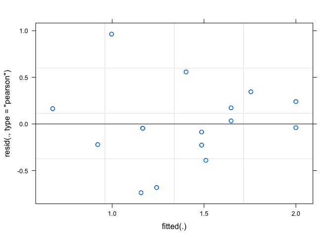

``` r
qqnorm(resid(LShB_sev_AUDPS))
qqline(resid(LShB_sev_AUDPS))
```

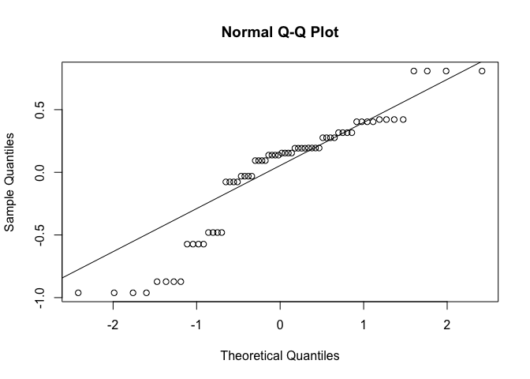

``` r
print(lsmeans(LShB_sev_AUDPS, list(pairwise ~ NRTE)), adjust = c("tukey"))
```

    ## NOTE: Results may be misleading due to involvement in interactions

    ## $`lsmeans of NRTE`
    ##  NRTE lsmean        SE   df  lower.CL upper.CL
    ##  N60  1.3300 0.1969901 3.52 0.5941968 2.065803
    ##  N180 1.4525 0.1969901 3.52 0.7166968 2.188303
    ## 
    ## Results are averaged over the levels of: WMGT 
    ## Degrees-of-freedom method: satterthwaite 
    ## Confidence level used: 0.95 
    ## Conf-level adjustment: sidak method for 2 estimates 
    ## 
    ## $`pairwise differences of contrast`
    ##  contrast   estimate       SE df t.ratio p.value
    ##  N60 - N180  -0.1225 0.109533 57  -1.118  0.2681
    ## 
    ## Results are averaged over the levels of: WMGT

``` r
print(lsmeans(LShB_sev_AUDPS, list(pairwise ~ WMGT)), adjust = c("tukey"))
```

    ## NOTE: Results may be misleading due to involvement in interactions

    ## $`lsmeans of WMGT`
    ##  WMGT lsmean        SE   df  lower.CL upper.CL
    ##  FLD  1.3300 0.1969901 3.52 0.5941968 2.065803
    ##  AWD  1.4525 0.1969901 3.52 0.7166968 2.188303
    ## 
    ## Results are averaged over the levels of: NRTE 
    ## Degrees-of-freedom method: satterthwaite 
    ## Confidence level used: 0.95 
    ## Conf-level adjustment: sidak method for 2 estimates 
    ## 
    ## $`pairwise differences of contrast`
    ##  contrast  estimate       SE df t.ratio p.value
    ##  FLD - AWD  -0.1225 0.109533 57  -1.118  0.2681
    ## 
    ## Results are averaged over the levels of: NRTE

``` r
print(lsmeans(LShB_sev_AUDPS, list(pairwise ~ WMGT | NRTE)), adjust = c("tukey"))
```

    ## $`lsmeans of WMGT | NRTE`
    ## NRTE = N60:
    ##  WMGT lsmean        SE   df  lower.CL upper.CL
    ##  FLD   1.085 0.2116692 4.68 0.3998974 1.770103
    ##  AWD   1.575 0.2116692 4.68 0.8898974 2.260103
    ## 
    ## NRTE = N180:
    ##  WMGT lsmean        SE   df  lower.CL upper.CL
    ##  FLD   1.575 0.2116692 4.68 0.8898974 2.260103
    ##  AWD   1.330 0.2116692 4.68 0.6448974 2.015103
    ## 
    ## Degrees-of-freedom method: satterthwaite 
    ## Confidence level used: 0.95 
    ## Conf-level adjustment: sidak method for 2 estimates 
    ## 
    ## $`pairwise differences of contrast, NRTE | NRTE`
    ## NRTE = N60:
    ##  contrast  estimate        SE df t.ratio p.value
    ##  FLD - AWD   -0.490 0.1549031 57  -3.163  0.0025
    ## 
    ## NRTE = N180:
    ##  contrast  estimate        SE df t.ratio p.value
    ##  FLD - AWD    0.245 0.1549031 57   1.582  0.1193

Conclusions
-----------

The `lme4` `lmer` models do not appear to be a good fit based on the qqplots. However, they do seem to agree with the `MCMCglmm` analysis results. But I'm dubious about using these models based on the diagnostics that I see above.

R Session Info
--------------

    ## Session info -------------------------------------------------------------

    ##  setting  value                       
    ##  version  R version 3.4.1 (2017-06-30)
    ##  system   x86_64, darwin15.6.0        
    ##  ui       X11                         
    ##  language (EN)                        
    ##  collate  en_AU.UTF-8                 
    ##  tz       Australia/Brisbane          
    ##  date     2017-08-03

    ## Packages -----------------------------------------------------------------

    ##  package         * version    date       source                       
    ##  acepack           1.4.1      2016-10-29 CRAN (R 3.4.0)               
    ##  agricolae       * 1.2-5      2017-07-26 CRAN (R 3.4.1)               
    ##  AlgDesign         1.1-7.3    2014-10-15 CRAN (R 3.4.0)               
    ##  ape             * 4.1        2017-02-14 CRAN (R 3.4.0)               
    ##  assertthat        0.2.0      2017-04-11 CRAN (R 3.4.1)               
    ##  backports         1.1.0      2017-05-22 CRAN (R 3.4.1)               
    ##  base            * 3.4.1      2017-07-07 local                        
    ##  base64enc         0.1-3      2015-07-28 CRAN (R 3.4.1)               
    ##  bindr             0.1        2016-11-13 CRAN (R 3.4.1)               
    ##  bindrcpp        * 0.2        2017-06-17 CRAN (R 3.4.1)               
    ##  bitops            1.0-6      2013-08-17 CRAN (R 3.4.1)               
    ##  boot              1.3-19     2017-04-21 CRAN (R 3.4.1)               
    ##  broom             0.4.2      2017-02-13 CRAN (R 3.4.1)               
    ##  car             * 2.1-5      2017-07-04 CRAN (R 3.4.1)               
    ##  caTools           1.17.1     2014-09-10 CRAN (R 3.4.1)               
    ##  cellranger        1.1.0      2016-07-27 CRAN (R 3.4.1)               
    ##  checkmate         1.8.3      2017-07-03 CRAN (R 3.4.1)               
    ##  cluster           2.0.6      2017-03-10 CRAN (R 3.4.1)               
    ##  coda            * 0.19-1     2016-12-08 CRAN (R 3.4.0)               
    ##  codetools         0.2-15     2016-10-05 CRAN (R 3.4.1)               
    ##  colorspace        1.3-2      2016-12-14 CRAN (R 3.4.1)               
    ##  combinat          0.0-8      2012-10-29 CRAN (R 3.4.0)               
    ##  compiler          3.4.1      2017-07-07 local                        
    ##  corpcor           1.6.9      2017-04-01 CRAN (R 3.4.0)               
    ##  cubature          1.3-11     2017-07-19 CRAN (R 3.4.1)               
    ##  data.table        1.10.4     2017-02-01 CRAN (R 3.4.0)               
    ##  datasets        * 3.4.1      2017-07-07 local                        
    ##  deldir            0.1-14     2017-04-22 CRAN (R 3.4.0)               
    ##  devtools          1.13.2     2017-06-02 CRAN (R 3.4.1)               
    ##  digest            0.6.12     2017-01-27 CRAN (R 3.4.1)               
    ##  dplyr           * 0.7.2      2017-07-20 CRAN (R 3.4.1)               
    ##  estimability    * 1.2        2016-11-19 CRAN (R 3.4.0)               
    ##  evaluate          0.10.1     2017-06-24 CRAN (R 3.4.1)               
    ##  expm              0.999-2    2017-03-29 CRAN (R 3.4.0)               
    ##  fitdistrplus    * 1.0-9      2017-03-24 CRAN (R 3.4.0)               
    ##  forcats           0.2.0      2017-01-23 CRAN (R 3.4.1)               
    ##  foreign           0.8-69     2017-06-21 CRAN (R 3.4.1)               
    ##  Formula           1.2-2      2017-07-10 CRAN (R 3.4.1)               
    ##  gdata             2.18.0     2017-06-06 CRAN (R 3.4.0)               
    ##  ggplot2         * 2.2.1      2016-12-30 CRAN (R 3.4.1)               
    ##  glue              1.1.1      2017-06-21 CRAN (R 3.4.1)               
    ##  gmodels           2.16.2     2015-07-22 CRAN (R 3.4.0)               
    ##  gplots            3.0.1      2016-03-30 CRAN (R 3.4.0)               
    ##  graphics        * 3.4.1      2017-07-07 local                        
    ##  grDevices       * 3.4.1      2017-07-07 local                        
    ##  grid              3.4.1      2017-07-07 local                        
    ##  gridExtra         2.2.1      2016-02-29 CRAN (R 3.4.1)               
    ##  gtable            0.2.0      2016-02-26 CRAN (R 3.4.1)               
    ##  gtools            3.5.0      2015-05-29 CRAN (R 3.4.0)               
    ##  haven             1.1.0      2017-07-09 CRAN (R 3.4.1)               
    ##  Hmisc             4.0-3      2017-05-02 CRAN (R 3.4.0)               
    ##  hms               0.3        2016-11-22 CRAN (R 3.4.1)               
    ##  htmlTable         1.9        2017-01-26 CRAN (R 3.4.0)               
    ##  htmltools         0.3.6      2017-04-28 CRAN (R 3.4.1)               
    ##  htmlwidgets       0.9        2017-07-10 CRAN (R 3.4.1)               
    ##  httr              1.2.1      2016-07-03 CRAN (R 3.4.1)               
    ##  jsonlite          1.5        2017-06-01 CRAN (R 3.4.1)               
    ##  KernSmooth        2.23-15    2015-06-29 CRAN (R 3.4.1)               
    ##  klaR              0.6-12     2014-08-06 CRAN (R 3.4.0)               
    ##  knitr             1.16       2017-05-18 CRAN (R 3.4.1)               
    ##  labeling          0.3        2014-08-23 CRAN (R 3.4.1)               
    ##  lattice         * 0.20-35    2017-03-25 CRAN (R 3.4.1)               
    ##  latticeExtra      0.6-28     2016-02-09 CRAN (R 3.4.0)               
    ##  lazyeval          0.2.0      2016-06-12 CRAN (R 3.4.1)               
    ##  LearnBayes        2.15       2014-05-29 CRAN (R 3.4.0)               
    ##  lme4            * 1.1-13     2017-04-19 CRAN (R 3.4.0)               
    ##  lmerTest          2.0-33     2016-12-03 CRAN (R 3.4.0)               
    ##  lsmeans         * 2.26-3     2017-05-09 CRAN (R 3.4.0)               
    ##  lubridate       * 1.6.0      2016-09-13 CRAN (R 3.4.1)               
    ##  magrittr          1.5        2014-11-22 CRAN (R 3.4.1)               
    ##  MASS            * 7.3-47     2017-04-21 CRAN (R 3.4.1)               
    ##  Matrix          * 1.2-10     2017-05-03 CRAN (R 3.4.1)               
    ##  MatrixModels      0.4-1      2015-08-22 CRAN (R 3.4.0)               
    ##  MCMCglmm        * 2.24       2016-11-14 CRAN (R 3.4.0)               
    ##  memoise           1.1.0      2017-04-21 CRAN (R 3.4.1)               
    ##  methods         * 3.4.1      2017-07-07 local                        
    ##  mgcv              1.8-17     2017-02-08 CRAN (R 3.4.0)               
    ##  minqa             1.2.4      2014-10-09 CRAN (R 3.4.0)               
    ##  mnormt            1.5-5      2016-10-15 CRAN (R 3.4.0)               
    ##  modelr            0.1.1      2017-07-24 CRAN (R 3.4.1)               
    ##  multcomp          1.4-6      2016-07-14 CRAN (R 3.4.0)               
    ##  munsell           0.4.3      2016-02-13 CRAN (R 3.4.1)               
    ##  mvtnorm           1.0-6      2017-03-02 CRAN (R 3.4.0)               
    ##  nlme              3.1-131    2017-02-06 CRAN (R 3.4.0)               
    ##  nloptr            1.0.4      2014-08-04 CRAN (R 3.4.0)               
    ##  nnet              7.3-12     2016-02-02 CRAN (R 3.4.1)               
    ##  parallel          3.4.1      2017-07-07 local                        
    ##  pbkrtest          0.4-7      2017-03-15 CRAN (R 3.4.0)               
    ##  pkgconfig         2.0.1      2017-03-21 CRAN (R 3.4.1)               
    ##  plotMCMC        * 2.0-0      2014-03-12 CRAN (R 3.4.0)               
    ##  plyr              1.8.4      2016-06-08 CRAN (R 3.4.1)               
    ##  ProjectTemplate * 0.7        2016-08-11 CRAN (R 3.4.0)               
    ##  psych             1.7.5      2017-05-03 CRAN (R 3.4.1)               
    ##  purrr           * 0.2.2.2    2017-05-11 CRAN (R 3.4.1)               
    ##  quantreg          5.33       2017-04-18 CRAN (R 3.4.0)               
    ##  R6                2.2.2      2017-06-17 CRAN (R 3.4.1)               
    ##  RColorBrewer      1.1-2      2014-12-07 CRAN (R 3.4.1)               
    ##  Rcpp              0.12.12    2017-07-15 CRAN (R 3.4.1)               
    ##  readr           * 1.1.1      2017-05-16 CRAN (R 3.4.1)               
    ##  readxl            1.0.0      2017-04-18 CRAN (R 3.4.1)               
    ##  reshape2        * 1.4.2      2016-10-22 CRAN (R 3.4.1)               
    ##  rlang             0.1.1.9000 2017-08-02 Github (hadley/rlang@e469466)
    ##  rmarkdown         1.6        2017-06-15 CRAN (R 3.4.1)               
    ##  rpart             4.1-11     2017-04-21 CRAN (R 3.4.1)               
    ##  rprojroot         1.2        2017-01-16 CRAN (R 3.4.1)               
    ##  rvest             0.3.2      2016-06-17 CRAN (R 3.4.1)               
    ##  sandwich          2.4-0      2017-07-26 CRAN (R 3.4.1)               
    ##  scales            0.4.1      2016-11-09 CRAN (R 3.4.1)               
    ##  sp                1.2-5      2017-06-29 CRAN (R 3.4.1)               
    ##  SparseM           1.77       2017-04-23 CRAN (R 3.4.0)               
    ##  spdep             0.6-13     2017-04-25 CRAN (R 3.4.0)               
    ##  splines           3.4.1      2017-07-07 local                        
    ##  stats           * 3.4.1      2017-07-07 local                        
    ##  stringi           1.1.5      2017-04-07 CRAN (R 3.4.1)               
    ##  stringr           1.2.0      2017-02-18 CRAN (R 3.4.1)               
    ##  survival        * 2.41-3     2017-04-04 CRAN (R 3.4.1)               
    ##  tensorA           0.36       2010-12-01 CRAN (R 3.4.0)               
    ##  TH.data           1.0-8      2017-01-23 CRAN (R 3.4.0)               
    ##  tibble          * 1.3.3      2017-05-28 CRAN (R 3.4.1)               
    ##  tidyr           * 0.6.3      2017-05-15 CRAN (R 3.4.1)               
    ##  tidyverse       * 1.1.1      2017-01-27 CRAN (R 3.4.1)               
    ##  tools             3.4.1      2017-07-07 local                        
    ##  utils           * 3.4.1      2017-07-07 local                        
    ##  withr             2.0.0      2017-07-28 cran (@2.0.0)                
    ##  xml2              1.1.1      2017-01-24 CRAN (R 3.4.1)               
    ##  xtable            1.8-2      2016-02-05 CRAN (R 3.4.1)               
    ##  yaml              2.1.14     2016-11-12 CRAN (R 3.4.1)               
    ##  zoo               1.8-0      2017-04-12 CRAN (R 3.4.0)
